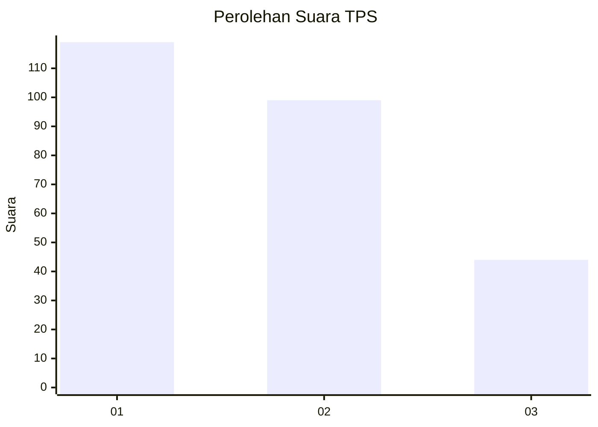
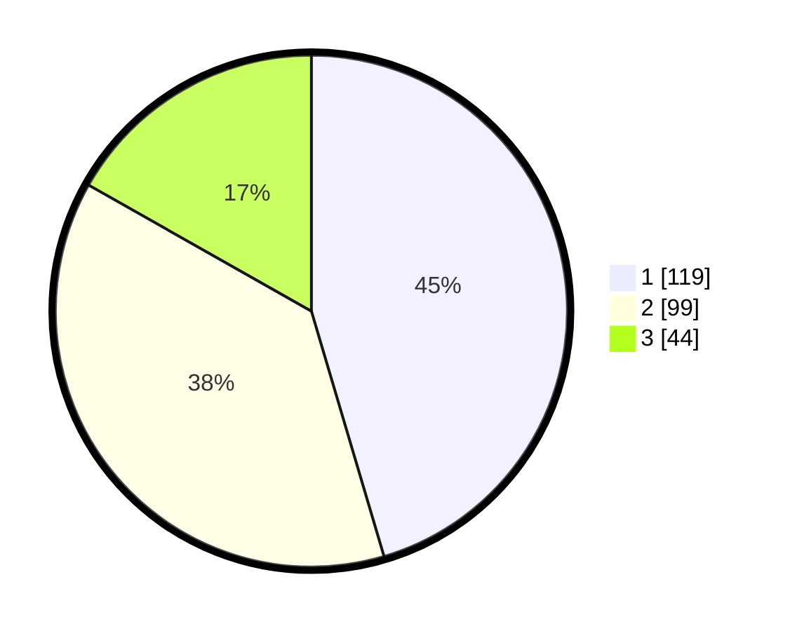

# Hasil

## Grafik

## Tabel

| No. | Nama Paslon    | Suara | Suara (raw) | Persentase |
|:--- |:-------------- | -----:| -----------:| ----------:|
| 1   | ANIES MUHAIMIN | 119   | [119][p-1]  | 45,42      |
| 2   | PRABOWO GIBRAN | 99    | [99][p-2]   | 37,79      |
| 3   | GANJAR MAHFUD  | 44    | [44][p-3]   | 16,79      |

[p-1]: https://github.com/gigit-pemilu/pemilu-2024-32-jawa-barat/blob/main/pilpres/hitung-suara/sub/32-jawa-barat/sub/75-kota-bekasi/sub/07-bantargebang/sub/1008-sumurbatu/sub/055-tps/sub/paslon-1.txt
[p-2]: https://github.com/gigit-pemilu/pemilu-2024-32-jawa-barat/blob/main/pilpres/hitung-suara/sub/32-jawa-barat/sub/75-kota-bekasi/sub/07-bantargebang/sub/1008-sumurbatu/sub/055-tps/sub/paslon-2.txt
[p-3]: https://github.com/gigit-pemilu/pemilu-2024-32-jawa-barat/blob/main/pilpres/hitung-suara/sub/32-jawa-barat/sub/75-kota-bekasi/sub/07-bantargebang/sub/1008-sumurbatu/sub/055-tps/sub/paslon-3.txt

## Foto C Plano

https://sirekap-obj-formc.kpu.go.id/9786/pemilu/ppwp/32/75/07/10/08/3275071008055-20240215-015420--3c400437-fd7d-458d-bcbc-7ef3aca85950.jpg

https://sirekap-obj-formc.kpu.go.id/9786/pemilu/ppwp/32/75/07/10/08/3275071008055-20240215-015542--e1508f10-0d39-4015-8acb-fa629f885cbf.jpg

https://sirekap-obj-formc.kpu.go.id/9786/pemilu/ppwp/32/75/07/10/08/3275071008055-20240215-015710--2eb7ece2-a30a-4369-9f7c-1711a77d2b31.jpg

## Metadata

| Key        | Value               |
| ---------- | ------------------- |
| Time Stamp | 2024-02-25 19:00:00 |

