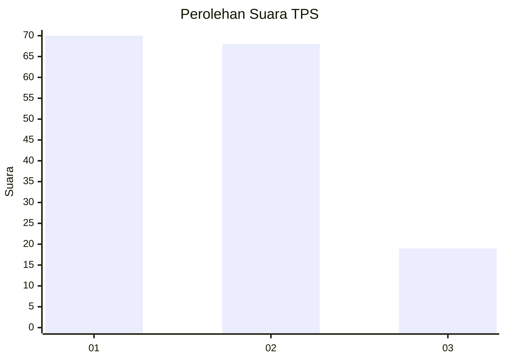
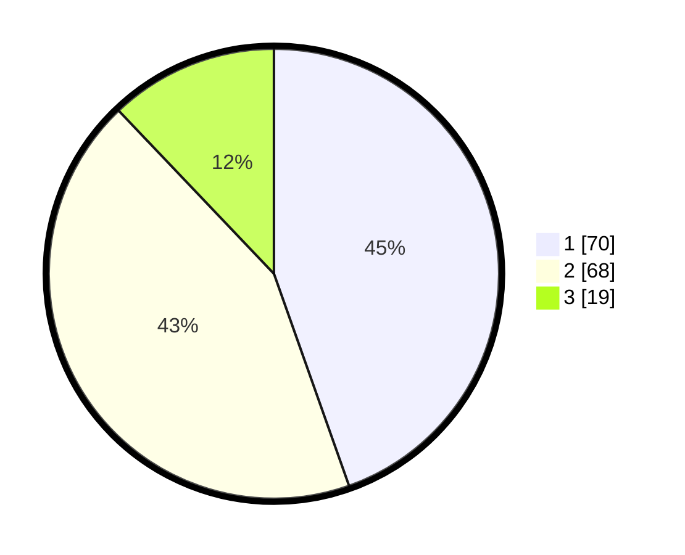

# Hasil

## Grafik

## Tabel

| No. | Nama Paslon    | Suara | Suara (raw) | Persentase |
|:--- |:-------------- | -----:| -----------:| ----------:|
| 1   | ANIES MUHAIMIN | 70    | [70][p-1]   | 44,59      |
| 2   | PRABOWO GIBRAN | 68    | [68][p-2]   | 43,31      |
| 3   | GANJAR MAHFUD  | 19    | [19][p-3]   | 12,10      |

[p-1]: https://github.com/gigit-pemilu/pemilu-2024/blob/main/pilpres/hitung-suara/sub/32-jawa-barat/sub/75-kota-bekasi/sub/08-pondokgede/sub/1001-jatiwaringin/sub/002-tps/sub/paslon-1.txt
[p-2]: https://github.com/gigit-pemilu/pemilu-2024/blob/main/pilpres/hitung-suara/sub/32-jawa-barat/sub/75-kota-bekasi/sub/08-pondokgede/sub/1001-jatiwaringin/sub/002-tps/sub/paslon-2.txt
[p-3]: https://github.com/gigit-pemilu/pemilu-2024/blob/main/pilpres/hitung-suara/sub/32-jawa-barat/sub/75-kota-bekasi/sub/08-pondokgede/sub/1001-jatiwaringin/sub/002-tps/sub/paslon-3.txt

## Foto C Plano

https://sirekap-obj-formc.kpu.go.id/bac8/pemilu/ppwp/32/75/08/10/01/3275081001002-20240215-002415--a144f679-79f0-485d-87f2-6c7b618fdce5.jpg

https://sirekap-obj-formc.kpu.go.id/bac8/pemilu/ppwp/32/75/08/10/01/3275081001002-20240215-002608--30e92676-3f7c-4180-90ac-579ded861bac.jpg

https://sirekap-obj-formc.kpu.go.id/bac8/pemilu/ppwp/32/75/08/10/01/3275081001002-20240215-002654--9ae1a553-8f82-4be2-b022-30b0c6f70b26.jpg

## Metadata

| Key        | Value               |
| ---------- | ------------------- |
| Time Stamp | 2024-02-15 22:40:13 |

