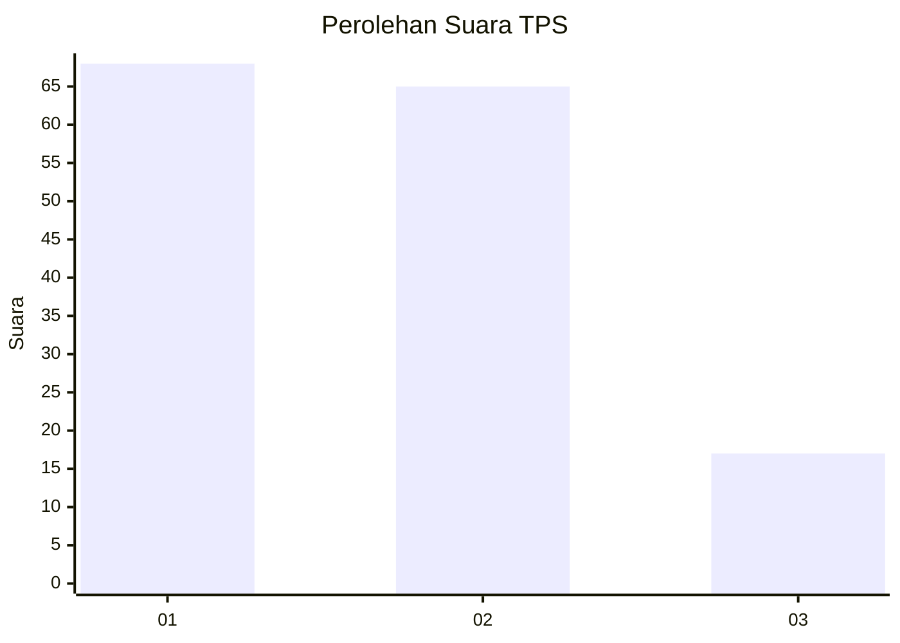
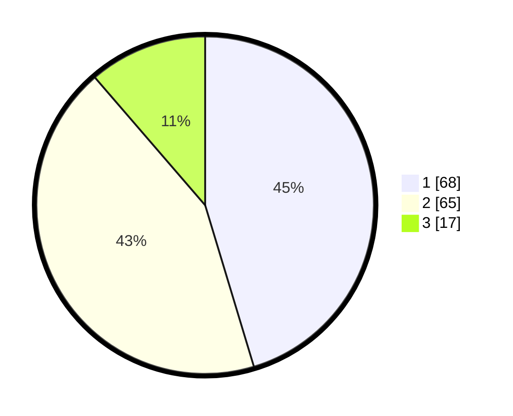

# Hasil

## Grafik

## Tabel

| No. | Nama Paslon    | Suara | Suara (raw) | Persentase |
|:--- |:-------------- | -----:| -----------:| ----------:|
| 1   | ANIES MUHAIMIN | 68    | [68][p-1]   | 45,33      |
| 2   | PRABOWO GIBRAN | 65    | [65][p-2]   | 43,33      |
| 3   | GANJAR MAHFUD  | 17    | [17][p-3]   | 11,33      |

[p-1]: https://github.com/gigit-pemilu/pemilu-2024/blob/main/pilpres/hitung-suara/sub/32-jawa-barat/sub/75-kota-bekasi/sub/08-pondokgede/sub/1001-jatiwaringin/sub/003-tps/sub/paslon-1.txt
[p-2]: https://github.com/gigit-pemilu/pemilu-2024/blob/main/pilpres/hitung-suara/sub/32-jawa-barat/sub/75-kota-bekasi/sub/08-pondokgede/sub/1001-jatiwaringin/sub/003-tps/sub/paslon-2.txt
[p-3]: https://github.com/gigit-pemilu/pemilu-2024/blob/main/pilpres/hitung-suara/sub/32-jawa-barat/sub/75-kota-bekasi/sub/08-pondokgede/sub/1001-jatiwaringin/sub/003-tps/sub/paslon-3.txt

## Foto C Plano

https://sirekap-obj-formc.kpu.go.id/c44e/pemilu/ppwp/32/75/08/10/01/3275081001003-20240215-000650--d4fdb931-9832-46c6-a23f-d8c25f3f38a0.jpg

https://sirekap-obj-formc.kpu.go.id/c44e/pemilu/ppwp/32/75/08/10/01/3275081001003-20240215-000725--ab9a064b-5937-46ff-bf83-b3bc0623536f.jpg

https://sirekap-obj-formc.kpu.go.id/c44e/pemilu/ppwp/32/75/08/10/01/3275081001003-20240215-000703--bfdb1670-516a-4f14-a82f-22fd674ae9c5.jpg

## Metadata

| Key        | Value               |
| ---------- | ------------------- |
| Time Stamp | 2024-02-15 22:40:13 |

