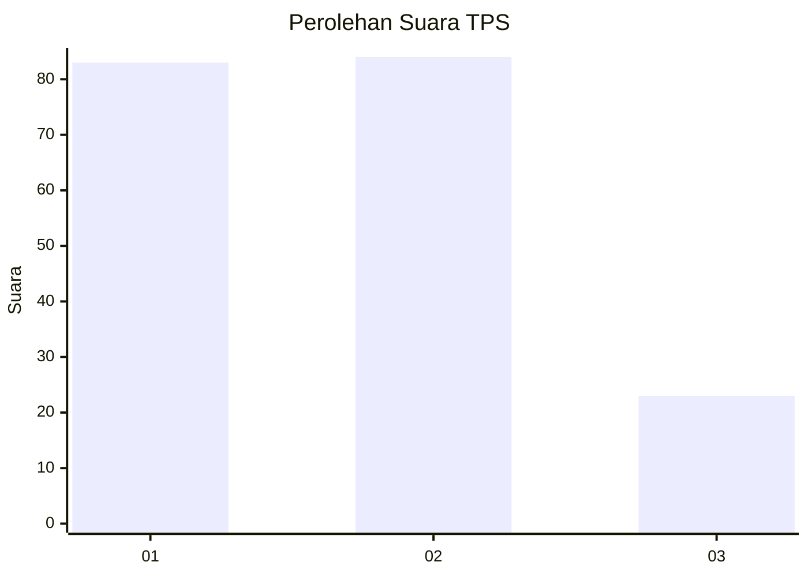
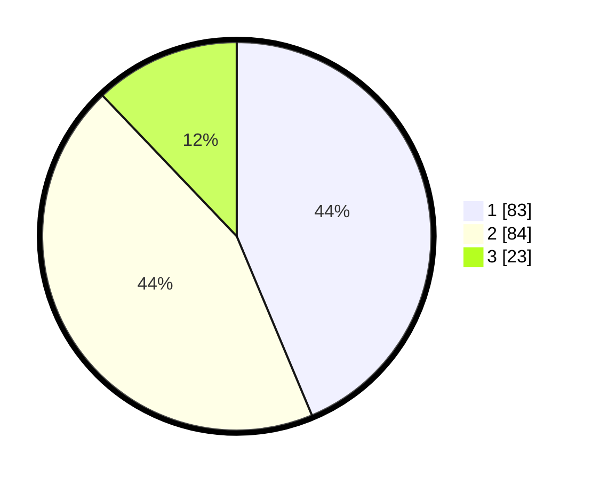

# Hasil

## Grafik

## Tabel

| No. | Nama Paslon    | Suara | Suara (raw) | Persentase |
|:--- |:-------------- | -----:| -----------:| ----------:|
| 1   | ANIES MUHAIMIN | 83    | [83][p-1]   | 43,68      |
| 2   | PRABOWO GIBRAN | 84    | [84][p-2]   | 44,21      |
| 3   | GANJAR MAHFUD  | 23    | [23][p-3]   | 12,11      |

[p-1]: https://github.com/gigit-pemilu/pemilu-2024/blob/main/pilpres/hitung-suara/sub/32-jawa-barat/sub/75-kota-bekasi/sub/08-pondokgede/sub/1001-jatiwaringin/sub/010-tps/sub/paslon-1.txt
[p-2]: https://github.com/gigit-pemilu/pemilu-2024/blob/main/pilpres/hitung-suara/sub/32-jawa-barat/sub/75-kota-bekasi/sub/08-pondokgede/sub/1001-jatiwaringin/sub/010-tps/sub/paslon-2.txt
[p-3]: https://github.com/gigit-pemilu/pemilu-2024/blob/main/pilpres/hitung-suara/sub/32-jawa-barat/sub/75-kota-bekasi/sub/08-pondokgede/sub/1001-jatiwaringin/sub/010-tps/sub/paslon-3.txt

## Foto C Plano

https://sirekap-obj-formc.kpu.go.id/60f9/pemilu/ppwp/32/75/08/10/01/3275081001010-20240216-122049--d7e2240a-c9e9-4b97-be6d-c82bc39b853e.jpg

https://sirekap-obj-formc.kpu.go.id/60f9/pemilu/ppwp/32/75/08/10/01/3275081001010-20240216-122054--787cd8be-a2c4-4308-a95a-935931c85e9a.jpg

https://sirekap-obj-formc.kpu.go.id/60f9/pemilu/ppwp/32/75/08/10/01/3275081001010-20240216-122057--26687b52-c236-4e19-a4b0-7762af5275f4.jpg

## Metadata

| Key        | Value               |
| ---------- | ------------------- |
| Time Stamp | 2024-02-16 12:51:22 |

