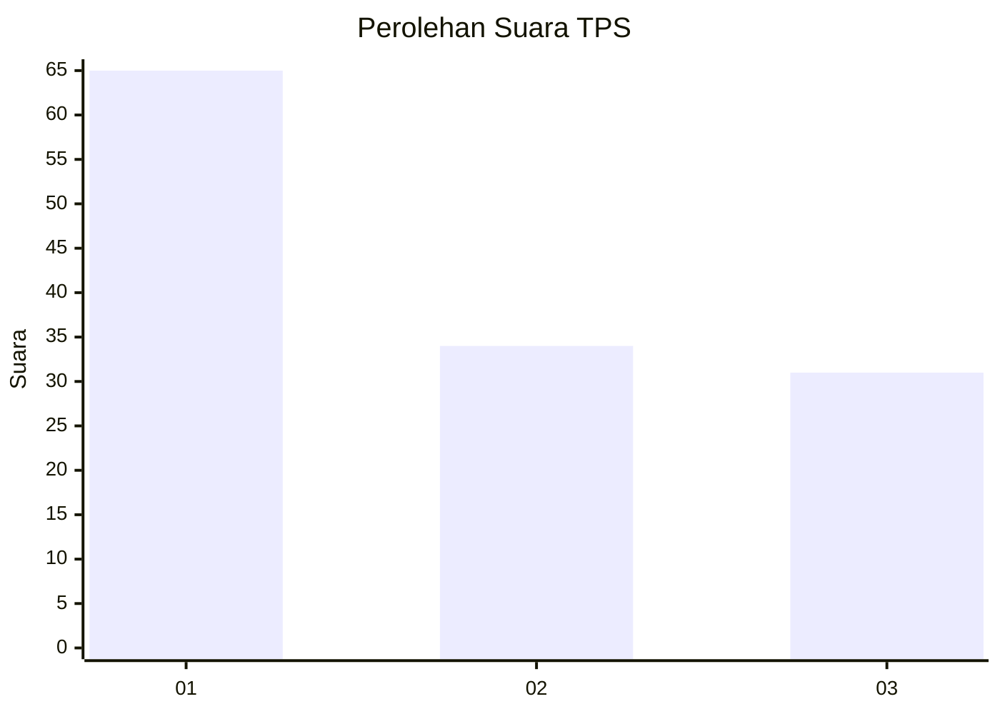
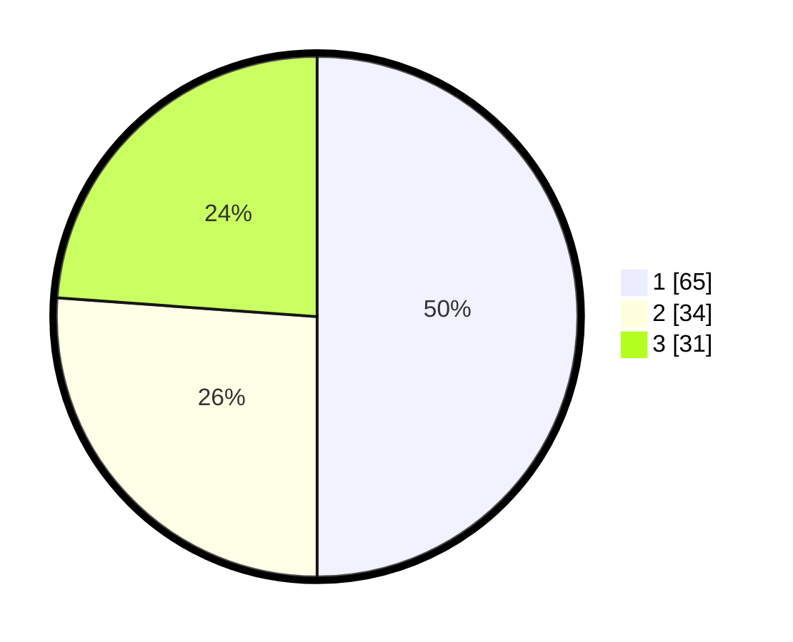

# Hasil

## Grafik

## Tabel

| No. | Nama Paslon    | Suara | Suara (raw) | Persentase |
|:--- |:-------------- | -----:| -----------:| ----------:|
| 1   | ANIES MUHAIMIN | 65    | [65][p-1]   | 50,00      |
| 2   | PRABOWO GIBRAN | 34    | [34][p-2]   | 26,15      |
| 3   | GANJAR MAHFUD  | 31    | [31][p-3]   | 23,85      |

[p-1]: https://github.com/gigit-pemilu/pemilu-2024/blob/main/pilpres/hitung-suara/sub/32-jawa-barat/sub/75-kota-bekasi/sub/08-pondokgede/sub/1006-jatibening-baru/sub/076-tps/sub/paslon-1.txt
[p-2]: https://github.com/gigit-pemilu/pemilu-2024/blob/main/pilpres/hitung-suara/sub/32-jawa-barat/sub/75-kota-bekasi/sub/08-pondokgede/sub/1006-jatibening-baru/sub/076-tps/sub/paslon-2.txt
[p-3]: https://github.com/gigit-pemilu/pemilu-2024/blob/main/pilpres/hitung-suara/sub/32-jawa-barat/sub/75-kota-bekasi/sub/08-pondokgede/sub/1006-jatibening-baru/sub/076-tps/sub/paslon-3.txt

## Foto C Plano

https://sirekap-obj-formc.kpu.go.id/c66e/pemilu/ppwp/32/75/08/10/06/3275081006076-20240214-234144--d1a24671-be81-44fa-b683-a7745db9fbb6.jpg

https://sirekap-obj-formc.kpu.go.id/c66e/pemilu/ppwp/32/75/08/10/06/3275081006076-20240214-234542--ef239b72-af44-4c8d-aa9c-2461c0c88dee.jpg

https://sirekap-obj-formc.kpu.go.id/c66e/pemilu/ppwp/32/75/08/10/06/3275081006076-20240214-234245--27875d23-b0e0-4352-9bad-ab021c9eafcd.jpg

## Metadata

| Key        | Value               |
| ---------- | ------------------- |
| Time Stamp | 2024-02-16 00:00:26 |

