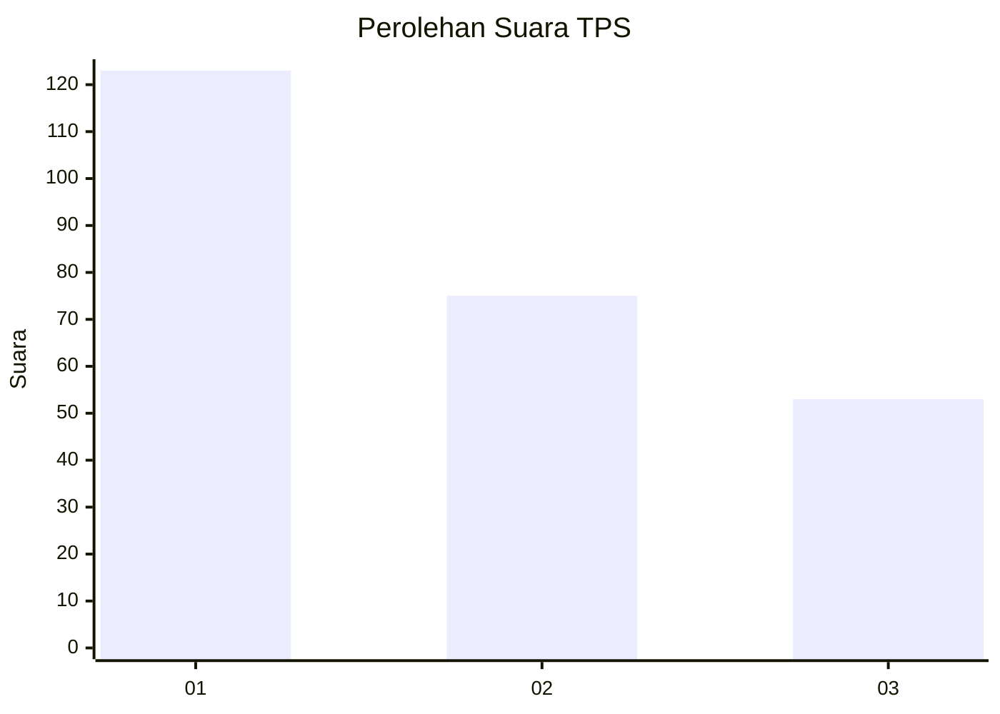
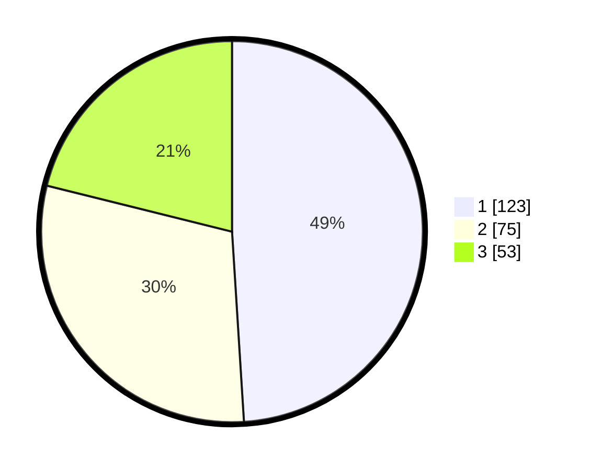

# Hasil

## Grafik

## Tabel

| No. | Nama Paslon    | Suara | Suara (raw) | Persentase |
|:--- |:-------------- | -----:| -----------:| ----------:|
| 1   | ANIES MUHAIMIN | 123   | [123][p-1]  | 49,00      |
| 2   | PRABOWO GIBRAN | 75    | [75][p-2]   | 29,88      |
| 3   | GANJAR MAHFUD  | 53    | [53][p-3]   | 21,12      |

[p-1]: https://github.com/gigit-pemilu/pemilu-2024-32-jawa-barat/blob/main/pilpres/hitung-suara/sub/32-jawa-barat/sub/75-kota-bekasi/sub/08-pondokgede/sub/1007-jaticempaka/sub/127-tps/sub/paslon-1.txt
[p-2]: https://github.com/gigit-pemilu/pemilu-2024-32-jawa-barat/blob/main/pilpres/hitung-suara/sub/32-jawa-barat/sub/75-kota-bekasi/sub/08-pondokgede/sub/1007-jaticempaka/sub/127-tps/sub/paslon-2.txt
[p-3]: https://github.com/gigit-pemilu/pemilu-2024-32-jawa-barat/blob/main/pilpres/hitung-suara/sub/32-jawa-barat/sub/75-kota-bekasi/sub/08-pondokgede/sub/1007-jaticempaka/sub/127-tps/sub/paslon-3.txt

## Foto C Plano

https://sirekap-obj-formc.kpu.go.id/91be/pemilu/ppwp/32/75/08/10/07/3275081007127-20240214-185635--562b4686-7011-42e4-99bb-762aa76df5b1.jpg

https://sirekap-obj-formc.kpu.go.id/91be/pemilu/ppwp/32/75/08/10/07/3275081007127-20240214-185815--d19d425f-4272-4174-bfdc-33bd6194b40f.jpg

https://sirekap-obj-formc.kpu.go.id/91be/pemilu/ppwp/32/75/08/10/07/3275081007127-20240214-190400--48400c01-4bf8-4a02-971a-6fd122699be1.jpg

## Metadata

| Key        | Value               |
| ---------- | ------------------- |
| Time Stamp | 2024-02-16 01:00:27 |

