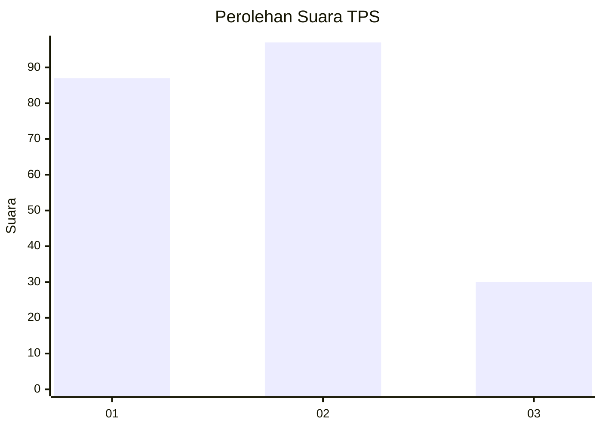
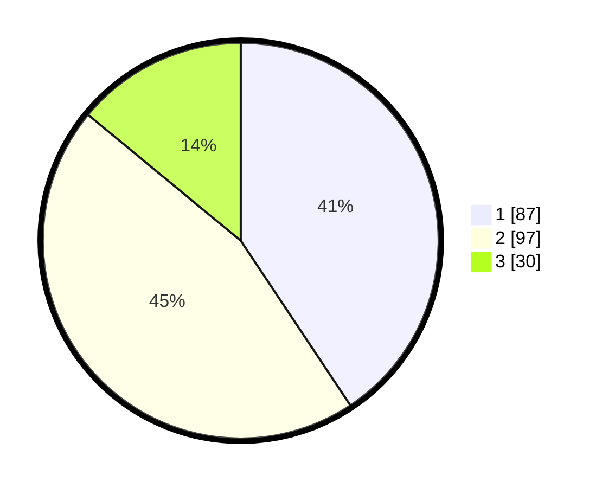

# Hasil

## Grafik

## Tabel

| No. | Nama Paslon    | Suara | Suara (raw) | Persentase |
|:--- |:-------------- | -----:| -----------:| ----------:|
| 1   | ANIES MUHAIMIN | 87    | [87][p-1]   | 40,65      |
| 2   | PRABOWO GIBRAN | 97    | [97][p-2]   | 45,33      |
| 3   | GANJAR MAHFUD  | 30    | [30][p-3]   | 14,02      |

[p-1]: https://github.com/gigit-pemilu/pemilu-2024/blob/main/pilpres/hitung-suara/sub/32-jawa-barat/sub/75-kota-bekasi/sub/09-jatiasih/sub/1001-jatimekar/sub/001-tps/sub/paslon-1.txt
[p-2]: https://github.com/gigit-pemilu/pemilu-2024/blob/main/pilpres/hitung-suara/sub/32-jawa-barat/sub/75-kota-bekasi/sub/09-jatiasih/sub/1001-jatimekar/sub/001-tps/sub/paslon-2.txt
[p-3]: https://github.com/gigit-pemilu/pemilu-2024/blob/main/pilpres/hitung-suara/sub/32-jawa-barat/sub/75-kota-bekasi/sub/09-jatiasih/sub/1001-jatimekar/sub/001-tps/sub/paslon-3.txt

## Foto C Plano

https://sirekap-obj-formc.kpu.go.id/d14e/pemilu/ppwp/32/75/09/10/01/3275091001001-20240214-211315--71c66e27-f7f3-4bff-bf1a-b86216c839c2.jpg

https://sirekap-obj-formc.kpu.go.id/d14e/pemilu/ppwp/32/75/09/10/01/3275091001001-20240214-211611--be72ca79-0d99-45c9-abb7-b44e0a8ca4b0.jpg

https://sirekap-obj-formc.kpu.go.id/d14e/pemilu/ppwp/32/75/09/10/01/3275091001001-20240214-211809--7770e8aa-6bef-48ea-84b2-9a3132b705d2.jpg

## Metadata

| Key        | Value               |
| ---------- | ------------------- |
| Time Stamp | 2024-02-25 10:00:00 |

