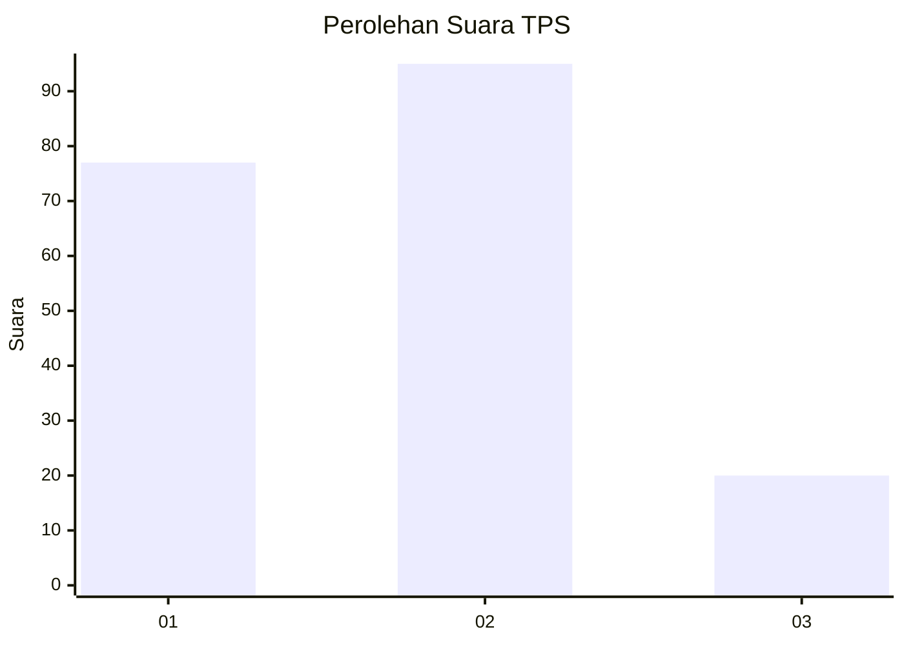
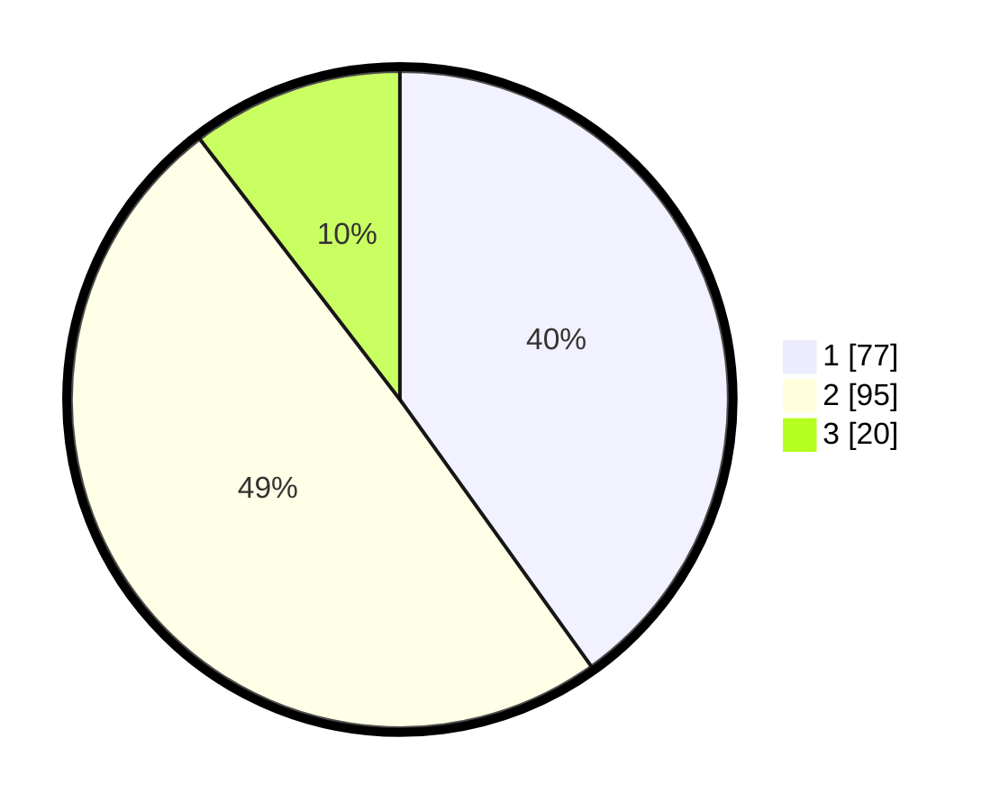

# Hasil

## Grafik

## Tabel

| No. | Nama Paslon    | Suara | Suara (raw) | Persentase |
|:--- |:-------------- | -----:| -----------:| ----------:|
| 1   | ANIES MUHAIMIN | 77    | [77][p-1]   | 40,10      |
| 2   | PRABOWO GIBRAN | 95    | [95][p-2]   | 49,48      |
| 3   | GANJAR MAHFUD  | 20    | [20][p-3]   | 10,42      |

[p-1]: https://github.com/gigit-pemilu/pemilu-2024/blob/main/pilpres/hitung-suara/sub/32-jawa-barat/sub/75-kota-bekasi/sub/09-jatiasih/sub/1001-jatimekar/sub/002-tps/sub/paslon-1.txt
[p-2]: https://github.com/gigit-pemilu/pemilu-2024/blob/main/pilpres/hitung-suara/sub/32-jawa-barat/sub/75-kota-bekasi/sub/09-jatiasih/sub/1001-jatimekar/sub/002-tps/sub/paslon-2.txt
[p-3]: https://github.com/gigit-pemilu/pemilu-2024/blob/main/pilpres/hitung-suara/sub/32-jawa-barat/sub/75-kota-bekasi/sub/09-jatiasih/sub/1001-jatimekar/sub/002-tps/sub/paslon-3.txt

## Foto C Plano

https://sirekap-obj-formc.kpu.go.id/2ef5/pemilu/ppwp/32/75/09/10/01/3275091001002-20240214-194320--08761328-feac-4c05-ae07-290f650fd2bf.jpg

https://sirekap-obj-formc.kpu.go.id/2ef5/pemilu/ppwp/32/75/09/10/01/3275091001002-20240214-193903--8711a08c-61de-4c6d-901f-98c91c6b9c55.jpg

https://sirekap-obj-formc.kpu.go.id/2ef5/pemilu/ppwp/32/75/09/10/01/3275091001002-20240214-194139--36394ea2-c336-4070-8a6a-6cb7a042f095.jpg

## Metadata

| Key        | Value               |
| ---------- | ------------------- |
| Time Stamp | 2024-02-24 22:31:28 |

