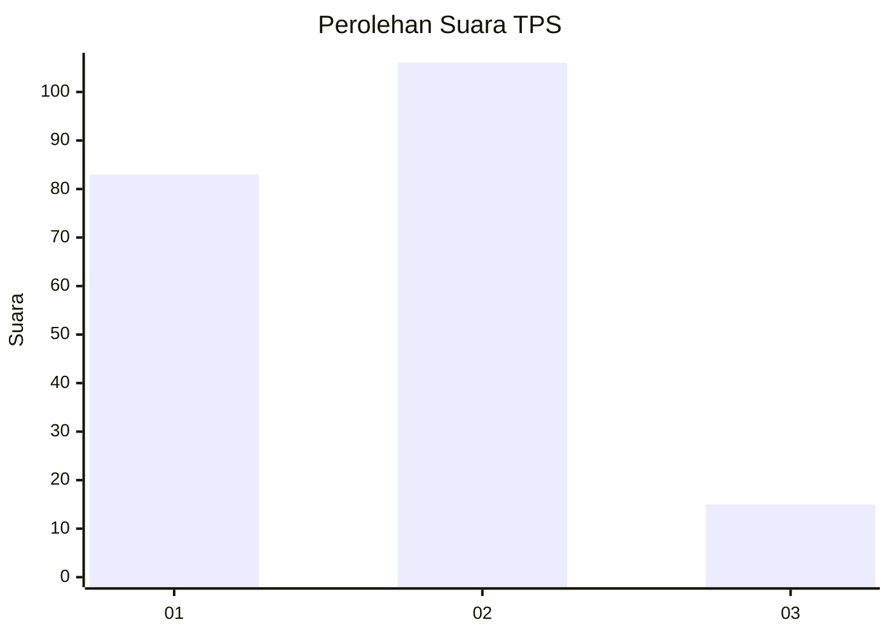

# Hasil

## Grafik

## Tabel

| No. | Nama Paslon    | Suara | Suara (raw) | Persentase |
|:--- |:-------------- | -----:| -----------:| ----------:|
| 1   | ANIES MUHAIMIN | 83    | [83][p-1]   | 40,69      |
| 2   | PRABOWO GIBRAN | 106   | [106][p-2]  | 51,96      |
| 3   | GANJAR MAHFUD  | 15    | [15][p-3]   | 7,35       |

[p-1]: https://github.com/gigit-pemilu/pemilu-2024-32-jawa-barat/blob/main/pilpres/hitung-suara/sub/32-jawa-barat/sub/75-kota-bekasi/sub/09-jatiasih/sub/1001-jatimekar/sub/004-tps/sub/paslon-1.txt
[p-2]: https://github.com/gigit-pemilu/pemilu-2024-32-jawa-barat/blob/main/pilpres/hitung-suara/sub/32-jawa-barat/sub/75-kota-bekasi/sub/09-jatiasih/sub/1001-jatimekar/sub/004-tps/sub/paslon-2.txt
[p-3]: https://github.com/gigit-pemilu/pemilu-2024-32-jawa-barat/blob/main/pilpres/hitung-suara/sub/32-jawa-barat/sub/75-kota-bekasi/sub/09-jatiasih/sub/1001-jatimekar/sub/004-tps/sub/paslon-3.txt

## Foto C Plano

https://sirekap-obj-formc.kpu.go.id/95b5/pemilu/ppwp/32/75/09/10/01/3275091001004-20240215-035435--2623c1ae-c26a-4a6b-baa2-8f434d10e565.jpg

https://sirekap-obj-formc.kpu.go.id/95b5/pemilu/ppwp/32/75/09/10/01/3275091001004-20240215-033754--a9a6755f-6193-4de7-8c5c-37b1ade3d4eb.jpg

https://sirekap-obj-formc.kpu.go.id/95b5/pemilu/ppwp/32/75/09/10/01/3275091001004-20240215-033855--bfd25126-4c5c-4d7e-866c-c5586e62831e.jpg

## Metadata

| Key        | Value               |
| ---------- | ------------------- |
| Time Stamp | 2024-02-24 22:31:28 |

