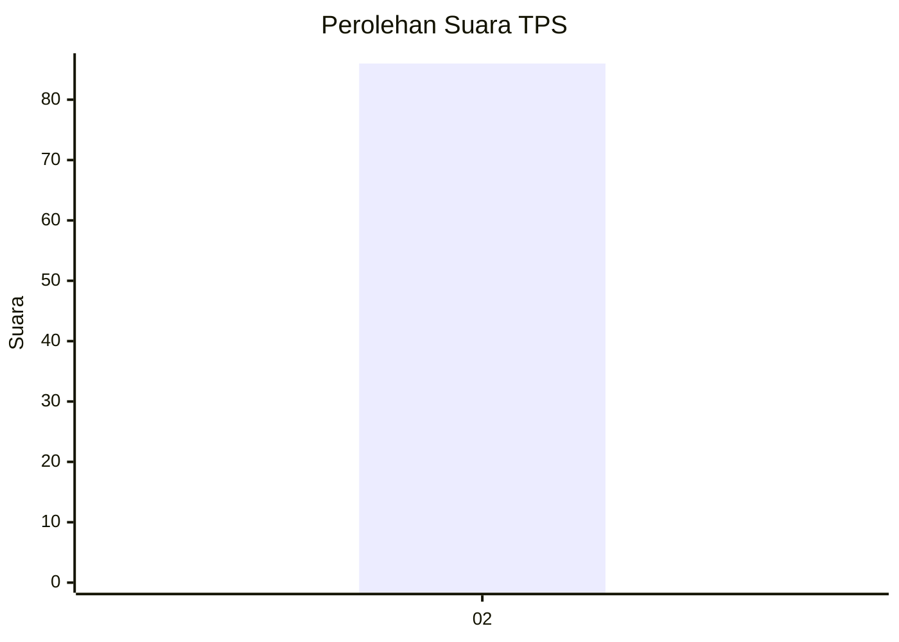
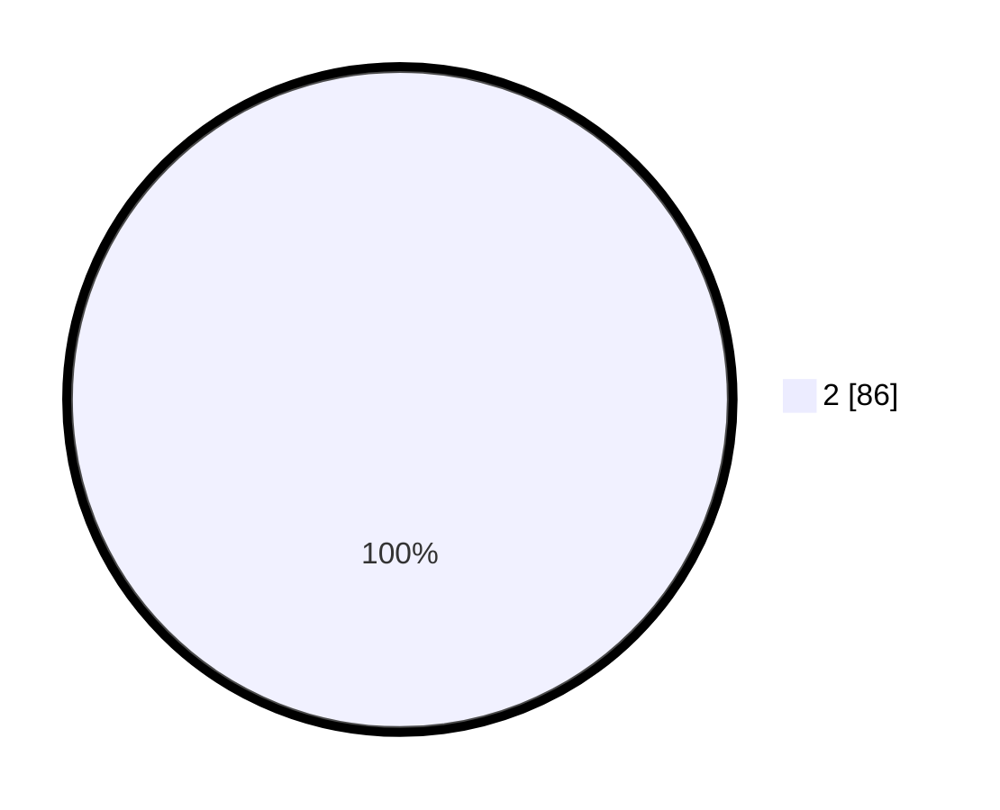

# Hasil

## Grafik

## Tabel

| No. | Nama Paslon    | Suara | Suara (raw) | Persentase |
|:--- |:-------------- | -----:| -----------:| ----------:|
| 2   | PRABOWO GIBRAN | 86    | [86][p-2]   | 100,00     |

[p-1]: https://github.com/gigit-pemilu/pemilu-2024/blob/main/pilpres/hitung-suara/sub/32-jawa-barat/sub/75-kota-bekasi/sub/09-jatiasih/sub/1002-jatiasih/sub/036-tps/sub/paslon-1.txt
[p-2]: https://github.com/gigit-pemilu/pemilu-2024/blob/main/pilpres/hitung-suara/sub/32-jawa-barat/sub/75-kota-bekasi/sub/09-jatiasih/sub/1002-jatiasih/sub/036-tps/sub/paslon-2.txt
[p-3]: https://github.com/gigit-pemilu/pemilu-2024/blob/main/pilpres/hitung-suara/sub/32-jawa-barat/sub/75-kota-bekasi/sub/09-jatiasih/sub/1002-jatiasih/sub/036-tps/sub/paslon-3.txt

## Foto C Plano

https://sirekap-obj-formc.kpu.go.id/22d1/pemilu/ppwp/32/75/09/10/02/3275091002036-20240214-202256--48681d50-3c40-4e0d-bf90-b0bd1e123e5a.jpg

https://sirekap-obj-formc.kpu.go.id/22d1/pemilu/ppwp/32/75/09/10/02/3275091002036-20240214-214146--5719a5bd-833f-480e-b8c8-b5e297806439.jpg

https://sirekap-obj-formc.kpu.go.id/22d1/pemilu/ppwp/32/75/09/10/02/3275091002036-20240214-202305--f7f35815-ab36-4826-b569-f1845d31ed57.jpg

## Metadata

| Key        | Value               |
| ---------- | ------------------- |
| Time Stamp | 2024-02-25 12:00:00 |

