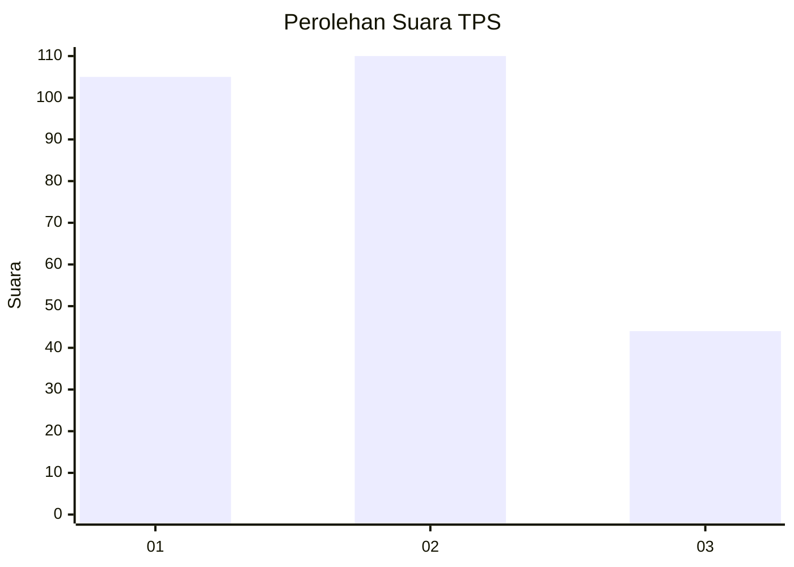
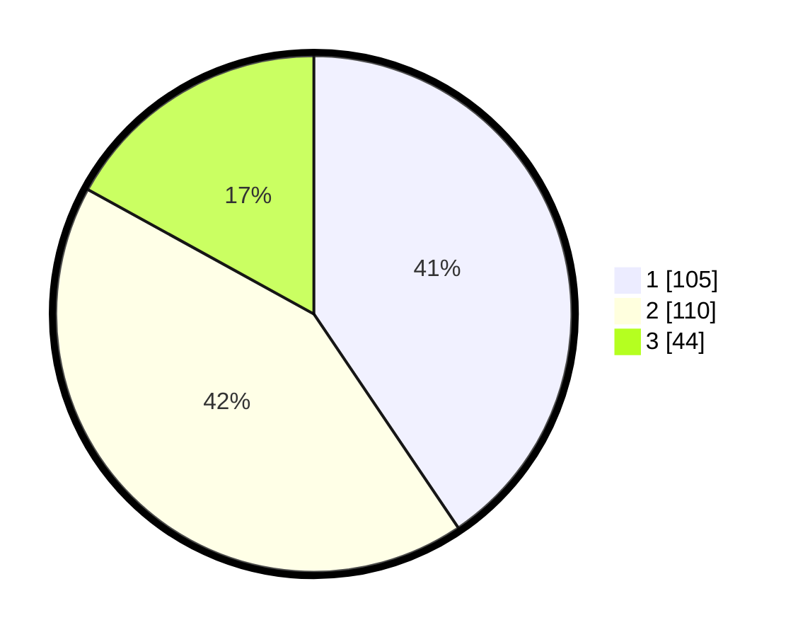

# Hasil

## Grafik

## Tabel

| No. | Nama Paslon    | Suara | Suara (raw) | Persentase |
|:--- |:-------------- | -----:| -----------:| ----------:|
| 1   | ANIES MUHAIMIN | 105   | [105][p-1]  | 40,54      |
| 2   | PRABOWO GIBRAN | 110   | [110][p-2]  | 42,47      |
| 3   | GANJAR MAHFUD  | 44    | [44][p-3]   | 16,99      |

[p-1]: https://github.com/gigit-pemilu/pemilu-2024/blob/main/pilpres/hitung-suara/sub/32-jawa-barat/sub/75-kota-bekasi/sub/09-jatiasih/sub/1004-jatirasa/sub/082-tps/sub/paslon-1.txt
[p-2]: https://github.com/gigit-pemilu/pemilu-2024/blob/main/pilpres/hitung-suara/sub/32-jawa-barat/sub/75-kota-bekasi/sub/09-jatiasih/sub/1004-jatirasa/sub/082-tps/sub/paslon-2.txt
[p-3]: https://github.com/gigit-pemilu/pemilu-2024/blob/main/pilpres/hitung-suara/sub/32-jawa-barat/sub/75-kota-bekasi/sub/09-jatiasih/sub/1004-jatirasa/sub/082-tps/sub/paslon-3.txt

## Foto C Plano

https://sirekap-obj-formc.kpu.go.id/1c49/pemilu/ppwp/32/75/09/10/04/3275091004082-20240214-195905--d7611793-6e64-480e-a0f1-29ff96c1f220.jpg

https://sirekap-obj-formc.kpu.go.id/1c49/pemilu/ppwp/32/75/09/10/04/3275091004082-20240214-200029--53b05000-6bd0-4f31-befd-c1dcdf6db2b5.jpg

https://sirekap-obj-formc.kpu.go.id/1c49/pemilu/ppwp/32/75/09/10/04/3275091004082-20240214-200142--30414378-e731-42c3-a88c-20b505243f0f.jpg

## Metadata

| Key        | Value               |
| ---------- | ------------------- |
| Time Stamp | 2024-02-25 16:00:00 |

