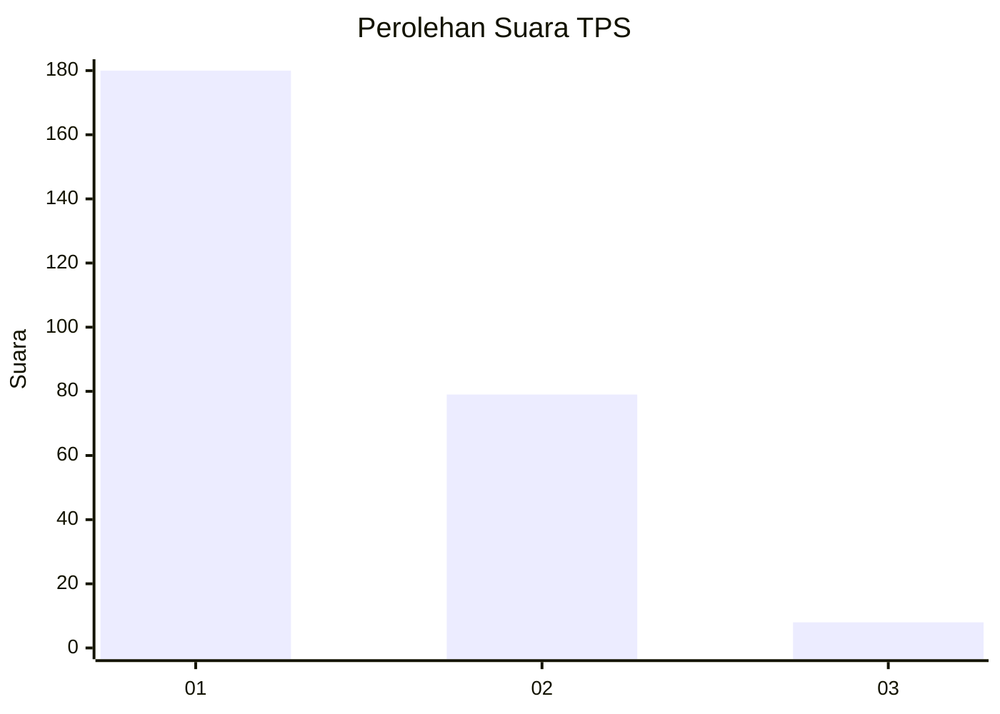
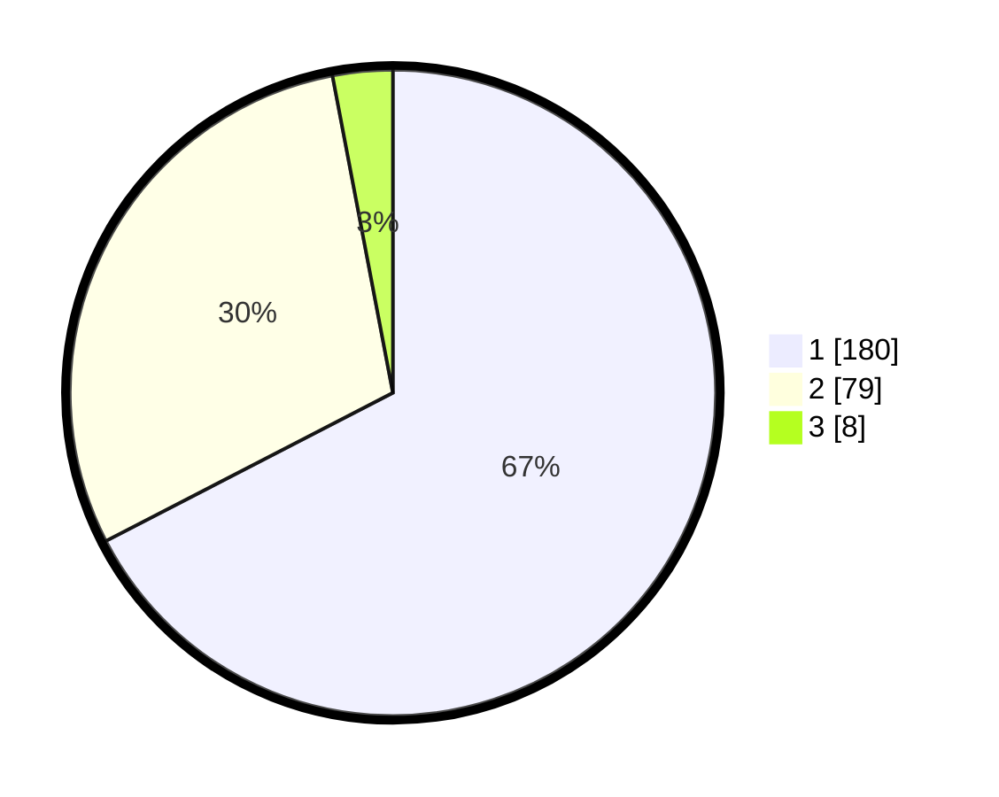

# Hasil

## Grafik

## Tabel

| No. | Nama Paslon    | Suara | Suara (raw) | Persentase |
|:--- |:-------------- | -----:| -----------:| ----------:|
| 1   | ANIES MUHAIMIN | 180   | [180][p-1]  | 67,42      |
| 2   | PRABOWO GIBRAN | 79    | [79][p-2]   | 29,59      |
| 3   | GANJAR MAHFUD  | 8     | [8][p-3]    | 3,00       |

[p-1]: https://github.com/gigit-pemilu/pemilu-2024/blob/main/pilpres/hitung-suara/sub/32-jawa-barat/sub/75-kota-bekasi/sub/09-jatiasih/sub/1005-jatiluhur/sub/040-tps/sub/paslon-1.txt
[p-2]: https://github.com/gigit-pemilu/pemilu-2024/blob/main/pilpres/hitung-suara/sub/32-jawa-barat/sub/75-kota-bekasi/sub/09-jatiasih/sub/1005-jatiluhur/sub/040-tps/sub/paslon-2.txt
[p-3]: https://github.com/gigit-pemilu/pemilu-2024/blob/main/pilpres/hitung-suara/sub/32-jawa-barat/sub/75-kota-bekasi/sub/09-jatiasih/sub/1005-jatiluhur/sub/040-tps/sub/paslon-3.txt

## Foto C Plano

https://sirekap-obj-formc.kpu.go.id/58ae/pemilu/ppwp/32/75/09/10/05/3275091005040-20240215-015315--32d48fe7-f9d5-4fdb-9721-993cd1ae1bd4.jpg

https://sirekap-obj-formc.kpu.go.id/58ae/pemilu/ppwp/32/75/09/10/05/3275091005040-20240215-014919--1ba8c420-a1d9-4064-8fd5-319568de9ce9.jpg

https://sirekap-obj-formc.kpu.go.id/58ae/pemilu/ppwp/32/75/09/10/05/3275091005040-20240215-014937--b496b7ce-7737-4f9b-a57a-9b50fb1a8591.jpg

## Metadata

| Key        | Value               |
| ---------- | ------------------- |
| Time Stamp | 2024-02-16 01:00:27 |

