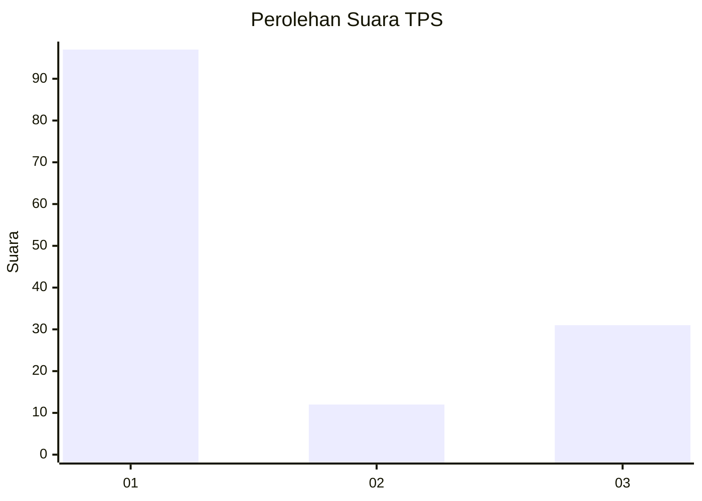
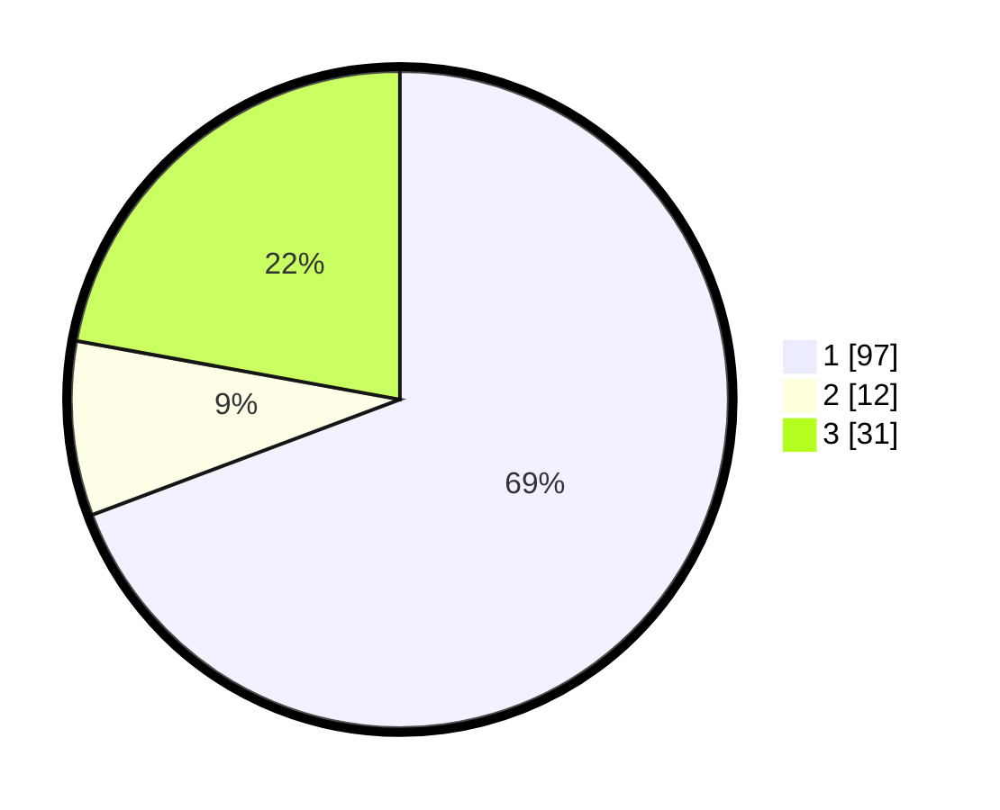

# Hasil

## Grafik

## Tabel

| No. | Nama Paslon    | Suara | Suara (raw) | Persentase |
|:--- |:-------------- | -----:| -----------:| ----------:|
| 1   | ANIES MUHAIMIN | 97    | [97][p-1]   | 69,29      |
| 2   | PRABOWO GIBRAN | 12    | [12][p-2]   | 8,57       |
| 3   | GANJAR MAHFUD  | 31    | [31][p-3]   | 22,14      |

[p-1]: https://github.com/gigit-pemilu/pemilu-2024/blob/main/pilpres/hitung-suara/sub/32-jawa-barat/sub/75-kota-bekasi/sub/09-jatiasih/sub/1006-jatisari/sub/030-tps/sub/paslon-1.txt
[p-2]: https://github.com/gigit-pemilu/pemilu-2024/blob/main/pilpres/hitung-suara/sub/32-jawa-barat/sub/75-kota-bekasi/sub/09-jatiasih/sub/1006-jatisari/sub/030-tps/sub/paslon-2.txt
[p-3]: https://github.com/gigit-pemilu/pemilu-2024/blob/main/pilpres/hitung-suara/sub/32-jawa-barat/sub/75-kota-bekasi/sub/09-jatiasih/sub/1006-jatisari/sub/030-tps/sub/paslon-3.txt

## Foto C Plano

https://sirekap-obj-formc.kpu.go.id/06bd/pemilu/ppwp/32/75/09/10/06/3275091006030-20240215-031216--d87f8ba6-4c37-416c-b7c6-695ea2ea011e.jpg

https://sirekap-obj-formc.kpu.go.id/06bd/pemilu/ppwp/32/75/09/10/06/3275091006030-20240215-031414--25a496b4-5dd7-42b9-9236-dbb62a0fbcc6.jpg

https://sirekap-obj-formc.kpu.go.id/06bd/pemilu/ppwp/32/75/09/10/06/3275091006030-20240215-031408--7f112f1f-c4a3-4adc-8a27-b9c67cdc7681.jpg

## Metadata

| Key        | Value               |
| ---------- | ------------------- |
| Time Stamp | 2024-02-16 00:30:27 |

