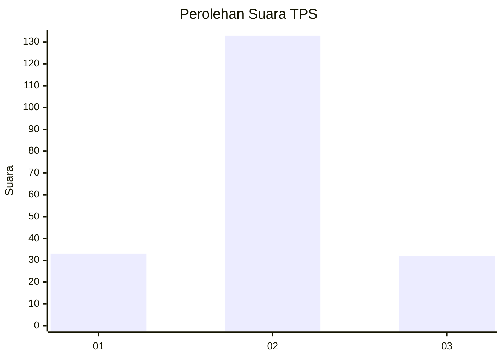
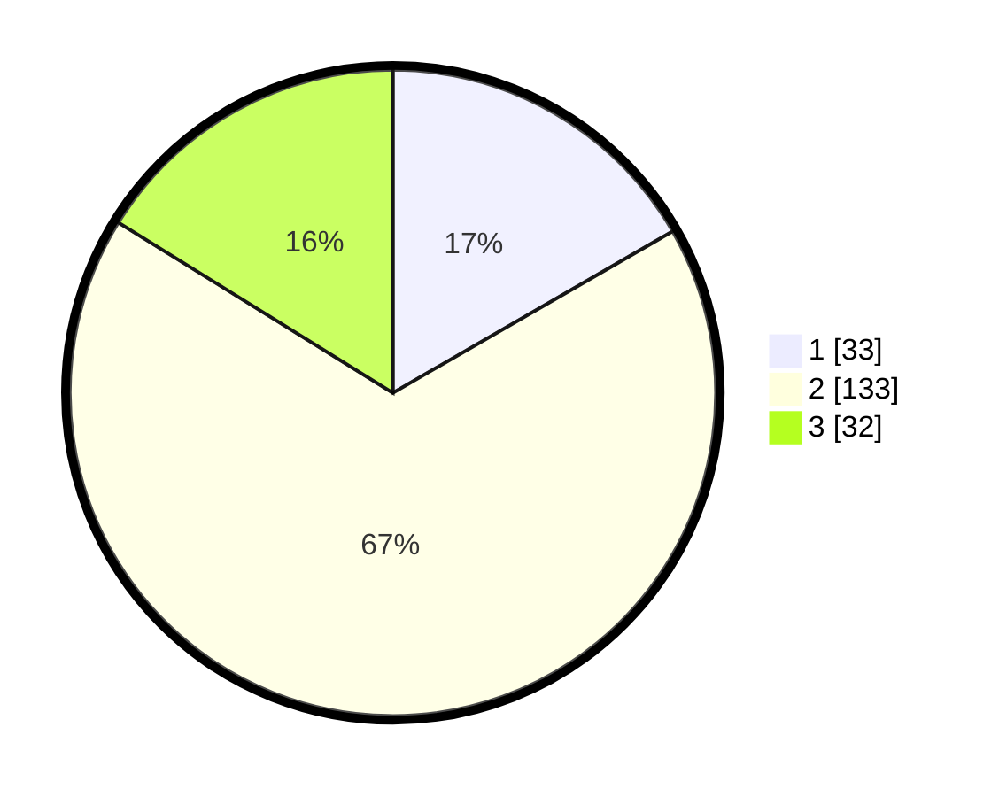

# Hasil

## Grafik

## Tabel

| No. | Nama Paslon    | Suara | Suara (raw) | Persentase |
|:--- |:-------------- | -----:| -----------:| ----------:|
| 1   | ANIES MUHAIMIN | 33    | [33][p-1]   | 16,67      |
| 2   | PRABOWO GIBRAN | 133   | [133][p-2]  | 67,17      |
| 3   | GANJAR MAHFUD  | 32    | [32][p-3]   | 16,16      |

[p-1]: https://github.com/gigit-pemilu/pemilu-2024-32-jawa-barat/blob/main/pilpres/hitung-suara/sub/32-jawa-barat/sub/75-kota-bekasi/sub/10-jatisampurna/sub/1001-jatisampurna/sub/001-tps/sub/paslon-1.txt
[p-2]: https://github.com/gigit-pemilu/pemilu-2024-32-jawa-barat/blob/main/pilpres/hitung-suara/sub/32-jawa-barat/sub/75-kota-bekasi/sub/10-jatisampurna/sub/1001-jatisampurna/sub/001-tps/sub/paslon-2.txt
[p-3]: https://github.com/gigit-pemilu/pemilu-2024-32-jawa-barat/blob/main/pilpres/hitung-suara/sub/32-jawa-barat/sub/75-kota-bekasi/sub/10-jatisampurna/sub/1001-jatisampurna/sub/001-tps/sub/paslon-3.txt

## Foto C Plano

https://sirekap-obj-formc.kpu.go.id/e813/pemilu/ppwp/32/75/10/10/01/3275101001001-20240214-231149--0c037b88-bac0-4010-864e-68ccccfe8903.jpg

https://sirekap-obj-formc.kpu.go.id/e813/pemilu/ppwp/32/75/10/10/01/3275101001001-20240214-231425--e4662a15-930e-41cf-9aad-939fbddd0e3f.jpg

https://sirekap-obj-formc.kpu.go.id/e813/pemilu/ppwp/32/75/10/10/01/3275101001001-20240214-231800--66edb85d-47b9-4998-9894-327d19927afc.jpg

## Metadata

| Key        | Value               |
| ---------- | ------------------- |
| Time Stamp | 2024-02-15 15:30:25 |

