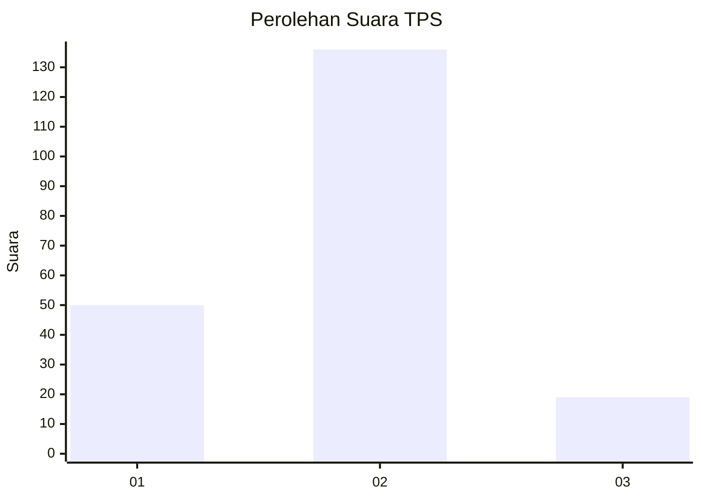

# Hasil

## Grafik

## Tabel

| No. | Nama Paslon    | Suara | Suara (raw) | Persentase |
|:--- |:-------------- | -----:| -----------:| ----------:|
| 1   | ANIES MUHAIMIN | 50    | [50][p-1]   | 24,39      |
| 2   | PRABOWO GIBRAN | 136   | [136][p-2]  | 66,34      |
| 3   | GANJAR MAHFUD  | 19    | [19][p-3]   | 9,27       |

[p-1]: https://github.com/gigit-pemilu/pemilu-2024-32-jawa-barat/blob/main/pilpres/hitung-suara/sub/32-jawa-barat/sub/75-kota-bekasi/sub/10-jatisampurna/sub/1001-jatisampurna/sub/003-tps/sub/paslon-1.txt
[p-2]: https://github.com/gigit-pemilu/pemilu-2024-32-jawa-barat/blob/main/pilpres/hitung-suara/sub/32-jawa-barat/sub/75-kota-bekasi/sub/10-jatisampurna/sub/1001-jatisampurna/sub/003-tps/sub/paslon-2.txt
[p-3]: https://github.com/gigit-pemilu/pemilu-2024-32-jawa-barat/blob/main/pilpres/hitung-suara/sub/32-jawa-barat/sub/75-kota-bekasi/sub/10-jatisampurna/sub/1001-jatisampurna/sub/003-tps/sub/paslon-3.txt

## Foto C Plano

https://sirekap-obj-formc.kpu.go.id/6fe9/pemilu/ppwp/32/75/10/10/01/3275101001003-20240216-173219--a17f9e75-d69e-4dcf-9a31-c676b38a091c.jpg

https://sirekap-obj-formc.kpu.go.id/6fe9/pemilu/ppwp/32/75/10/10/01/3275101001003-20240216-172611--1984d4d2-1bba-4d6d-bc12-95d759fc9762.jpg

https://sirekap-obj-formc.kpu.go.id/6fe9/pemilu/ppwp/32/75/10/10/01/3275101001003-20240216-172620--c630cb48-4e7f-49cb-bada-468e4f8b6a60.jpg

## Metadata

| Key        | Value               |
| ---------- | ------------------- |
| Time Stamp | 2024-02-17 18:00:00 |

