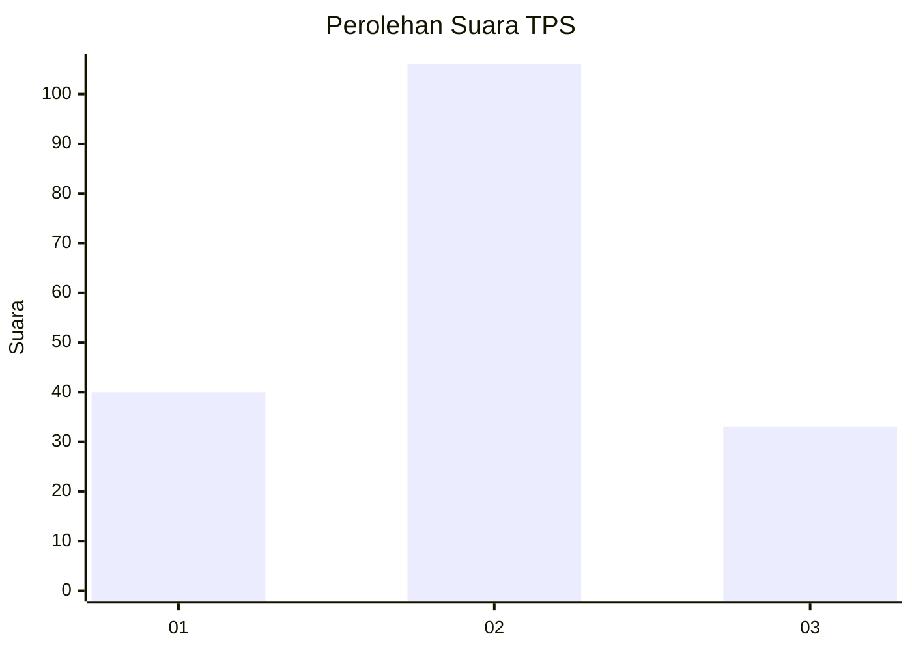
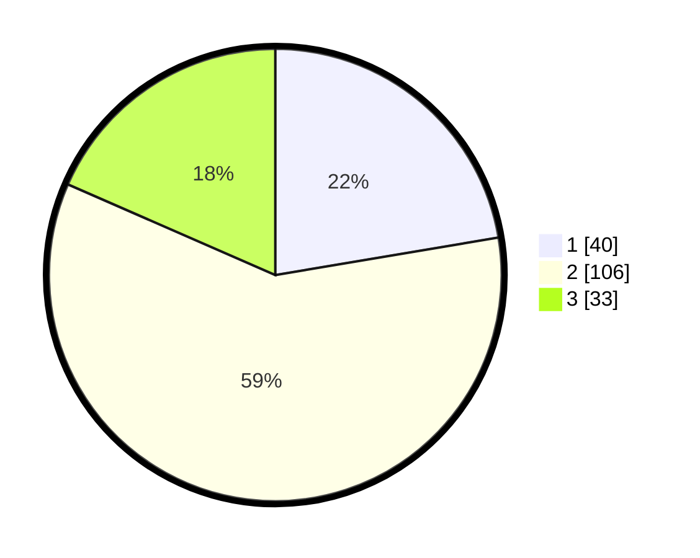

# Hasil

## Grafik

## Tabel

| No. | Nama Paslon    | Suara | Suara (raw) | Persentase |
|:--- |:-------------- | -----:| -----------:| ----------:|
| 1   | ANIES MUHAIMIN | 40    | [40][p-1]   | 22,35      |
| 2   | PRABOWO GIBRAN | 106   | [106][p-2]  | 59,22      |
| 3   | GANJAR MAHFUD  | 33    | [33][p-3]   | 18,44      |

[p-1]: https://github.com/gigit-pemilu/pemilu-2024-32-jawa-barat/blob/main/pilpres/hitung-suara/sub/32-jawa-barat/sub/75-kota-bekasi/sub/10-jatisampurna/sub/1001-jatisampurna/sub/004-tps/sub/paslon-1.txt
[p-2]: https://github.com/gigit-pemilu/pemilu-2024-32-jawa-barat/blob/main/pilpres/hitung-suara/sub/32-jawa-barat/sub/75-kota-bekasi/sub/10-jatisampurna/sub/1001-jatisampurna/sub/004-tps/sub/paslon-2.txt
[p-3]: https://github.com/gigit-pemilu/pemilu-2024-32-jawa-barat/blob/main/pilpres/hitung-suara/sub/32-jawa-barat/sub/75-kota-bekasi/sub/10-jatisampurna/sub/1001-jatisampurna/sub/004-tps/sub/paslon-3.txt

## Foto C Plano

https://sirekap-obj-formc.kpu.go.id/5907/pemilu/ppwp/32/75/10/10/01/3275101001004-20240214-212239--5e16e112-7680-4b5a-8d34-ec3618077210.jpg

https://sirekap-obj-formc.kpu.go.id/5907/pemilu/ppwp/32/75/10/10/01/3275101001004-20240214-212308--de37054c-9146-4138-86d3-efb41bb54a3e.jpg

https://sirekap-obj-formc.kpu.go.id/5907/pemilu/ppwp/32/75/10/10/01/3275101001004-20240214-212347--24cc2cca-9807-429f-85f3-bcbef40914a8.jpg

## Metadata

| Key        | Value               |
| ---------- | ------------------- |
| Time Stamp | 2024-02-25 12:00:00 |

