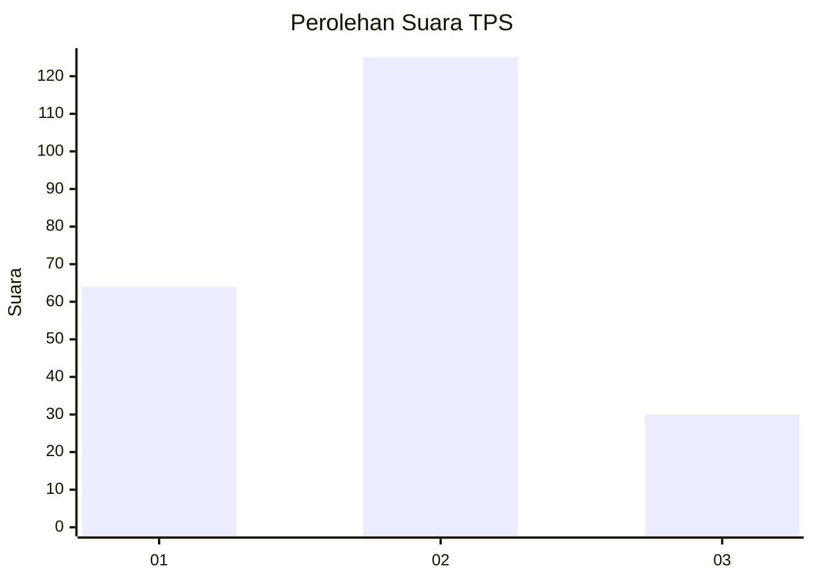
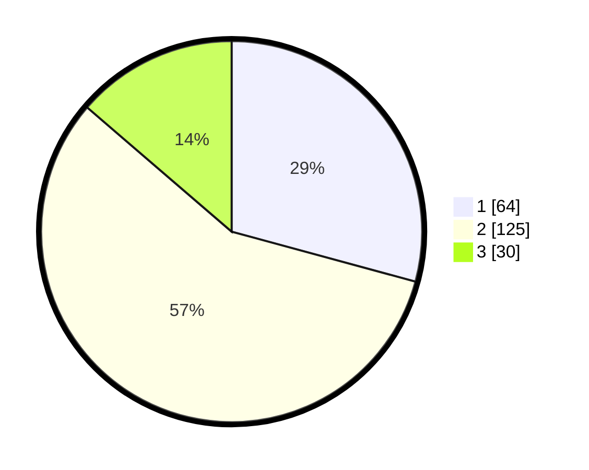

# Hasil

## Grafik

## Tabel

| No. | Nama Paslon    | Suara | Suara (raw) | Persentase |
|:--- |:-------------- | -----:| -----------:| ----------:|
| 1   | ANIES MUHAIMIN | 64    | [64][p-1]   | 29,22      |
| 2   | PRABOWO GIBRAN | 125   | [125][p-2]  | 57,08      |
| 3   | GANJAR MAHFUD  | 30    | [30][p-3]   | 13,70      |

[p-1]: https://github.com/gigit-pemilu/pemilu-2024-32-jawa-barat/blob/main/pilpres/hitung-suara/sub/32-jawa-barat/sub/75-kota-bekasi/sub/10-jatisampurna/sub/1001-jatisampurna/sub/006-tps/sub/paslon-1.txt
[p-2]: https://github.com/gigit-pemilu/pemilu-2024-32-jawa-barat/blob/main/pilpres/hitung-suara/sub/32-jawa-barat/sub/75-kota-bekasi/sub/10-jatisampurna/sub/1001-jatisampurna/sub/006-tps/sub/paslon-2.txt
[p-3]: https://github.com/gigit-pemilu/pemilu-2024-32-jawa-barat/blob/main/pilpres/hitung-suara/sub/32-jawa-barat/sub/75-kota-bekasi/sub/10-jatisampurna/sub/1001-jatisampurna/sub/006-tps/sub/paslon-3.txt

## Foto C Plano

https://sirekap-obj-formc.kpu.go.id/3423/pemilu/ppwp/32/75/10/10/01/3275101001006-20240214-202336--dcad5bc2-4e84-4d03-8160-aa5b9116f3df.jpg

https://sirekap-obj-formc.kpu.go.id/3423/pemilu/ppwp/32/75/10/10/01/3275101001006-20240214-202614--7acd1a3d-3888-47be-8609-ecc35c14fe43.jpg

https://sirekap-obj-formc.kpu.go.id/3423/pemilu/ppwp/32/75/10/10/01/3275101001006-20240214-202918--fe3daec5-1ed6-4aba-8ae2-cd39b51405a0.jpg

## Metadata

| Key        | Value               |
| ---------- | ------------------- |
| Time Stamp | 2024-02-15 22:30:27 |

