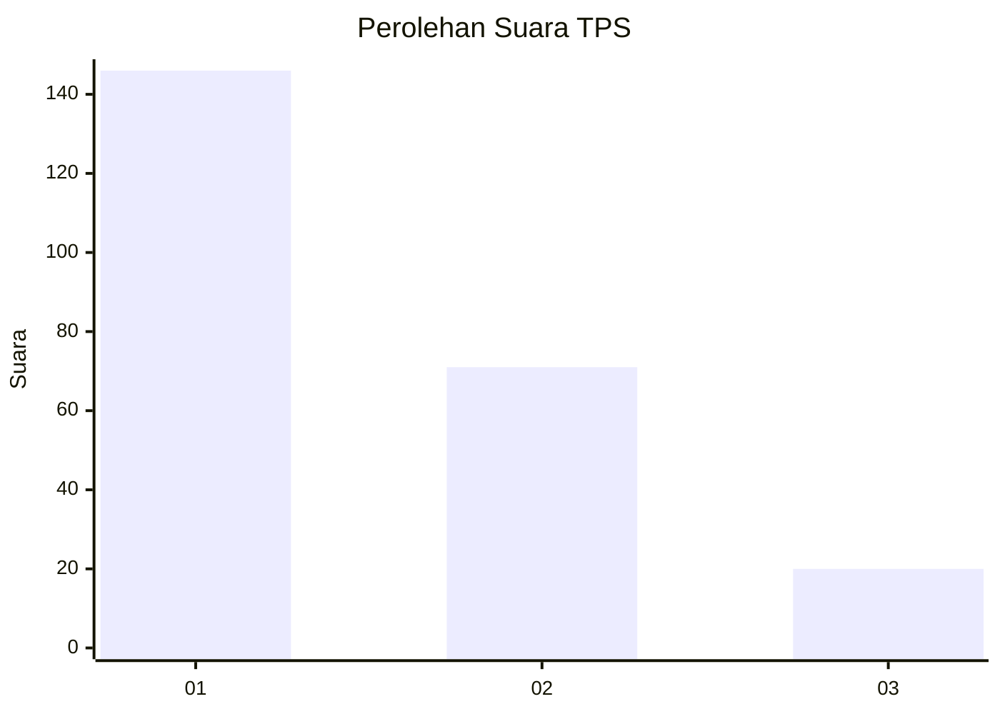
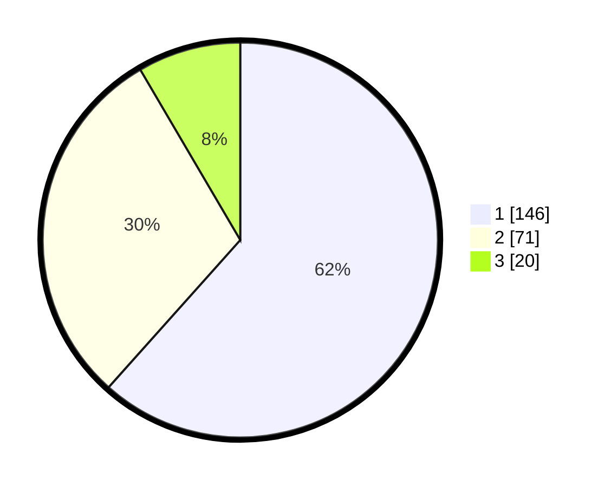

# Hasil

## Grafik

## Tabel

| No. | Nama Paslon    | Suara | Suara (raw) | Persentase |
|:--- |:-------------- | -----:| -----------:| ----------:|
| 1   | ANIES MUHAIMIN | 146   | [146][p-1]  | 61,60      |
| 2   | PRABOWO GIBRAN | 71    | [71][p-2]   | 29,96      |
| 3   | GANJAR MAHFUD  | 20    | [20][p-3]   | 8,44       |

[p-1]: https://github.com/gigit-pemilu/pemilu-2024/blob/main/pilpres/hitung-suara/sub/32-jawa-barat/sub/75-kota-bekasi/sub/10-jatisampurna/sub/1005-jatiraden/sub/016-tps/sub/paslon-1.txt
[p-2]: https://github.com/gigit-pemilu/pemilu-2024/blob/main/pilpres/hitung-suara/sub/32-jawa-barat/sub/75-kota-bekasi/sub/10-jatisampurna/sub/1005-jatiraden/sub/016-tps/sub/paslon-2.txt
[p-3]: https://github.com/gigit-pemilu/pemilu-2024/blob/main/pilpres/hitung-suara/sub/32-jawa-barat/sub/75-kota-bekasi/sub/10-jatisampurna/sub/1005-jatiraden/sub/016-tps/sub/paslon-3.txt

## Foto C Plano

https://sirekap-obj-formc.kpu.go.id/230e/pemilu/ppwp/32/75/10/10/05/3275101005016-20240215-010654--5b6b5853-a036-4af4-9025-5f0fdb637dd3.jpg

https://sirekap-obj-formc.kpu.go.id/230e/pemilu/ppwp/32/75/10/10/05/3275101005016-20240215-010825--023fa330-d4ab-4525-ab61-3b05daed4eda.jpg

https://sirekap-obj-formc.kpu.go.id/230e/pemilu/ppwp/32/75/10/10/05/3275101005016-20240215-015656--062e9cef-5aa2-44e3-9357-4ee281183c98.jpg

## Metadata

| Key        | Value               |
| ---------- | ------------------- |
| Time Stamp | 2024-02-25 11:00:00 |

