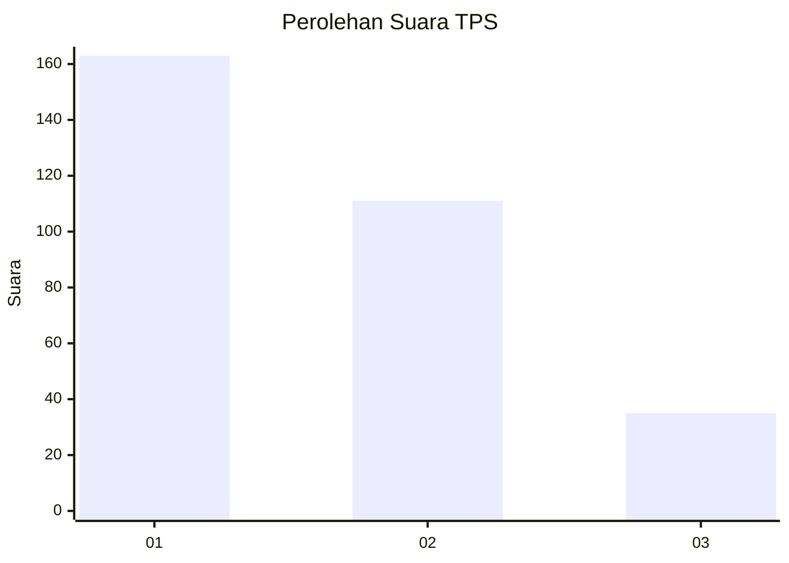
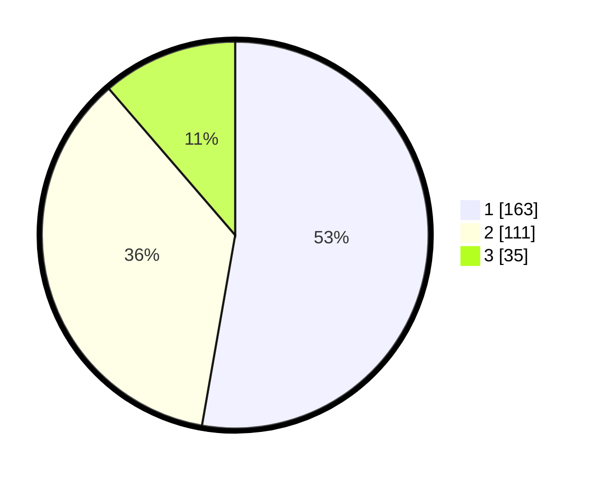

# Hasil

## Grafik

## Tabel

| No. | Nama Paslon    | Suara | Suara (raw) | Persentase |
|:--- |:-------------- | -----:| -----------:| ----------:|
| 1   | ANIES MUHAIMIN | 163   | [163][p-1]  | 52,75      |
| 2   | PRABOWO GIBRAN | 111   | [111][p-2]  | 35,92      |
| 3   | GANJAR MAHFUD  | 35    | [35][p-3]   | 11,33      |

[p-1]: https://github.com/gigit-pemilu/pemilu-2024-32-jawa-barat/blob/main/pilpres/hitung-suara/sub/32-jawa-barat/sub/75-kota-bekasi/sub/10-jatisampurna/sub/1005-jatiraden/sub/037-tps/sub/paslon-1.txt
[p-2]: https://github.com/gigit-pemilu/pemilu-2024-32-jawa-barat/blob/main/pilpres/hitung-suara/sub/32-jawa-barat/sub/75-kota-bekasi/sub/10-jatisampurna/sub/1005-jatiraden/sub/037-tps/sub/paslon-2.txt
[p-3]: https://github.com/gigit-pemilu/pemilu-2024-32-jawa-barat/blob/main/pilpres/hitung-suara/sub/32-jawa-barat/sub/75-kota-bekasi/sub/10-jatisampurna/sub/1005-jatiraden/sub/037-tps/sub/paslon-3.txt

## Foto C Plano

https://sirekap-obj-formc.kpu.go.id/2722/pemilu/ppwp/32/75/10/10/05/3275101005037-20240215-002324--bfacf206-8efb-4275-b958-d6e60b929bbb.jpg

https://sirekap-obj-formc.kpu.go.id/2722/pemilu/ppwp/32/75/10/10/05/3275101005037-20240215-002501--3e886285-b13e-4cfa-95ab-40a2cb33f5c1.jpg

https://sirekap-obj-formc.kpu.go.id/2722/pemilu/ppwp/32/75/10/10/05/3275101005037-20240215-002607--00d4532e-e330-4b36-87aa-beac1436db9d.jpg

## Metadata

| Key        | Value               |
| ---------- | ------------------- |
| Time Stamp | 2024-02-24 22:31:28 |

