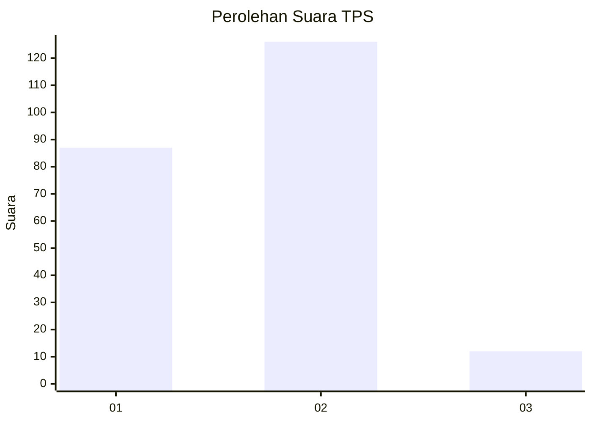
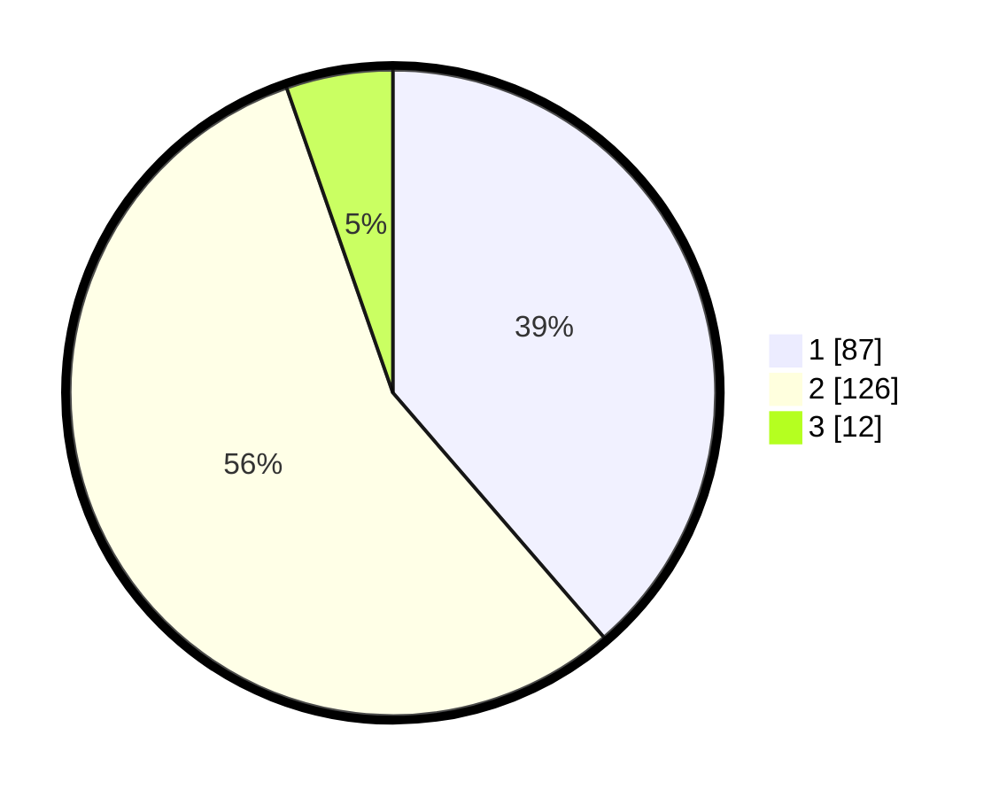

# Hasil

## Grafik

## Tabel

| No. | Nama Paslon    | Suara | Suara (raw) | Persentase |
|:--- |:-------------- | -----:| -----------:| ----------:|
| 1   | ANIES MUHAIMIN | 87    | [87][p-1]   | 38,67      |
| 2   | PRABOWO GIBRAN | 126   | [126][p-2]  | 56,00      |
| 3   | GANJAR MAHFUD  | 12    | [12][p-3]   | 5,33       |

[p-1]: https://github.com/gigit-pemilu/pemilu-2024-32-jawa-barat/blob/main/pilpres/hitung-suara/sub/32-jawa-barat/sub/75-kota-bekasi/sub/11-mustikajaya/sub/1001-padurenan/sub/001-tps/sub/paslon-1.txt
[p-2]: https://github.com/gigit-pemilu/pemilu-2024-32-jawa-barat/blob/main/pilpres/hitung-suara/sub/32-jawa-barat/sub/75-kota-bekasi/sub/11-mustikajaya/sub/1001-padurenan/sub/001-tps/sub/paslon-2.txt
[p-3]: https://github.com/gigit-pemilu/pemilu-2024-32-jawa-barat/blob/main/pilpres/hitung-suara/sub/32-jawa-barat/sub/75-kota-bekasi/sub/11-mustikajaya/sub/1001-padurenan/sub/001-tps/sub/paslon-3.txt

## Foto C Plano

https://sirekap-obj-formc.kpu.go.id/f2fe/pemilu/ppwp/32/75/11/10/01/3275111001001-20240215-011905--53d410ac-d1dc-422b-9759-8c0cea226e4a.jpg

https://sirekap-obj-formc.kpu.go.id/f2fe/pemilu/ppwp/32/75/11/10/01/3275111001001-20240215-011950--31ecf4a2-3876-4377-a90d-20c6353db8ff.jpg

https://sirekap-obj-formc.kpu.go.id/f2fe/pemilu/ppwp/32/75/11/10/01/3275111001001-20240215-012040--1f0c36a6-0e63-468c-b318-248152239e93.jpg

## Metadata

| Key        | Value               |
| ---------- | ------------------- |
| Time Stamp | 2024-02-24 22:31:28 |

