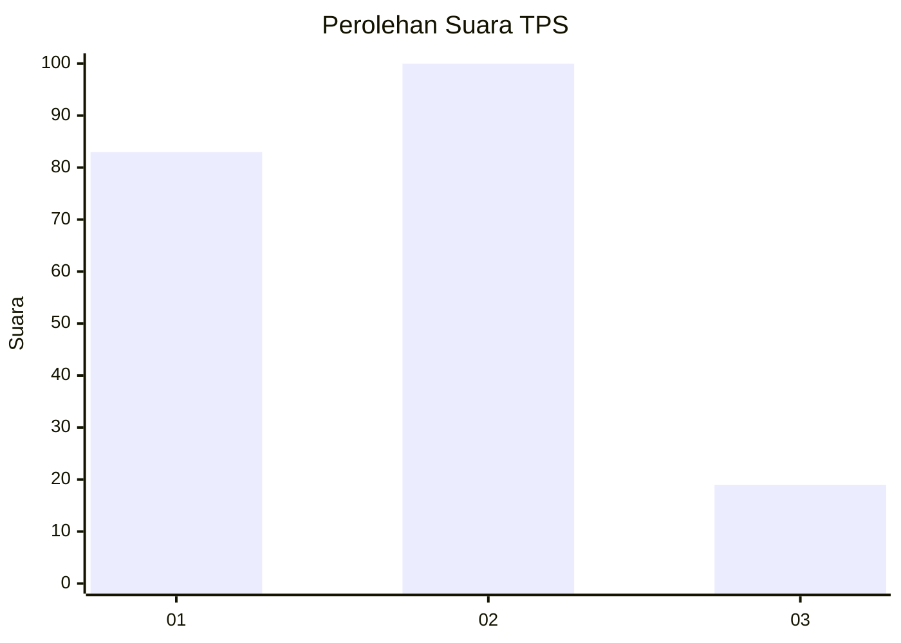
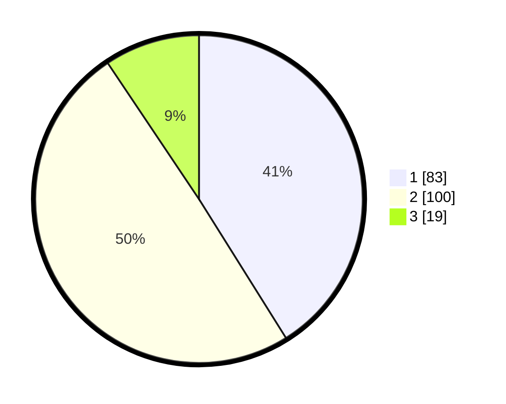

# Hasil

## Grafik

## Tabel

| No. | Nama Paslon    | Suara | Suara (raw) | Persentase |
|:--- |:-------------- | -----:| -----------:| ----------:|
| 1   | ANIES MUHAIMIN | 83    | [83][p-1]   | 41,09      |
| 2   | PRABOWO GIBRAN | 100   | [100][p-2]  | 49,50      |
| 3   | GANJAR MAHFUD  | 19    | [19][p-3]   | 9,41       |

[p-1]: https://github.com/gigit-pemilu/pemilu-2024-32-jawa-barat/blob/main/pilpres/hitung-suara/sub/32-jawa-barat/sub/75-kota-bekasi/sub/11-mustikajaya/sub/1001-padurenan/sub/004-tps/sub/paslon-1.txt
[p-2]: https://github.com/gigit-pemilu/pemilu-2024-32-jawa-barat/blob/main/pilpres/hitung-suara/sub/32-jawa-barat/sub/75-kota-bekasi/sub/11-mustikajaya/sub/1001-padurenan/sub/004-tps/sub/paslon-2.txt
[p-3]: https://github.com/gigit-pemilu/pemilu-2024-32-jawa-barat/blob/main/pilpres/hitung-suara/sub/32-jawa-barat/sub/75-kota-bekasi/sub/11-mustikajaya/sub/1001-padurenan/sub/004-tps/sub/paslon-3.txt

## Foto C Plano

https://sirekap-obj-formc.kpu.go.id/048a/pemilu/ppwp/32/75/11/10/01/3275111001004-20240215-012644--221b4c41-98a1-4a35-ae2f-b93f835ab89d.jpg

https://sirekap-obj-formc.kpu.go.id/048a/pemilu/ppwp/32/75/11/10/01/3275111001004-20240215-014901--247e3120-dacb-4dfb-bbc7-d534ce9238f2.jpg

https://sirekap-obj-formc.kpu.go.id/048a/pemilu/ppwp/32/75/11/10/01/3275111001004-20240215-014338--6da748e9-0024-422b-a427-f82429beff8e.jpg

## Metadata

| Key        | Value               |
| ---------- | ------------------- |
| Time Stamp | 2024-02-24 22:31:28 |

