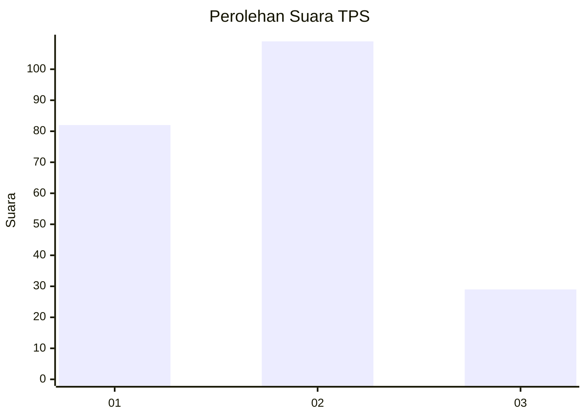
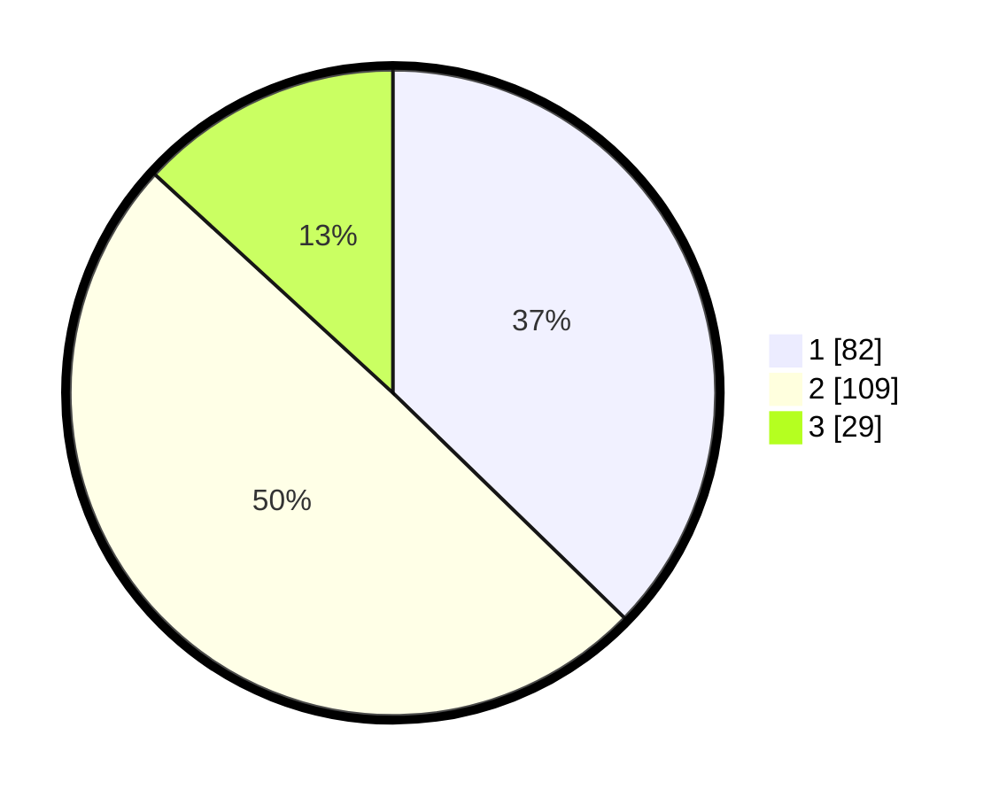

# Hasil

## Grafik

## Tabel

| No. | Nama Paslon    | Suara | Suara (raw) | Persentase |
|:--- |:-------------- | -----:| -----------:| ----------:|
| 1   | ANIES MUHAIMIN | 82    | [82][p-1]   | 37,27      |
| 2   | PRABOWO GIBRAN | 109   | [109][p-2]  | 49,55      |
| 3   | GANJAR MAHFUD  | 29    | [29][p-3]   | 13,18      |

[p-1]: https://github.com/gigit-pemilu/pemilu-2024-32-jawa-barat/blob/main/pilpres/hitung-suara/sub/32-jawa-barat/sub/75-kota-bekasi/sub/11-mustikajaya/sub/1001-padurenan/sub/005-tps/sub/paslon-1.txt
[p-2]: https://github.com/gigit-pemilu/pemilu-2024-32-jawa-barat/blob/main/pilpres/hitung-suara/sub/32-jawa-barat/sub/75-kota-bekasi/sub/11-mustikajaya/sub/1001-padurenan/sub/005-tps/sub/paslon-2.txt
[p-3]: https://github.com/gigit-pemilu/pemilu-2024-32-jawa-barat/blob/main/pilpres/hitung-suara/sub/32-jawa-barat/sub/75-kota-bekasi/sub/11-mustikajaya/sub/1001-padurenan/sub/005-tps/sub/paslon-3.txt

## Foto C Plano

https://sirekap-obj-formc.kpu.go.id/d6fe/pemilu/ppwp/32/75/11/10/01/3275111001005-20240214-222023--df1e586a-22f4-47a3-9cb2-8cd40e5837bd.jpg

https://sirekap-obj-formc.kpu.go.id/d6fe/pemilu/ppwp/32/75/11/10/01/3275111001005-20240214-222340--de93ab5b-a33c-4a89-a914-7589b4691671.jpg

https://sirekap-obj-formc.kpu.go.id/d6fe/pemilu/ppwp/32/75/11/10/01/3275111001005-20240214-222545--70dbe31a-1baa-43b3-8c77-6b3d1d43a4da.jpg

## Metadata

| Key        | Value               |
| ---------- | ------------------- |
| Time Stamp | 2024-02-25 18:00:00 |

