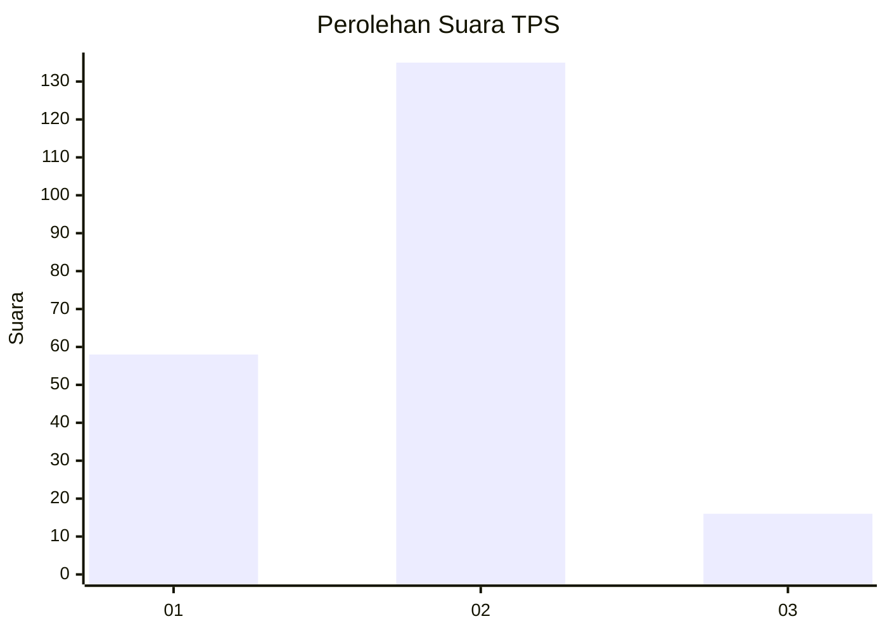
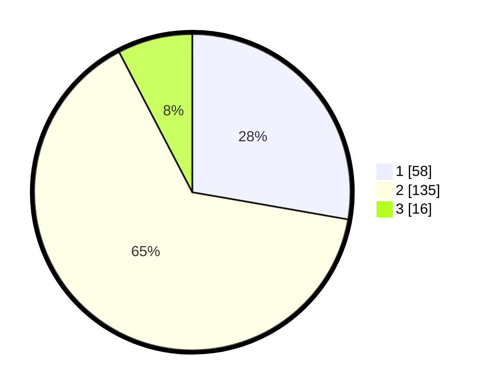

# Hasil

## Grafik

## Tabel

| No. | Nama Paslon    | Suara | Suara (raw) | Persentase |
|:--- |:-------------- | -----:| -----------:| ----------:|
| 1   | ANIES MUHAIMIN | 58    | [58][p-1]   | 27,75      |
| 2   | PRABOWO GIBRAN | 135   | [135][p-2]  | 64,59      |
| 3   | GANJAR MAHFUD  | 16    | [16][p-3]   | 7,66       |

[p-1]: https://github.com/gigit-pemilu/pemilu-2024/blob/main/pilpres/hitung-suara/sub/32-jawa-barat/sub/75-kota-bekasi/sub/11-mustikajaya/sub/1001-padurenan/sub/007-tps/sub/paslon-1.txt
[p-2]: https://github.com/gigit-pemilu/pemilu-2024/blob/main/pilpres/hitung-suara/sub/32-jawa-barat/sub/75-kota-bekasi/sub/11-mustikajaya/sub/1001-padurenan/sub/007-tps/sub/paslon-2.txt
[p-3]: https://github.com/gigit-pemilu/pemilu-2024/blob/main/pilpres/hitung-suara/sub/32-jawa-barat/sub/75-kota-bekasi/sub/11-mustikajaya/sub/1001-padurenan/sub/007-tps/sub/paslon-3.txt

## Foto C Plano

https://sirekap-obj-formc.kpu.go.id/a4ac/pemilu/ppwp/32/75/11/10/01/3275111001007-20240215-004644--066ca650-c9a0-45b9-ab2a-f68f8afff997.jpg

https://sirekap-obj-formc.kpu.go.id/a4ac/pemilu/ppwp/32/75/11/10/01/3275111001007-20240215-005612--8b2baffd-c149-4e6f-b001-b2d3aa2e4f29.jpg

https://sirekap-obj-formc.kpu.go.id/a4ac/pemilu/ppwp/32/75/11/10/01/3275111001007-20240215-010624--0ab6b19d-0a36-4764-b985-f8e45231925a.jpg

## Metadata

| Key        | Value               |
| ---------- | ------------------- |
| Time Stamp | 2024-02-25 16:00:00 |

