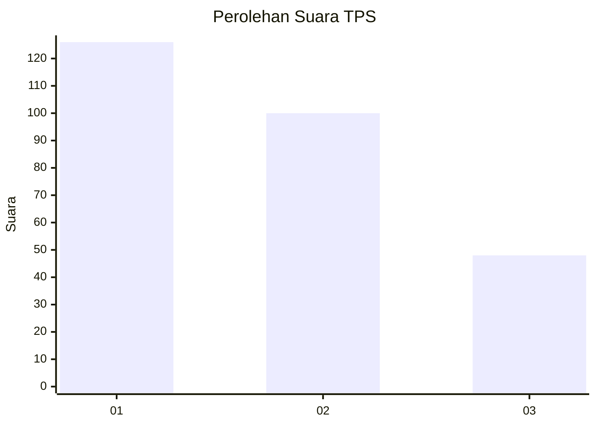
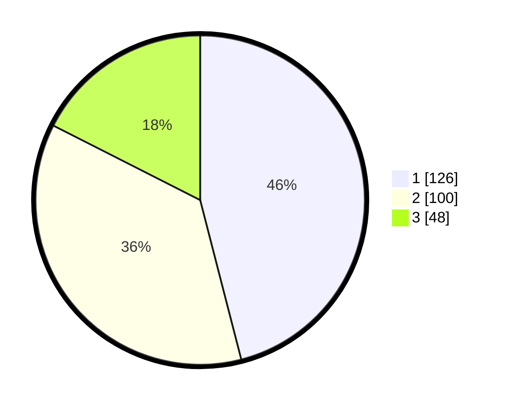

# Hasil

## Grafik

## Tabel

| No. | Nama Paslon    | Suara | Suara (raw) | Persentase |
|:--- |:-------------- | -----:| -----------:| ----------:|
| 1   | ANIES MUHAIMIN | 126   | [126][p-1]  | 45,99      |
| 2   | PRABOWO GIBRAN | 100   | [100][p-2]  | 36,50      |
| 3   | GANJAR MAHFUD  | 48    | [48][p-3]   | 17,52      |

[p-1]: https://github.com/gigit-pemilu/pemilu-2024/blob/main/pilpres/hitung-suara/sub/32-jawa-barat/sub/75-kota-bekasi/sub/11-mustikajaya/sub/1001-padurenan/sub/142-tps/sub/paslon-1.txt
[p-2]: https://github.com/gigit-pemilu/pemilu-2024/blob/main/pilpres/hitung-suara/sub/32-jawa-barat/sub/75-kota-bekasi/sub/11-mustikajaya/sub/1001-padurenan/sub/142-tps/sub/paslon-2.txt
[p-3]: https://github.com/gigit-pemilu/pemilu-2024/blob/main/pilpres/hitung-suara/sub/32-jawa-barat/sub/75-kota-bekasi/sub/11-mustikajaya/sub/1001-padurenan/sub/142-tps/sub/paslon-3.txt

## Foto C Plano

https://sirekap-obj-formc.kpu.go.id/bc7d/pemilu/ppwp/32/75/11/10/01/3275111001142-20240214-221314--42ee6b8a-a9c5-4e5e-8f94-37edbc39f726.jpg

https://sirekap-obj-formc.kpu.go.id/bc7d/pemilu/ppwp/32/75/11/10/01/3275111001142-20240214-221350--2d2c737a-4d6f-4361-8343-96bbcb1dc1f8.jpg

https://sirekap-obj-formc.kpu.go.id/bc7d/pemilu/ppwp/32/75/11/10/01/3275111001142-20240214-190515--9a63a060-4c21-4ca9-acdd-8f5f27399fe3.jpg

## Metadata

| Key        | Value               |
| ---------- | ------------------- |
| Time Stamp | 2024-02-15 23:29:50 |

