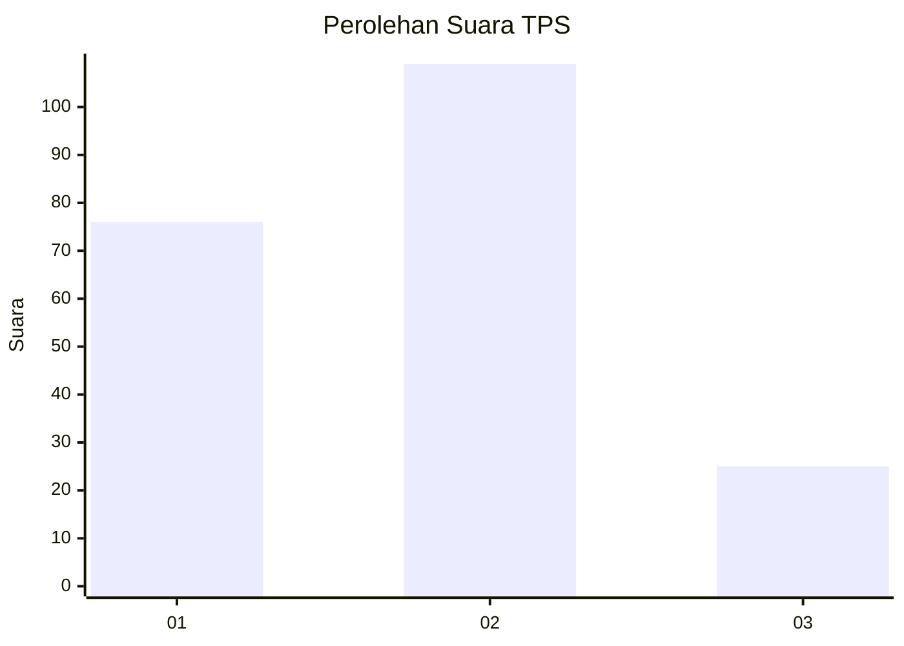
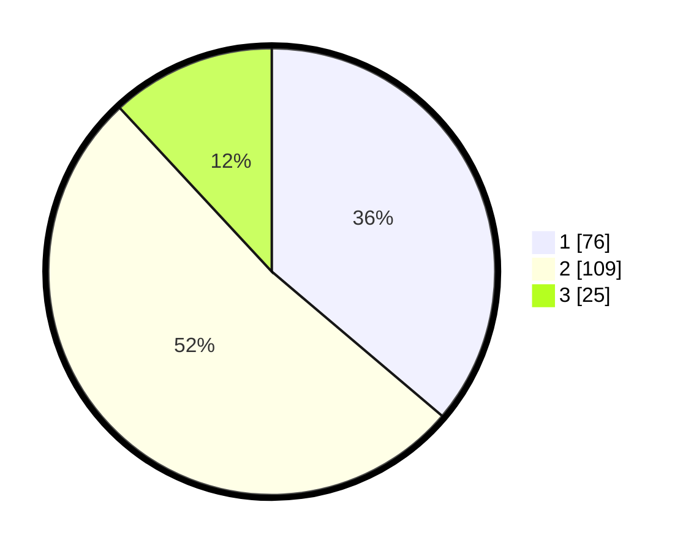

# Hasil

## Grafik

## Tabel

| No. | Nama Paslon    | Suara | Suara (raw) | Persentase |
|:--- |:-------------- | -----:| -----------:| ----------:|
| 1   | ANIES MUHAIMIN | 76    | [76][p-1]   | 36,19      |
| 2   | PRABOWO GIBRAN | 109   | [109][p-2]  | 51,90      |
| 3   | GANJAR MAHFUD  | 25    | [25][p-3]   | 11,90      |

[p-1]: https://github.com/gigit-pemilu/pemilu-2024-32-jawa-barat/blob/main/pilpres/hitung-suara/sub/32-jawa-barat/sub/75-kota-bekasi/sub/12-pondokmelati/sub/1001-jatirahayu/sub/022-tps/sub/paslon-1.txt
[p-2]: https://github.com/gigit-pemilu/pemilu-2024-32-jawa-barat/blob/main/pilpres/hitung-suara/sub/32-jawa-barat/sub/75-kota-bekasi/sub/12-pondokmelati/sub/1001-jatirahayu/sub/022-tps/sub/paslon-2.txt
[p-3]: https://github.com/gigit-pemilu/pemilu-2024-32-jawa-barat/blob/main/pilpres/hitung-suara/sub/32-jawa-barat/sub/75-kota-bekasi/sub/12-pondokmelati/sub/1001-jatirahayu/sub/022-tps/sub/paslon-3.txt

## Foto C Plano

https://sirekap-obj-formc.kpu.go.id/f20c/pemilu/ppwp/32/75/12/10/01/3275121001022-20240214-233948--fbd8c824-1b9c-46fa-ae60-04184382b3f4.jpg

https://sirekap-obj-formc.kpu.go.id/f20c/pemilu/ppwp/32/75/12/10/01/3275121001022-20240214-213839--688ef4be-a219-497f-8740-5f766e64c077.jpg

https://sirekap-obj-formc.kpu.go.id/f20c/pemilu/ppwp/32/75/12/10/01/3275121001022-20240214-214001--5bea94eb-7b96-4a09-a17a-1b325ba57fff.jpg

## Metadata

| Key        | Value               |
| ---------- | ------------------- |
| Time Stamp | 2024-02-25 11:00:00 |

