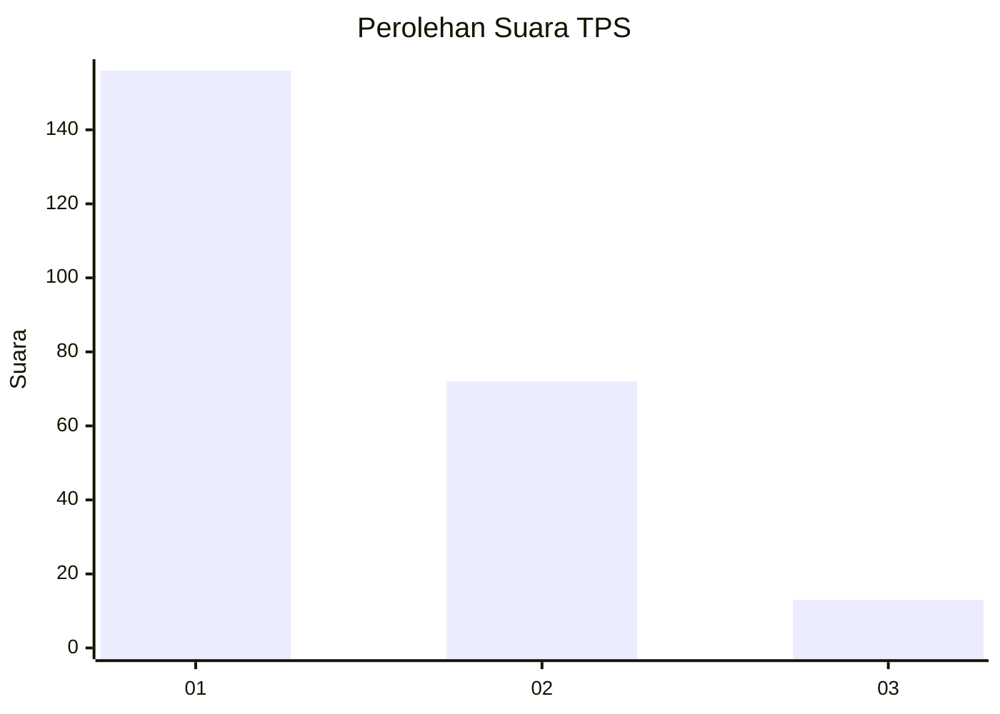
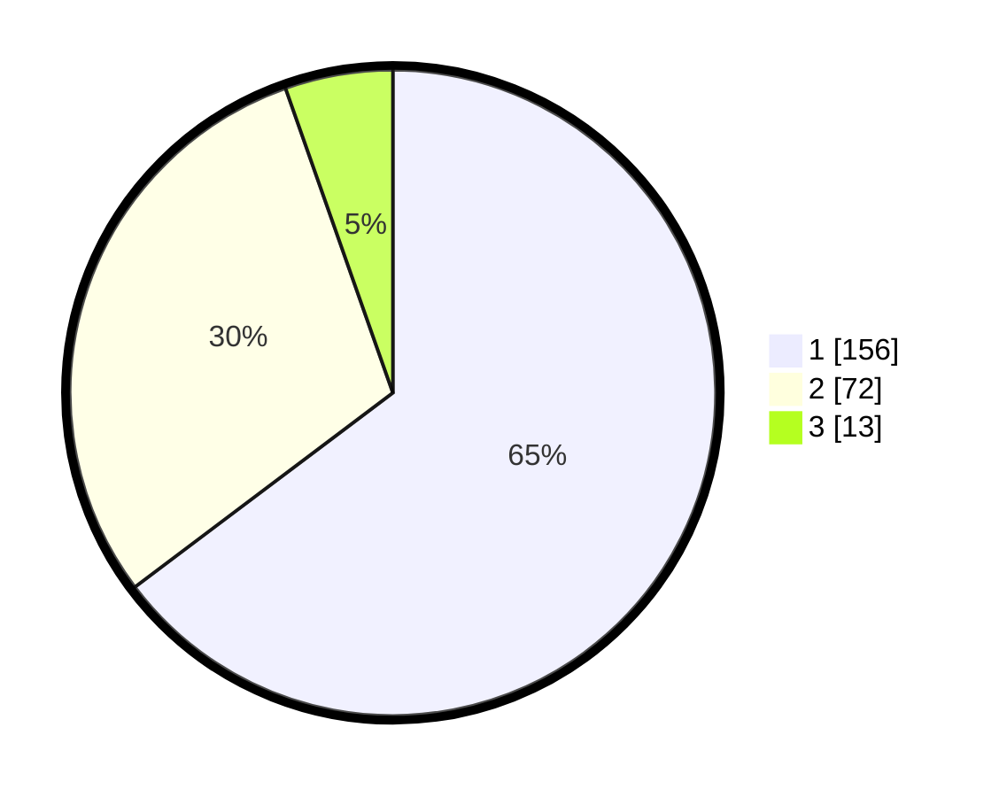

# Hasil

## Grafik

## Tabel

| No. | Nama Paslon    | Suara | Suara (raw) | Persentase |
|:--- |:-------------- | -----:| -----------:| ----------:|
| 1   | ANIES MUHAIMIN | 156   | [156][p-1]  | 64,73      |
| 2   | PRABOWO GIBRAN | 72    | [72][p-2]   | 29,88      |
| 3   | GANJAR MAHFUD  | 13    | [13][p-3]   | 5,39       |

[p-1]: https://github.com/gigit-pemilu/pemilu-2024/blob/main/pilpres/hitung-suara/sub/32-jawa-barat/sub/76-kota-depok/sub/01-pancoran-mas/sub/1006-depok/sub/096-tps/sub/paslon-1.txt
[p-2]: https://github.com/gigit-pemilu/pemilu-2024/blob/main/pilpres/hitung-suara/sub/32-jawa-barat/sub/76-kota-depok/sub/01-pancoran-mas/sub/1006-depok/sub/096-tps/sub/paslon-2.txt
[p-3]: https://github.com/gigit-pemilu/pemilu-2024/blob/main/pilpres/hitung-suara/sub/32-jawa-barat/sub/76-kota-depok/sub/01-pancoran-mas/sub/1006-depok/sub/096-tps/sub/paslon-3.txt

## Foto C Plano

https://sirekap-obj-formc.kpu.go.id/994c/pemilu/ppwp/32/76/01/10/06/3276011006096-20240216-161610--b9db5ac2-3b11-4025-b8ef-d7dd04b329b0.jpg

https://sirekap-obj-formc.kpu.go.id/994c/pemilu/ppwp/32/76/01/10/06/3276011006096-20240216-142925--ab0de196-2f0d-4496-992e-03c722b5340a.jpg

https://sirekap-obj-formc.kpu.go.id/994c/pemilu/ppwp/32/76/01/10/06/3276011006096-20240216-142933--42daf8f0-fa1e-472b-9315-53618af62dd1.jpg

## Metadata

| Key        | Value               |
| ---------- | ------------------- |
| Time Stamp | 2024-02-19 06:16:00 |

