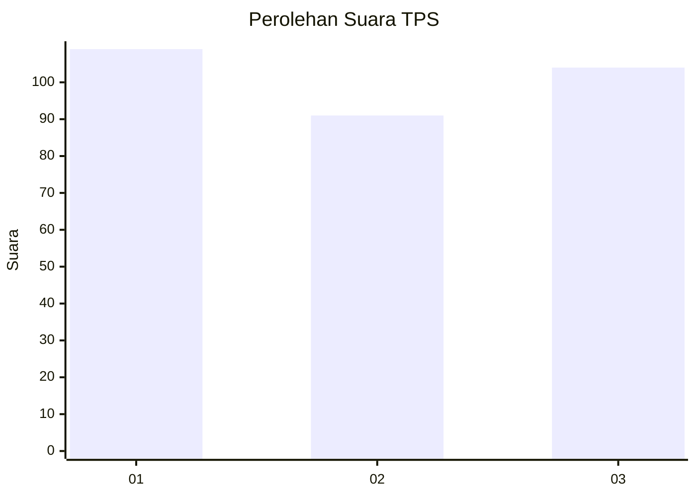
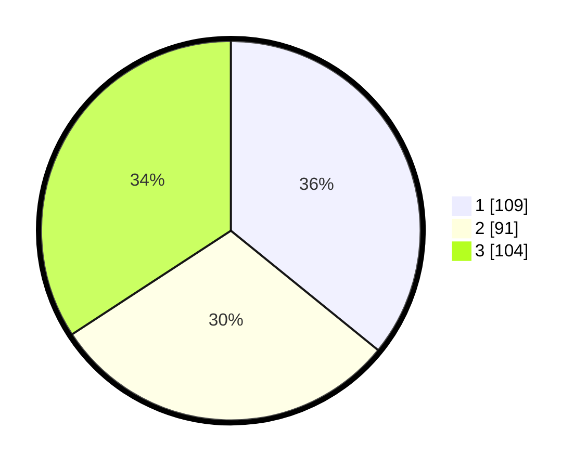

# Hasil

## Grafik

## Tabel

| No. | Nama Paslon    | Suara | Suara (raw) | Persentase |
|:--- |:-------------- | -----:| -----------:| ----------:|
| 1   | ANIES MUHAIMIN | 109   | [109][p-1]  | 35,86      |
| 2   | PRABOWO GIBRAN | 91    | [91][p-2]   | 29,93      |
| 3   | GANJAR MAHFUD  | 104   | [104][p-3]  | 34,21      |

[p-1]: https://github.com/gigit-pemilu/pemilu-2024/blob/main/pilpres/hitung-suara/sub/32-jawa-barat/sub/76-kota-depok/sub/01-pancoran-mas/sub/1010-rangkapan-jaya-baru/sub/074-tps/sub/paslon-1.txt
[p-2]: https://github.com/gigit-pemilu/pemilu-2024/blob/main/pilpres/hitung-suara/sub/32-jawa-barat/sub/76-kota-depok/sub/01-pancoran-mas/sub/1010-rangkapan-jaya-baru/sub/074-tps/sub/paslon-2.txt
[p-3]: https://github.com/gigit-pemilu/pemilu-2024/blob/main/pilpres/hitung-suara/sub/32-jawa-barat/sub/76-kota-depok/sub/01-pancoran-mas/sub/1010-rangkapan-jaya-baru/sub/074-tps/sub/paslon-3.txt

## Foto C Plano

https://sirekap-obj-formc.kpu.go.id/cc5e/pemilu/ppwp/32/76/01/10/10/3276011010074-20240219-080304--baff04cd-cc80-45ca-9906-2b3ac0f7afd5.jpg

https://sirekap-obj-formc.kpu.go.id/cc5e/pemilu/ppwp/32/76/01/10/10/3276011010074-20240216-181002--4f68159d-66f8-4485-a67b-8160fc73d44e.jpg

https://sirekap-obj-formc.kpu.go.id/cc5e/pemilu/ppwp/32/76/01/10/10/3276011010074-20240216-181052--6c405ede-f48e-4816-91e9-83200060c4d8.jpg

## Metadata

| Key        | Value               |
| ---------- | ------------------- |
| Time Stamp | 2024-02-19 09:00:00 |

