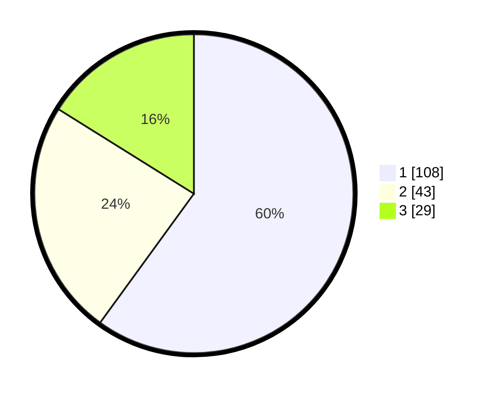

# Hasil

## Grafik

## Tabel

| No. | Nama Paslon    | Suara | Suara (raw) | Persentase |
|:--- |:-------------- | -----:| -----------:| ----------:|
| 1   | ANIES MUHAIMIN | 108   | [108][p-1]  | 60,00      |
| 2   | PRABOWO GIBRAN | 43    | [43][p-2]   | 23,89      |
| 3   | GANJAR MAHFUD  | 29    | [29][p-3]   | 16,11      |

[p-1]: https://github.com/gigit-pemilu/pemilu-2024/blob/main/pilpres/hitung-suara/sub/32-jawa-barat/sub/76-kota-depok/sub/02-cimanggis/sub/1007-harjamukti/sub/059-tps/sub/paslon-1.txt
[p-2]: https://github.com/gigit-pemilu/pemilu-2024/blob/main/pilpres/hitung-suara/sub/32-jawa-barat/sub/76-kota-depok/sub/02-cimanggis/sub/1007-harjamukti/sub/059-tps/sub/paslon-2.txt
[p-3]: https://github.com/gigit-pemilu/pemilu-2024/blob/main/pilpres/hitung-suara/sub/32-jawa-barat/sub/76-kota-depok/sub/02-cimanggis/sub/1007-harjamukti/sub/059-tps/sub/paslon-3.txt

## Foto C Plano

https://sirekap-obj-formc.kpu.go.id/3367/pemilu/ppwp/32/76/02/10/07/3276021007059-20240215-002719--f2236d69-f823-43ab-8906-347dd06ed8aa.jpg

https://sirekap-obj-formc.kpu.go.id/3367/pemilu/ppwp/32/76/02/10/07/3276021007059-20240215-002934--3e5ac918-f541-4527-aa96-40b7a054b597.jpg

https://sirekap-obj-formc.kpu.go.id/3367/pemilu/ppwp/32/76/02/10/07/3276021007059-20240215-003430--82854329-e8fe-423d-8cf7-d6212ac777e7.jpg

## Metadata

| Key        | Value               |
| ---------- | ------------------- |
| Time Stamp | 2024-02-20 13:00:00 |

