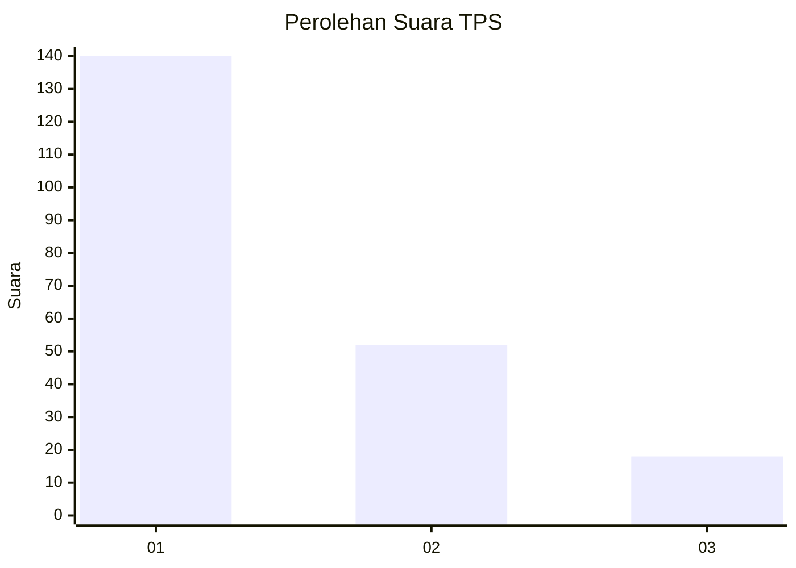
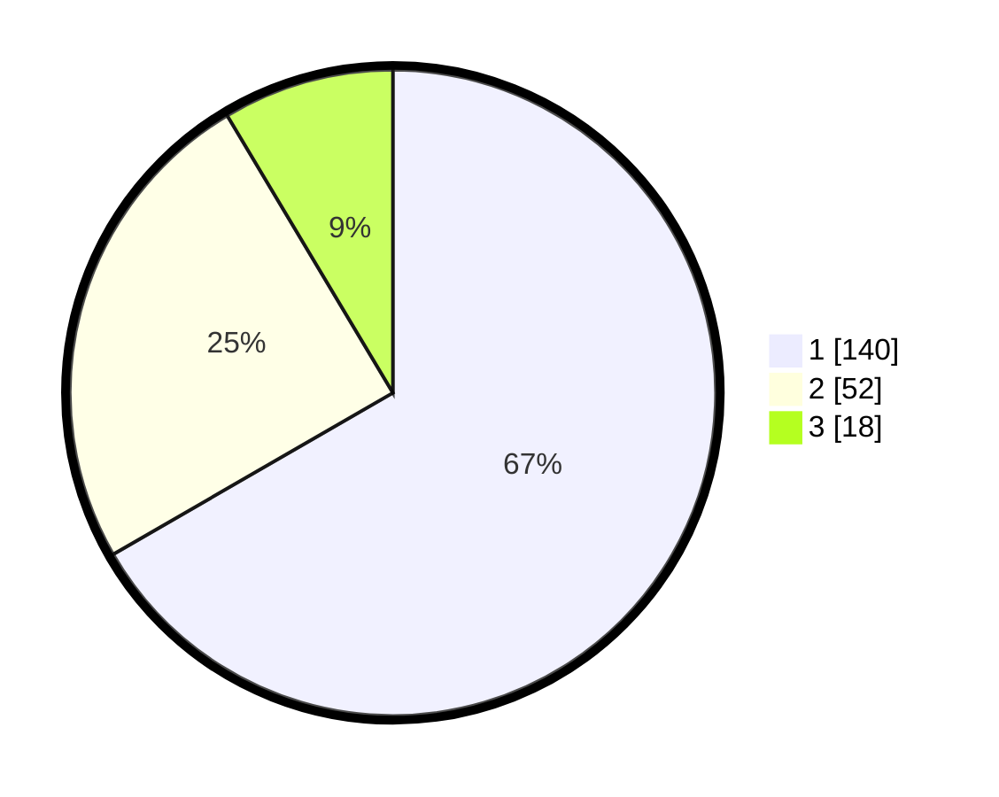

# Hasil

## Grafik

## Tabel

| No. | Nama Paslon    | Suara | Suara (raw) | Persentase |
|:--- |:-------------- | -----:| -----------:| ----------:|
| 1   | ANIES MUHAIMIN | 140   | [140][p-1]  | 66,67      |
| 2   | PRABOWO GIBRAN | 52    | [52][p-2]   | 24,76      |
| 3   | GANJAR MAHFUD  | 18    | [18][p-3]   | 8,57       |

[p-1]: https://github.com/gigit-pemilu/pemilu-2024/blob/main/pilpres/hitung-suara/sub/32-jawa-barat/sub/76-kota-depok/sub/02-cimanggis/sub/1009-tugu/sub/190-tps/sub/paslon-1.txt
[p-2]: https://github.com/gigit-pemilu/pemilu-2024/blob/main/pilpres/hitung-suara/sub/32-jawa-barat/sub/76-kota-depok/sub/02-cimanggis/sub/1009-tugu/sub/190-tps/sub/paslon-2.txt
[p-3]: https://github.com/gigit-pemilu/pemilu-2024/blob/main/pilpres/hitung-suara/sub/32-jawa-barat/sub/76-kota-depok/sub/02-cimanggis/sub/1009-tugu/sub/190-tps/sub/paslon-3.txt

## Foto C Plano

https://sirekap-obj-formc.kpu.go.id/9aca/pemilu/ppwp/32/76/02/10/09/3276021009190-20240214-225954--6f1a2b05-c89a-4b17-a823-bbe77d5936c0.jpg

https://sirekap-obj-formc.kpu.go.id/9aca/pemilu/ppwp/32/76/02/10/09/3276021009190-20240214-230406--84845859-3a7c-433b-abcb-7d5669cdc3c7.jpg

https://sirekap-obj-formc.kpu.go.id/9aca/pemilu/ppwp/32/76/02/10/09/3276021009190-20240218-203647--16991b09-d5bc-473e-a70c-caaf174c2167.jpg

## Metadata

| Key        | Value               |
| ---------- | ------------------- |
| Time Stamp | 2024-02-19 06:16:00 |

