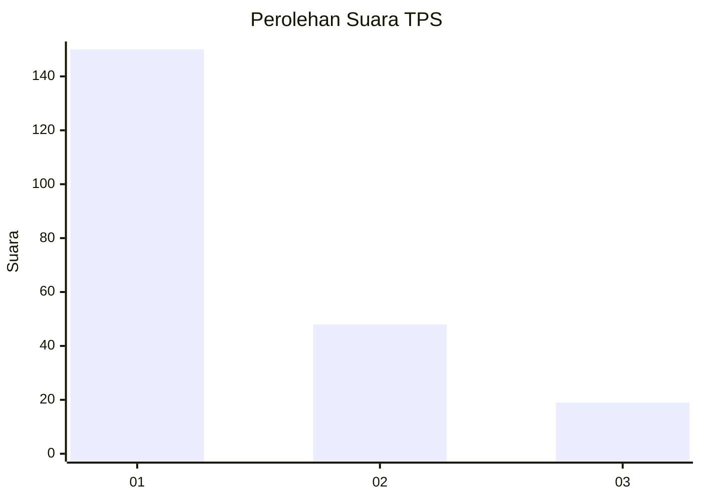
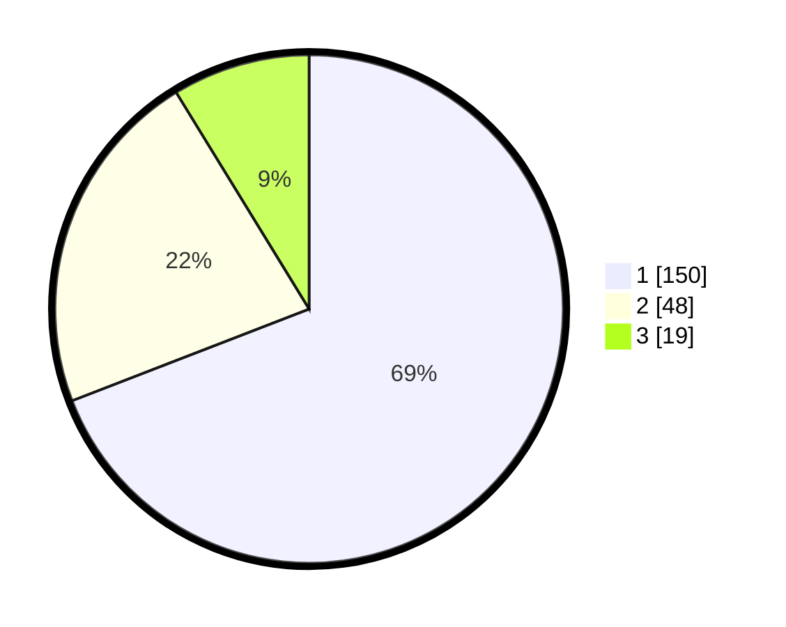

# Hasil

## Grafik

## Tabel

| No. | Nama Paslon    | Suara | Suara (raw) | Persentase |
|:--- |:-------------- | -----:| -----------:| ----------:|
| 1   | ANIES MUHAIMIN | 150   | [150][p-1]  | 69,12      |
| 2   | PRABOWO GIBRAN | 48    | [48][p-2]   | 22,12      |
| 3   | GANJAR MAHFUD  | 19    | [19][p-3]   | 8,76       |

[p-1]: https://github.com/gigit-pemilu/pemilu-2024/blob/main/pilpres/hitung-suara/sub/32-jawa-barat/sub/76-kota-depok/sub/02-cimanggis/sub/1009-tugu/sub/213-tps/sub/paslon-1.txt
[p-2]: https://github.com/gigit-pemilu/pemilu-2024/blob/main/pilpres/hitung-suara/sub/32-jawa-barat/sub/76-kota-depok/sub/02-cimanggis/sub/1009-tugu/sub/213-tps/sub/paslon-2.txt
[p-3]: https://github.com/gigit-pemilu/pemilu-2024/blob/main/pilpres/hitung-suara/sub/32-jawa-barat/sub/76-kota-depok/sub/02-cimanggis/sub/1009-tugu/sub/213-tps/sub/paslon-3.txt

## Foto C Plano

https://sirekap-obj-formc.kpu.go.id/6d2e/pemilu/ppwp/32/76/02/10/09/3276021009213-20240215-223517--da1a4262-b925-4f05-bb83-c33f1459cd41.jpg

https://sirekap-obj-formc.kpu.go.id/6d2e/pemilu/ppwp/32/76/02/10/09/3276021009213-20240215-035043--9b2e3193-b08b-4413-80b0-dce8cbd3fc44.jpg

https://sirekap-obj-formc.kpu.go.id/6d2e/pemilu/ppwp/32/76/02/10/09/3276021009213-20240215-035051--3308424b-d80d-4436-b4a5-f61559067d1a.jpg

## Metadata

| Key        | Value               |
| ---------- | ------------------- |
| Time Stamp | 2024-02-15 22:40:13 |

