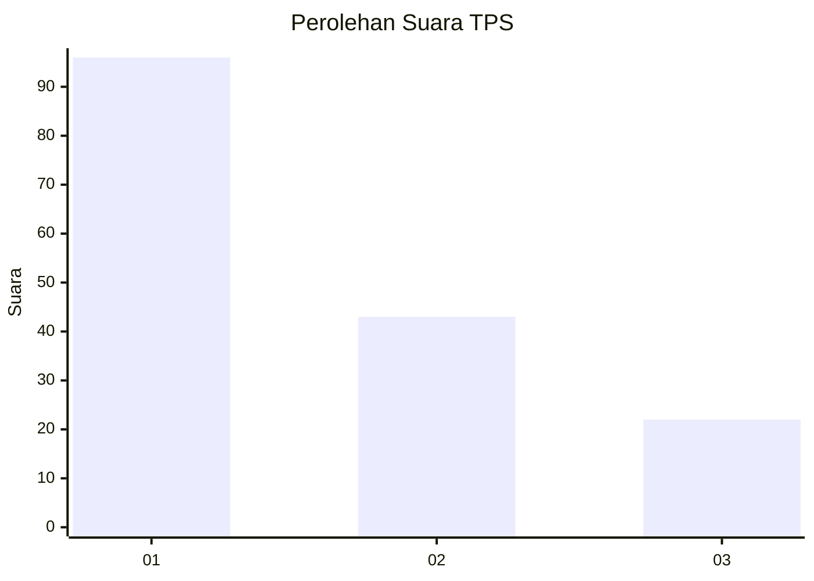
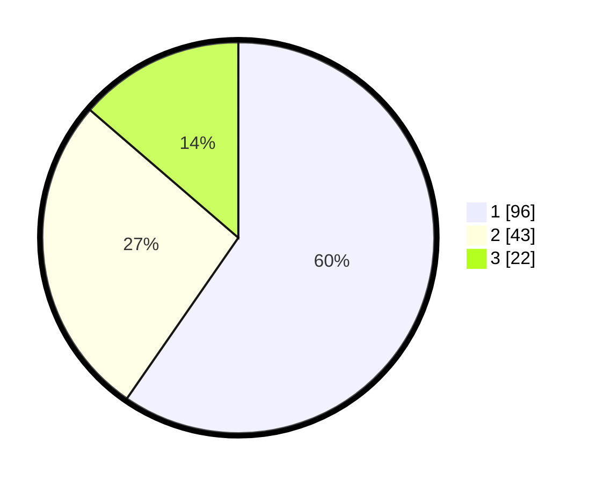

# Hasil

## Grafik

## Tabel

| No. | Nama Paslon    | Suara | Suara (raw) | Persentase |
|:--- |:-------------- | -----:| -----------:| ----------:|
| 1   | ANIES MUHAIMIN | 96    | [96][p-1]   | 59,63      |
| 2   | PRABOWO GIBRAN | 43    | [43][p-2]   | 26,71      |
| 3   | GANJAR MAHFUD  | 22    | [22][p-3]   | 13,66      |

[p-1]: https://github.com/gigit-pemilu/pemilu-2024-32-jawa-barat/blob/main/pilpres/hitung-suara/sub/32-jawa-barat/sub/76-kota-depok/sub/02-cimanggis/sub/1009-tugu/sub/235-tps/sub/paslon-1.txt
[p-2]: https://github.com/gigit-pemilu/pemilu-2024-32-jawa-barat/blob/main/pilpres/hitung-suara/sub/32-jawa-barat/sub/76-kota-depok/sub/02-cimanggis/sub/1009-tugu/sub/235-tps/sub/paslon-2.txt
[p-3]: https://github.com/gigit-pemilu/pemilu-2024-32-jawa-barat/blob/main/pilpres/hitung-suara/sub/32-jawa-barat/sub/76-kota-depok/sub/02-cimanggis/sub/1009-tugu/sub/235-tps/sub/paslon-3.txt

## Foto C Plano

https://sirekap-obj-formc.kpu.go.id/cb4b/pemilu/ppwp/32/76/02/10/09/3276021009235-20240215-002001--7105e2ad-0084-473c-b5b9-9e0a97d37906.jpg

https://sirekap-obj-formc.kpu.go.id/cb4b/pemilu/ppwp/32/76/02/10/09/3276021009235-20240215-002036--5013287c-764f-496c-ac02-32ecfb9cbf02.jpg

https://sirekap-obj-formc.kpu.go.id/cb4b/pemilu/ppwp/32/76/02/10/09/3276021009235-20240215-002114--af8b22ed-4d73-442a-8220-a63a429e623b.jpg

## Metadata

| Key        | Value               |
| ---------- | ------------------- |
| Time Stamp | 2024-02-15 16:00:26 |

