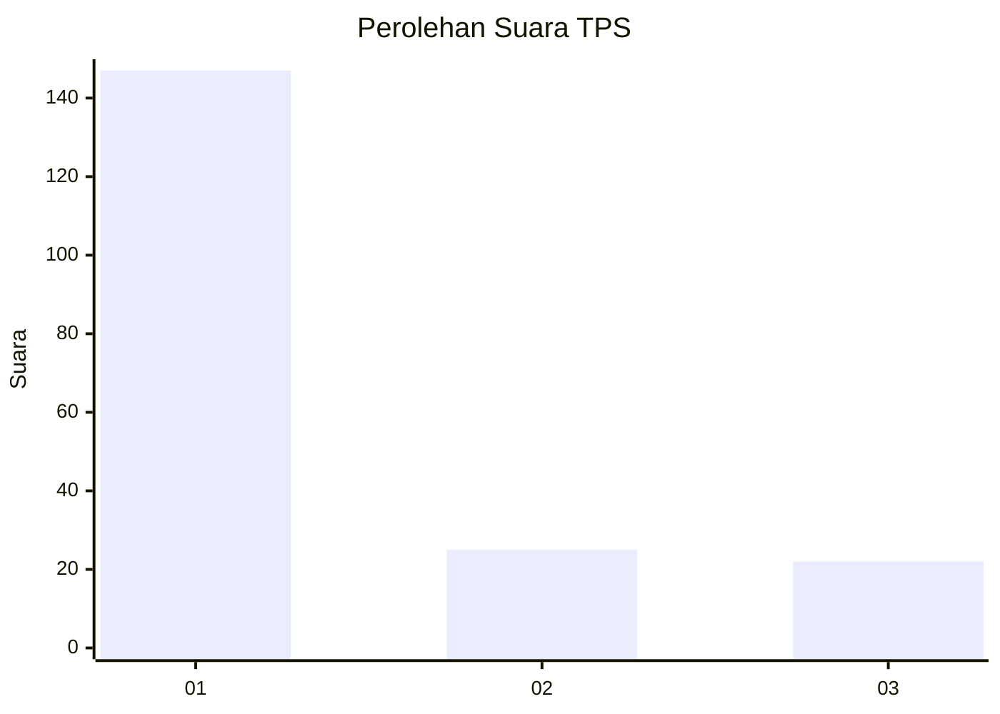
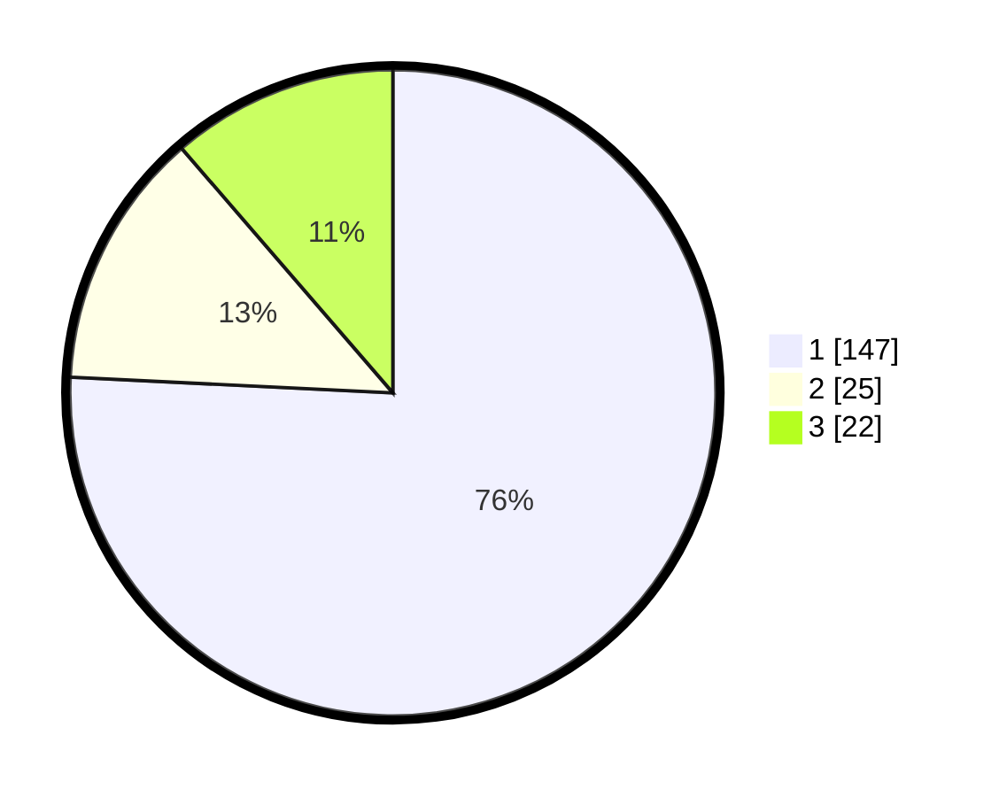

# Hasil

## Grafik

## Tabel

| No. | Nama Paslon    | Suara | Suara (raw) | Persentase |
|:--- |:-------------- | -----:| -----------:| ----------:|
| 1   | ANIES MUHAIMIN | 147   | [147][p-1]  | 75,77      |
| 2   | PRABOWO GIBRAN | 25    | [25][p-2]   | 12,89      |
| 3   | GANJAR MAHFUD  | 22    | [22][p-3]   | 11,34      |

[p-1]: https://github.com/gigit-pemilu/pemilu-2024/blob/main/pilpres/hitung-suara/sub/32-jawa-barat/sub/76-kota-depok/sub/02-cimanggis/sub/1009-tugu/sub/249-tps/sub/paslon-1.txt
[p-2]: https://github.com/gigit-pemilu/pemilu-2024/blob/main/pilpres/hitung-suara/sub/32-jawa-barat/sub/76-kota-depok/sub/02-cimanggis/sub/1009-tugu/sub/249-tps/sub/paslon-2.txt
[p-3]: https://github.com/gigit-pemilu/pemilu-2024/blob/main/pilpres/hitung-suara/sub/32-jawa-barat/sub/76-kota-depok/sub/02-cimanggis/sub/1009-tugu/sub/249-tps/sub/paslon-3.txt

## Foto C Plano

https://sirekap-obj-formc.kpu.go.id/c4c6/pemilu/ppwp/32/76/02/10/09/3276021009249-20240214-205441--9b227f4d-d8eb-4fe8-8848-24b805db996e.jpg

https://sirekap-obj-formc.kpu.go.id/c4c6/pemilu/ppwp/32/76/02/10/09/3276021009249-20240214-205124--af69da83-7336-479f-b89b-4c703ce78cf3.jpg

https://sirekap-obj-formc.kpu.go.id/c4c6/pemilu/ppwp/32/76/02/10/09/3276021009249-20240214-205231--cf400c37-8d6b-4d42-9444-8f0e24b37c84.jpg

## Metadata

| Key        | Value               |
| ---------- | ------------------- |
| Time Stamp | 2024-02-16 16:25:10 |

