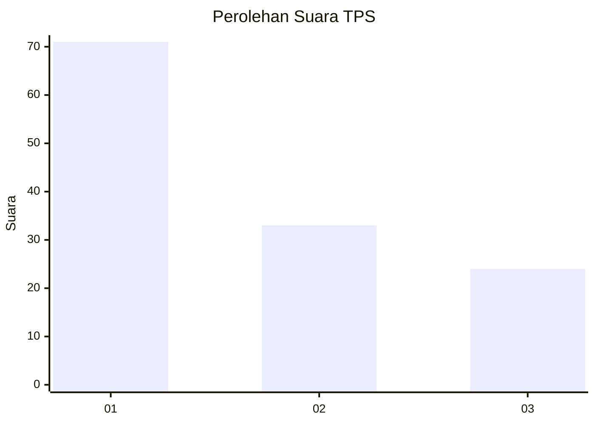
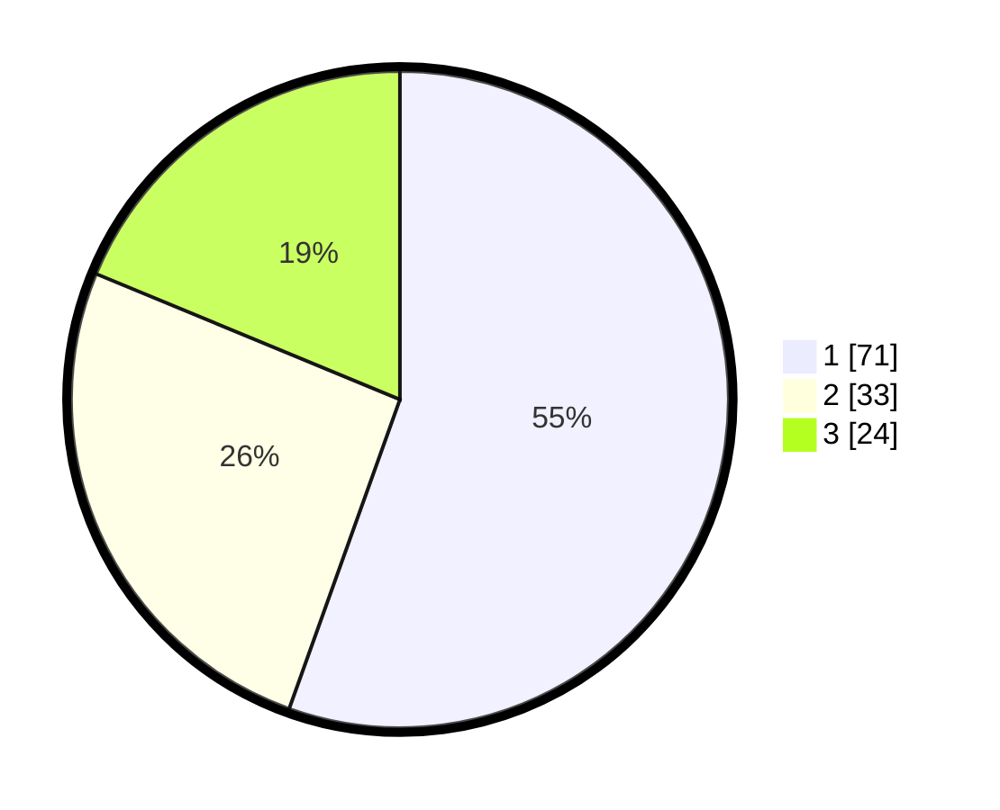

# Hasil

## Grafik

## Tabel

| No. | Nama Paslon    | Suara | Suara (raw) | Persentase |
|:--- |:-------------- | -----:| -----------:| ----------:|
| 1   | ANIES MUHAIMIN | 71    | [71][p-1]   | 55,47      |
| 2   | PRABOWO GIBRAN | 33    | [33][p-2]   | 25,78      |
| 3   | GANJAR MAHFUD  | 24    | [24][p-3]   | 18,75      |

[p-1]: https://github.com/gigit-pemilu/pemilu-2024/blob/main/pilpres/hitung-suara/sub/32-jawa-barat/sub/76-kota-depok/sub/02-cimanggis/sub/1010-mekarsari/sub/139-tps/sub/paslon-1.txt
[p-2]: https://github.com/gigit-pemilu/pemilu-2024/blob/main/pilpres/hitung-suara/sub/32-jawa-barat/sub/76-kota-depok/sub/02-cimanggis/sub/1010-mekarsari/sub/139-tps/sub/paslon-2.txt
[p-3]: https://github.com/gigit-pemilu/pemilu-2024/blob/main/pilpres/hitung-suara/sub/32-jawa-barat/sub/76-kota-depok/sub/02-cimanggis/sub/1010-mekarsari/sub/139-tps/sub/paslon-3.txt

## Foto C Plano

https://sirekap-obj-formc.kpu.go.id/918b/pemilu/ppwp/32/76/02/10/10/3276021010139-20240214-192612--ea7905aa-6d72-417a-b811-454cd7200c7a.jpg

https://sirekap-obj-formc.kpu.go.id/918b/pemilu/ppwp/32/76/02/10/10/3276021010139-20240214-192620--80d11c87-ec5d-4b06-9707-d9705c62177f.jpg

https://sirekap-obj-formc.kpu.go.id/918b/pemilu/ppwp/32/76/02/10/10/3276021010139-20240214-192629--386e53ae-0512-437d-894c-67d8fdb6aaf9.jpg

## Metadata

| Key        | Value               |
| ---------- | ------------------- |
| Time Stamp | 2024-02-24 22:31:28 |

