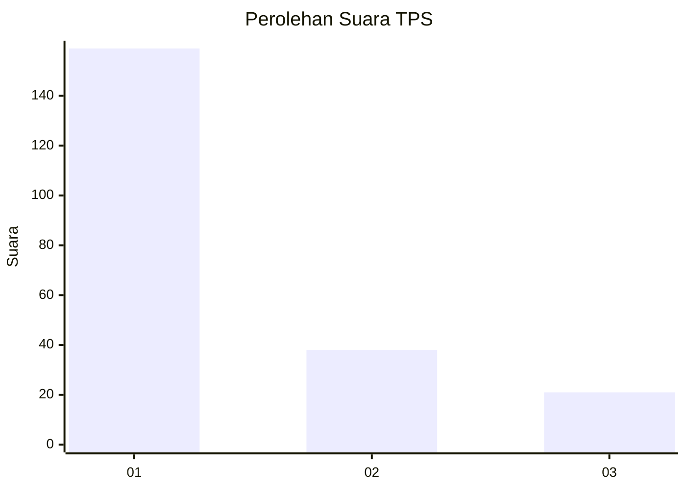
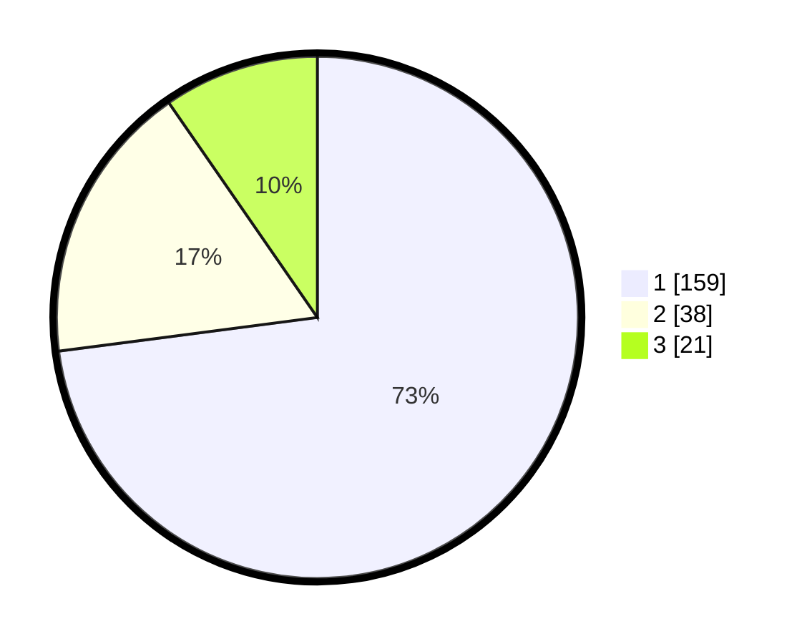

# Hasil

## Grafik

## Tabel

| No. | Nama Paslon    | Suara | Suara (raw) | Persentase |
|:--- |:-------------- | -----:| -----------:| ----------:|
| 1   | ANIES MUHAIMIN | 159   | [159][p-1]  | 72,94      |
| 2   | PRABOWO GIBRAN | 38    | [38][p-2]   | 17,43      |
| 3   | GANJAR MAHFUD  | 21    | [21][p-3]   | 9,63       |

[p-1]: https://github.com/gigit-pemilu/pemilu-2024/blob/main/pilpres/hitung-suara/sub/32-jawa-barat/sub/76-kota-depok/sub/02-cimanggis/sub/1011-pasir-gunung-selatan/sub/046-tps/sub/paslon-1.txt
[p-2]: https://github.com/gigit-pemilu/pemilu-2024/blob/main/pilpres/hitung-suara/sub/32-jawa-barat/sub/76-kota-depok/sub/02-cimanggis/sub/1011-pasir-gunung-selatan/sub/046-tps/sub/paslon-2.txt
[p-3]: https://github.com/gigit-pemilu/pemilu-2024/blob/main/pilpres/hitung-suara/sub/32-jawa-barat/sub/76-kota-depok/sub/02-cimanggis/sub/1011-pasir-gunung-selatan/sub/046-tps/sub/paslon-3.txt

## Foto C Plano

https://sirekap-obj-formc.kpu.go.id/5059/pemilu/ppwp/32/76/02/10/11/3276021011046-20240217-190954--023e3b6e-c8fa-4d3f-9ae3-24593e573509.jpg

https://sirekap-obj-formc.kpu.go.id/5059/pemilu/ppwp/32/76/02/10/11/3276021011046-20240217-191128--a13c5e71-a386-4255-b4c8-f2be8d1a4166.jpg

https://sirekap-obj-formc.kpu.go.id/5059/pemilu/ppwp/32/76/02/10/11/3276021011046-20240217-191240--d73f5dfc-3147-4fb7-a7fa-a4677d7d4972.jpg

## Metadata

| Key        | Value               |
| ---------- | ------------------- |
| Time Stamp | 2024-02-19 06:16:00 |

