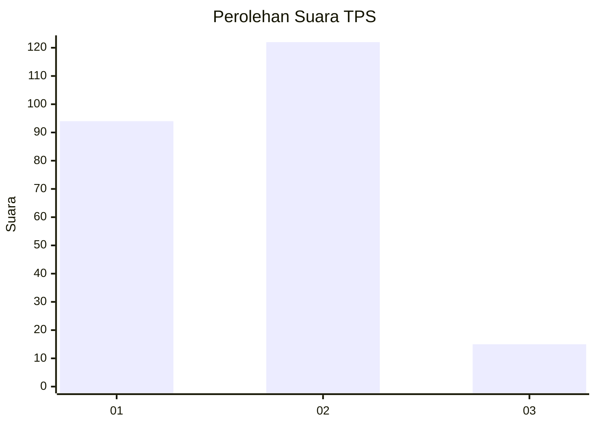

# Hasil

## Grafik

## Tabel

| No. | Nama Paslon    | Suara | Suara (raw) | Persentase |
|:--- |:-------------- | -----:| -----------:| ----------:|
| 1   | ANIES MUHAIMIN | 94    | [94][p-1]   | 40,69      |
| 2   | PRABOWO GIBRAN | 122   | [122][p-2]  | 52,81      |
| 3   | GANJAR MAHFUD  | 15    | [15][p-3]   | 6,49       |

[p-1]: https://github.com/gigit-pemilu/pemilu-2024/blob/main/pilpres/hitung-suara/sub/32-jawa-barat/sub/76-kota-depok/sub/03-sawangan/sub/1001-pasir-putih/sub/005-tps/sub/paslon-1.txt
[p-2]: https://github.com/gigit-pemilu/pemilu-2024/blob/main/pilpres/hitung-suara/sub/32-jawa-barat/sub/76-kota-depok/sub/03-sawangan/sub/1001-pasir-putih/sub/005-tps/sub/paslon-2.txt
[p-3]: https://github.com/gigit-pemilu/pemilu-2024/blob/main/pilpres/hitung-suara/sub/32-jawa-barat/sub/76-kota-depok/sub/03-sawangan/sub/1001-pasir-putih/sub/005-tps/sub/paslon-3.txt

## Foto C Plano

https://sirekap-obj-formc.kpu.go.id/6316/pemilu/ppwp/32/76/03/10/01/3276031001005-20240214-222241--4bed08c7-fd80-4154-874c-18e60c569f5d.jpg

https://sirekap-obj-formc.kpu.go.id/6316/pemilu/ppwp/32/76/03/10/01/3276031001005-20240214-224138--7eee9cd4-2789-484a-aef3-e25af751a104.jpg

https://sirekap-obj-formc.kpu.go.id/6316/pemilu/ppwp/32/76/03/10/01/3276031001005-20240214-222709--73bad117-a1a5-4eb3-b612-93ae45673c3b.jpg

## Metadata

| Key        | Value               |
| ---------- | ------------------- |
| Time Stamp | 2024-02-24 22:31:28 |

