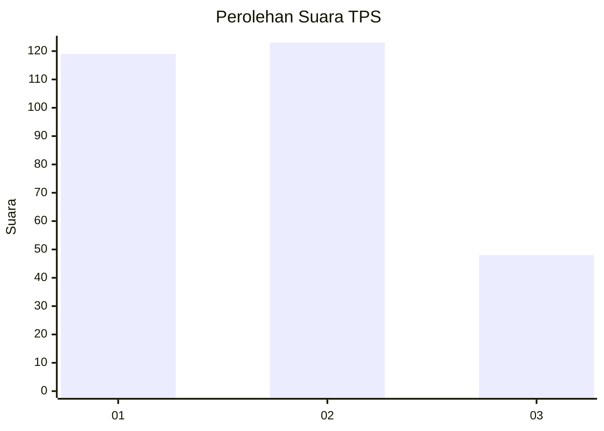
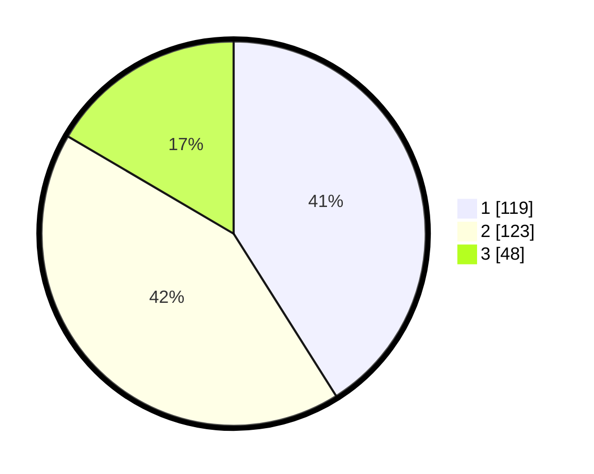

# Hasil

## Grafik

## Tabel

| No. | Nama Paslon    | Suara | Suara (raw) | Persentase |
|:--- |:-------------- | -----:| -----------:| ----------:|
| 1   | ANIES MUHAIMIN | 119   | [119][p-1]  | 41,03      |
| 2   | PRABOWO GIBRAN | 123   | [123][p-2]  | 42,41      |
| 3   | GANJAR MAHFUD  | 48    | [48][p-3]   | 16,55      |

[p-1]: https://github.com/gigit-pemilu/pemilu-2024/blob/main/pilpres/hitung-suara/sub/32-jawa-barat/sub/76-kota-depok/sub/03-sawangan/sub/1002-bedahan/sub/092-tps/sub/paslon-1.txt
[p-2]: https://github.com/gigit-pemilu/pemilu-2024/blob/main/pilpres/hitung-suara/sub/32-jawa-barat/sub/76-kota-depok/sub/03-sawangan/sub/1002-bedahan/sub/092-tps/sub/paslon-2.txt
[p-3]: https://github.com/gigit-pemilu/pemilu-2024/blob/main/pilpres/hitung-suara/sub/32-jawa-barat/sub/76-kota-depok/sub/03-sawangan/sub/1002-bedahan/sub/092-tps/sub/paslon-3.txt

## Foto C Plano

https://sirekap-obj-formc.kpu.go.id/5c38/pemilu/ppwp/32/76/03/10/02/3276031002092-20240217-103522--8c5f01d2-6c30-4f89-89eb-c45c6603434f.jpg

https://sirekap-obj-formc.kpu.go.id/5c38/pemilu/ppwp/32/76/03/10/02/3276031002092-20240217-103620--c37d053e-069f-4fd0-bb69-76cce81feba7.jpg

https://sirekap-obj-formc.kpu.go.id/5c38/pemilu/ppwp/32/76/03/10/02/3276031002092-20240217-103818--f51cc6b4-965c-4cfe-8dcb-7ee86255e3cd.jpg

## Metadata

| Key        | Value               |
| ---------- | ------------------- |
| Time Stamp | 2024-02-20 14:00:00 |

