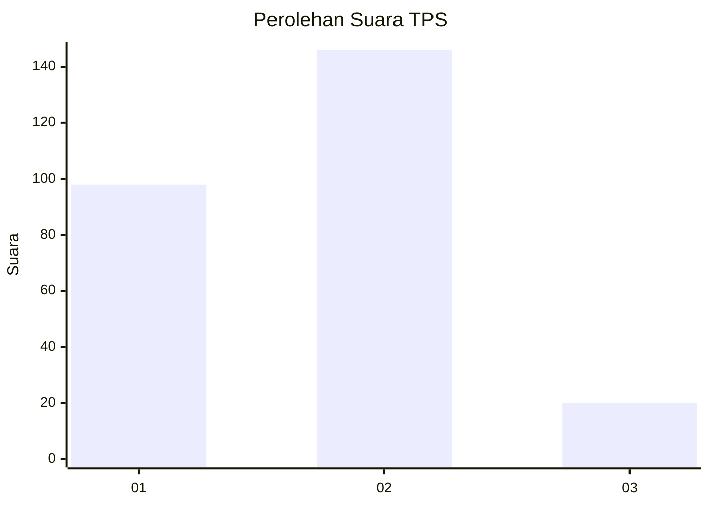

# Hasil

## Grafik

## Tabel

| No. | Nama Paslon    | Suara | Suara (raw) | Persentase |
|:--- |:-------------- | -----:| -----------:| ----------:|
| 1   | ANIES MUHAIMIN | 98    | [98][p-1]   | 37,12      |
| 2   | PRABOWO GIBRAN | 146   | [146][p-2]  | 55,30      |
| 3   | GANJAR MAHFUD  | 20    | [20][p-3]   | 7,58       |

[p-1]: https://github.com/gigit-pemilu/pemilu-2024-32-jawa-barat/blob/main/pilpres/hitung-suara/sub/32-jawa-barat/sub/76-kota-depok/sub/03-sawangan/sub/1003-pengasinan/sub/024-tps/sub/paslon-1.txt
[p-2]: https://github.com/gigit-pemilu/pemilu-2024-32-jawa-barat/blob/main/pilpres/hitung-suara/sub/32-jawa-barat/sub/76-kota-depok/sub/03-sawangan/sub/1003-pengasinan/sub/024-tps/sub/paslon-2.txt
[p-3]: https://github.com/gigit-pemilu/pemilu-2024-32-jawa-barat/blob/main/pilpres/hitung-suara/sub/32-jawa-barat/sub/76-kota-depok/sub/03-sawangan/sub/1003-pengasinan/sub/024-tps/sub/paslon-3.txt

## Foto C Plano

https://sirekap-obj-formc.kpu.go.id/b466/pemilu/ppwp/32/76/03/10/03/3276031003024-20240218-173455--fec7e852-caa9-431c-b3b7-ee58e93faccf.jpg

https://sirekap-obj-formc.kpu.go.id/b466/pemilu/ppwp/32/76/03/10/03/3276031003024-20240218-173732--d8fae611-d2b4-4c97-b65e-300f73046e56.jpg

https://sirekap-obj-formc.kpu.go.id/b466/pemilu/ppwp/32/76/03/10/03/3276031003024-20240218-174749--2aa9bf9f-24fe-42dc-8b82-bd1eddf5ef57.jpg

## Metadata

| Key        | Value               |
| ---------- | ------------------- |
| Time Stamp | 2024-02-19 14:00:00 |

## DATA PEMILIH TETAP

Jumlah pemilih dalam DPT: **291**.
 * L: **444**.
 * P: **247**.

## DATA PENGGUNA HAK PILIH

Jumlah pengguna hak pilih dalam DPT: **263**.
 * L: **424**.
 * P: **439**.

Jumlah pengguna hak pilih dalam DPTb: **885**.
 * L: **883**.
 * P: **882**.

Jumlah pengguna hak pilih dalam DPK: **2**.
 * L: **85**.
 * P: **7**.

Jumlah pengguna hak pilih: **270**.
 * L: **828**.
 * P: **442**.

## JUMLAH SUARA SAH DAN TIDAK SAH

JUMLAH SELURUH SUARA SAH: **264**.

JUMLAH SUARA TIDAK SAH: **6**.

JUMLAH SELURUH SUARA SAH DAN SUARA TIDAK SAH: **270**.

