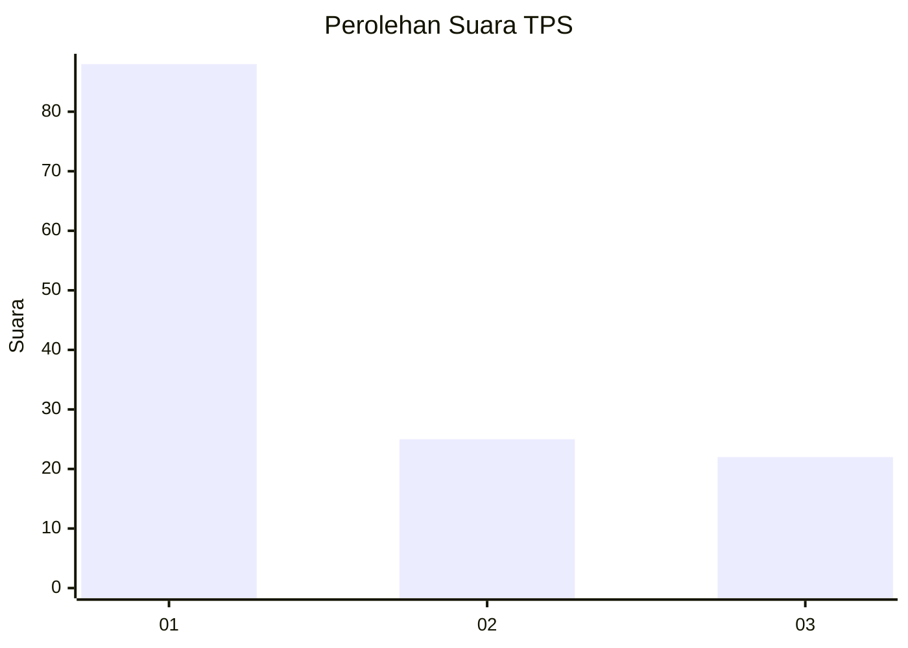
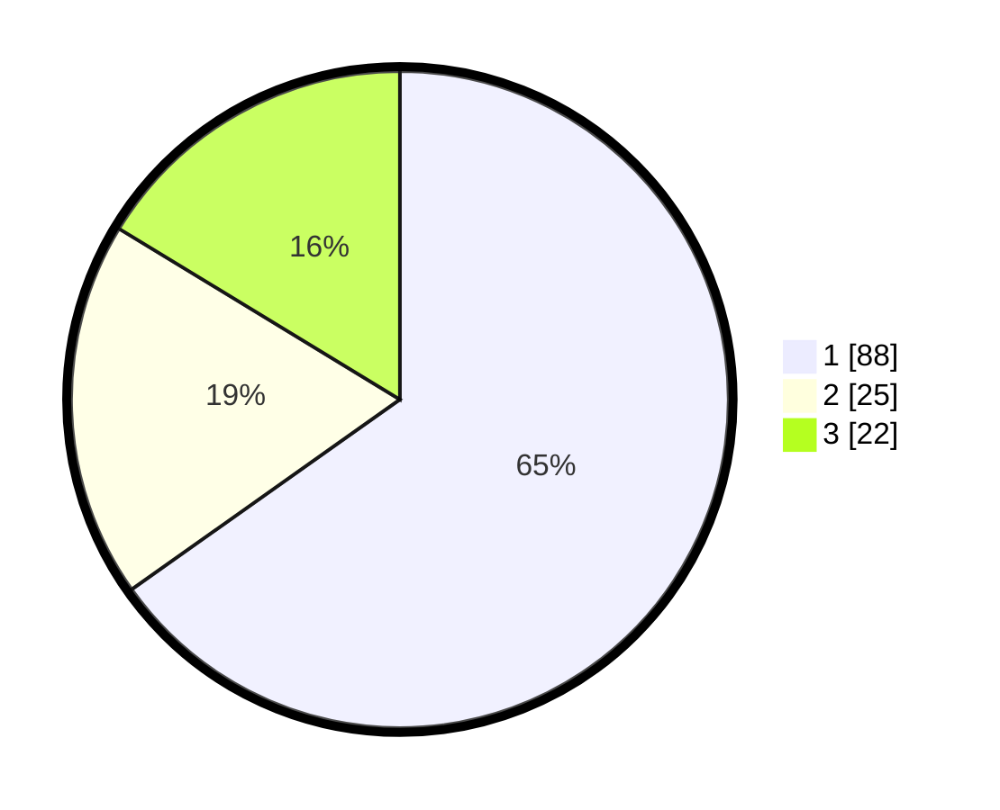

# Hasil

## Grafik

## Tabel

| No. | Nama Paslon    | Suara | Suara (raw) | Persentase |
|:--- |:-------------- | -----:| -----------:| ----------:|
| 1   | ANIES MUHAIMIN | 88    | [88][p-1]   | 65,19      |
| 2   | PRABOWO GIBRAN | 25    | [25][p-2]   | 18,52      |
| 3   | GANJAR MAHFUD  | 22    | [22][p-3]   | 16,30      |

[p-1]: https://github.com/gigit-pemilu/pemilu-2024/blob/main/pilpres/hitung-suara/sub/32-jawa-barat/sub/76-kota-depok/sub/03-sawangan/sub/1009-cinangka/sub/010-tps/sub/paslon-1.txt
[p-2]: https://github.com/gigit-pemilu/pemilu-2024/blob/main/pilpres/hitung-suara/sub/32-jawa-barat/sub/76-kota-depok/sub/03-sawangan/sub/1009-cinangka/sub/010-tps/sub/paslon-2.txt
[p-3]: https://github.com/gigit-pemilu/pemilu-2024/blob/main/pilpres/hitung-suara/sub/32-jawa-barat/sub/76-kota-depok/sub/03-sawangan/sub/1009-cinangka/sub/010-tps/sub/paslon-3.txt

## Foto C Plano

https://sirekap-obj-formc.kpu.go.id/cb35/pemilu/ppwp/32/76/03/10/09/3276031009010-20240222-181657--a56d1681-b4b7-460d-aee7-f1afb513a8c9.jpg

https://sirekap-obj-formc.kpu.go.id/cb35/pemilu/ppwp/32/76/03/10/09/3276031009010-20240222-182713--c90189e0-50dd-4ccb-b67d-a0d81111b76d.jpg

https://sirekap-obj-formc.kpu.go.id/cb35/pemilu/ppwp/32/76/03/10/09/3276031009010-20240222-183235--2716e3d1-ca6c-420f-abff-6deda2b22cad.jpg

## Metadata

| Key        | Value               |
| ---------- | ------------------- |
| Time Stamp | 2024-02-22 19:00:00 |

## DATA PEMILIH TETAP

Jumlah pemilih dalam DPT: **358**.
 * L: **849**.
 * P: **488**.

## DATA PENGGUNA HAK PILIH

Jumlah pengguna hak pilih dalam DPT: **372**.
 * L: **828**.
 * P: **848**.

Jumlah pengguna hak pilih dalam DPTb: **988**.
 * L: **848**.
 * P: **88**.

Jumlah pengguna hak pilih dalam DPK: **804**.
 * L: **480**.
 * P: **840**.

Jumlah pengguna hak pilih: **258**.
 * L: **888**.
 * P: **888**.

## JUMLAH SUARA SAH DAN TIDAK SAH

JUMLAH SELURUH SUARA SAH: **245**.

JUMLAH SUARA TIDAK SAH: **8**.

JUMLAH SELURUH SUARA SAH DAN SUARA TIDAK SAH: **296**.

