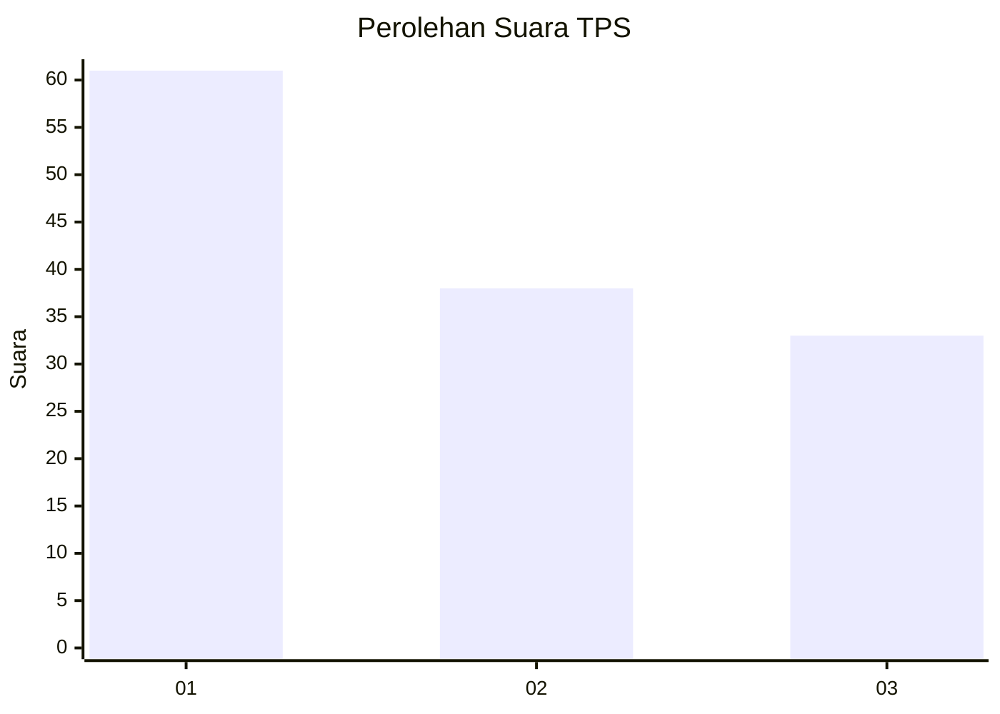
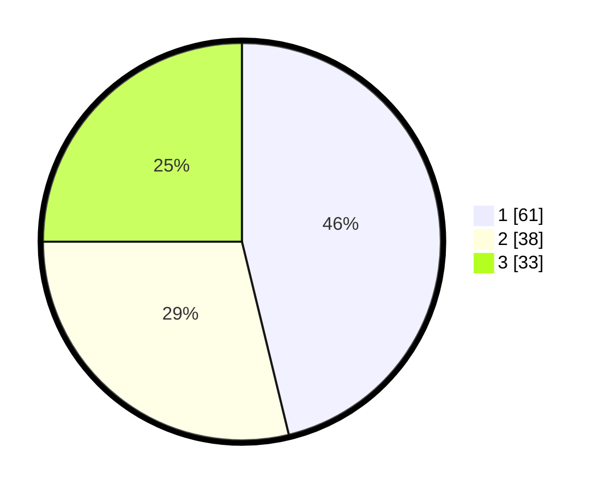

# Hasil

## Grafik

## Tabel

| No. | Nama Paslon    | Suara | Suara (raw) | Persentase |
|:--- |:-------------- | -----:| -----------:| ----------:|
| 1   | ANIES MUHAIMIN | 61    | [61][p-1]   | 46,21      |
| 2   | PRABOWO GIBRAN | 38    | [38][p-2]   | 28,79      |
| 3   | GANJAR MAHFUD  | 33    | [33][p-3]   | 25,00      |

[p-1]: https://github.com/gigit-pemilu/pemilu-2024/blob/main/pilpres/hitung-suara/sub/32-jawa-barat/sub/76-kota-depok/sub/03-sawangan/sub/1009-cinangka/sub/060-tps/sub/paslon-1.txt
[p-2]: https://github.com/gigit-pemilu/pemilu-2024/blob/main/pilpres/hitung-suara/sub/32-jawa-barat/sub/76-kota-depok/sub/03-sawangan/sub/1009-cinangka/sub/060-tps/sub/paslon-2.txt
[p-3]: https://github.com/gigit-pemilu/pemilu-2024/blob/main/pilpres/hitung-suara/sub/32-jawa-barat/sub/76-kota-depok/sub/03-sawangan/sub/1009-cinangka/sub/060-tps/sub/paslon-3.txt

## Foto C Plano

https://sirekap-obj-formc.kpu.go.id/2c25/pemilu/ppwp/32/76/03/10/09/3276031009060-20240214-201813--c02bc974-a530-438f-b24b-624dbf2ec9f2.jpg

https://sirekap-obj-formc.kpu.go.id/2c25/pemilu/ppwp/32/76/03/10/09/3276031009060-20240214-202104--0f25bca2-51a9-4c7a-8b4b-941ad7ea55c4.jpg

https://sirekap-obj-formc.kpu.go.id/2c25/pemilu/ppwp/32/76/03/10/09/3276031009060-20240214-155734--26656fb8-6a30-40bb-9cce-a5e3576b24f3.jpg

## Metadata

| Key        | Value               |
| ---------- | ------------------- |
| Time Stamp | 2024-02-15 16:30:25 |

