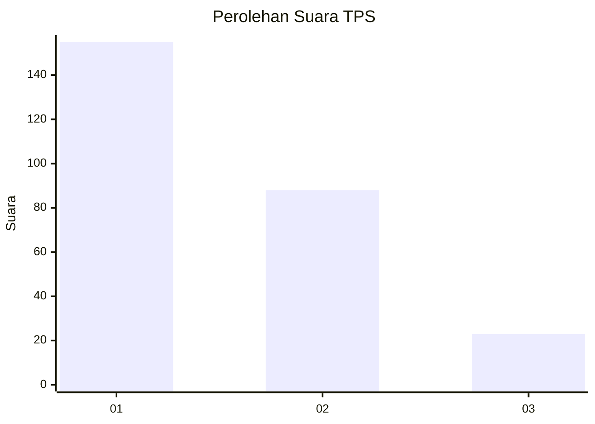
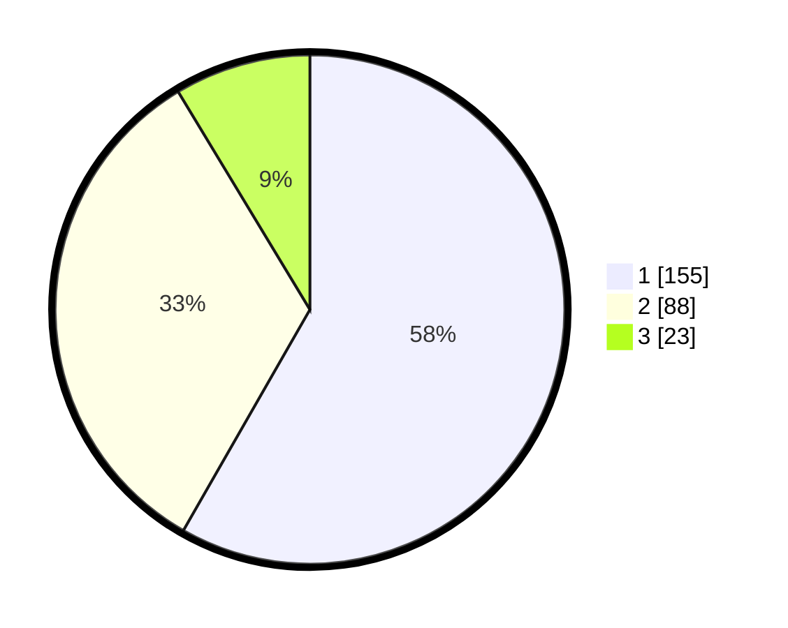

# Hasil

## Grafik

## Tabel

| No. | Nama Paslon    | Suara | Suara (raw) | Persentase |
|:--- |:-------------- | -----:| -----------:| ----------:|
| 1   | ANIES MUHAIMIN | 155   | [155][p-1]  | 58,27      |
| 2   | PRABOWO GIBRAN | 88    | [88][p-2]   | 33,08      |
| 3   | GANJAR MAHFUD  | 23    | [23][p-3]   | 8,65       |

[p-1]: https://github.com/gigit-pemilu/pemilu-2024-32-jawa-barat/blob/main/pilpres/hitung-suara/sub/32-jawa-barat/sub/76-kota-depok/sub/03-sawangan/sub/1010-sawangan/sub/013-tps/sub/paslon-1.txt
[p-2]: https://github.com/gigit-pemilu/pemilu-2024-32-jawa-barat/blob/main/pilpres/hitung-suara/sub/32-jawa-barat/sub/76-kota-depok/sub/03-sawangan/sub/1010-sawangan/sub/013-tps/sub/paslon-2.txt
[p-3]: https://github.com/gigit-pemilu/pemilu-2024-32-jawa-barat/blob/main/pilpres/hitung-suara/sub/32-jawa-barat/sub/76-kota-depok/sub/03-sawangan/sub/1010-sawangan/sub/013-tps/sub/paslon-3.txt

## Foto C Plano

https://sirekap-obj-formc.kpu.go.id/82e5/pemilu/ppwp/32/76/03/10/10/3276031010013-20240214-233202--3fad6f0a-e281-4a8c-b4c3-5986e7ff4235.jpg

https://sirekap-obj-formc.kpu.go.id/82e5/pemilu/ppwp/32/76/03/10/10/3276031010013-20240214-233315--0b304fd3-6125-4c6b-8e89-51db031ccb4e.jpg

https://sirekap-obj-formc.kpu.go.id/82e5/pemilu/ppwp/32/76/03/10/10/3276031010013-20240214-233456--82dff6eb-7eee-4f01-b71f-eddf82a6f1b8.jpg

## Metadata

| Key        | Value               |
| ---------- | ------------------- |
| Time Stamp | 2024-02-15 18:30:25 |

