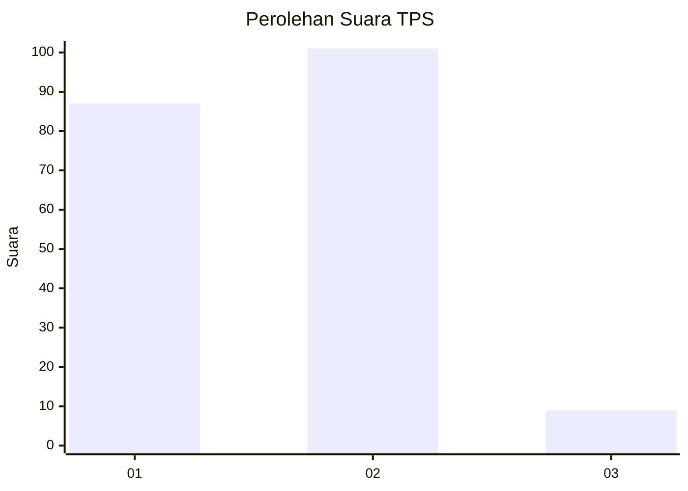
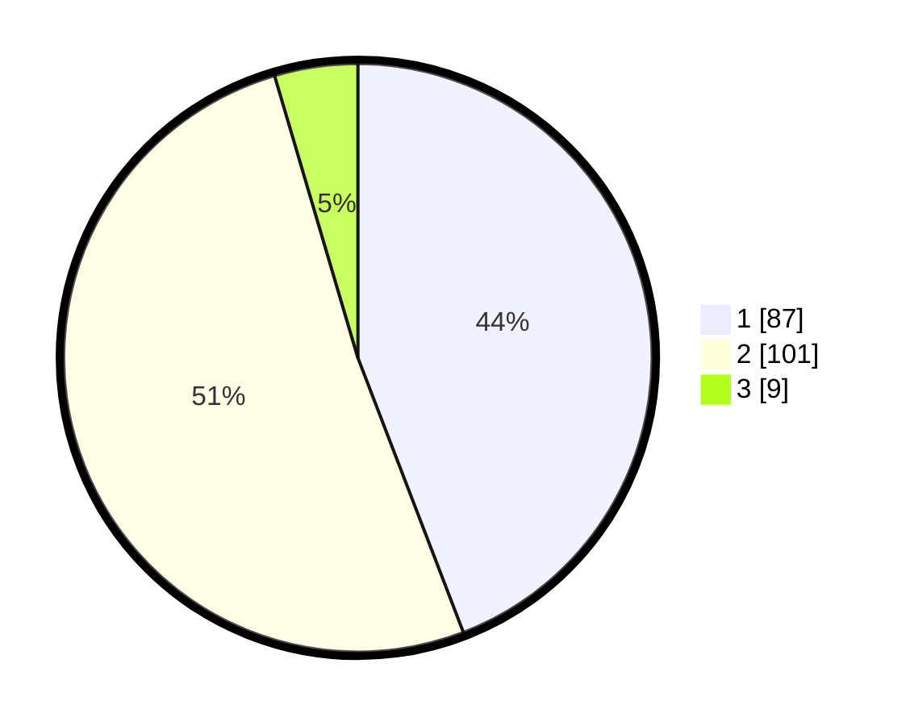

# Hasil

## Grafik

## Tabel

| No. | Nama Paslon    | Suara | Suara (raw) | Persentase |
|:--- |:-------------- | -----:| -----------:| ----------:|
| 1   | ANIES MUHAIMIN | 87    | [87][p-1]   | 44,16      |
| 2   | PRABOWO GIBRAN | 101   | [101][p-2]  | 51,27      |
| 3   | GANJAR MAHFUD  | 9     | [9][p-3]    | 4,57       |

[p-1]: https://github.com/gigit-pemilu/pemilu-2024/blob/main/pilpres/hitung-suara/sub/32-jawa-barat/sub/76-kota-depok/sub/05-sukmajaya/sub/1001-sukmajaya/sub/004-tps/sub/paslon-1.txt
[p-2]: https://github.com/gigit-pemilu/pemilu-2024/blob/main/pilpres/hitung-suara/sub/32-jawa-barat/sub/76-kota-depok/sub/05-sukmajaya/sub/1001-sukmajaya/sub/004-tps/sub/paslon-2.txt
[p-3]: https://github.com/gigit-pemilu/pemilu-2024/blob/main/pilpres/hitung-suara/sub/32-jawa-barat/sub/76-kota-depok/sub/05-sukmajaya/sub/1001-sukmajaya/sub/004-tps/sub/paslon-3.txt

## Foto C Plano

https://sirekap-obj-formc.kpu.go.id/e0a3/pemilu/ppwp/32/76/05/10/01/3276051001004-20240227-174303--e0ce5c19-91c6-4d51-89c3-9f5a2c5787f3.jpg

https://sirekap-obj-formc.kpu.go.id/e0a3/pemilu/ppwp/32/76/05/10/01/3276051001004-20240227-174346--219bac14-9196-4915-b6a2-25a6b29407ac.jpg

https://sirekap-obj-formc.kpu.go.id/e0a3/pemilu/ppwp/32/76/05/10/01/3276051001004-20240227-174502--237c0386-93ae-4566-b473-35dd8e69b930.jpg

## Metadata

| Key        | Value               |
| ---------- | ------------------- |
| Time Stamp | 2024-02-29 22:00:00 |

