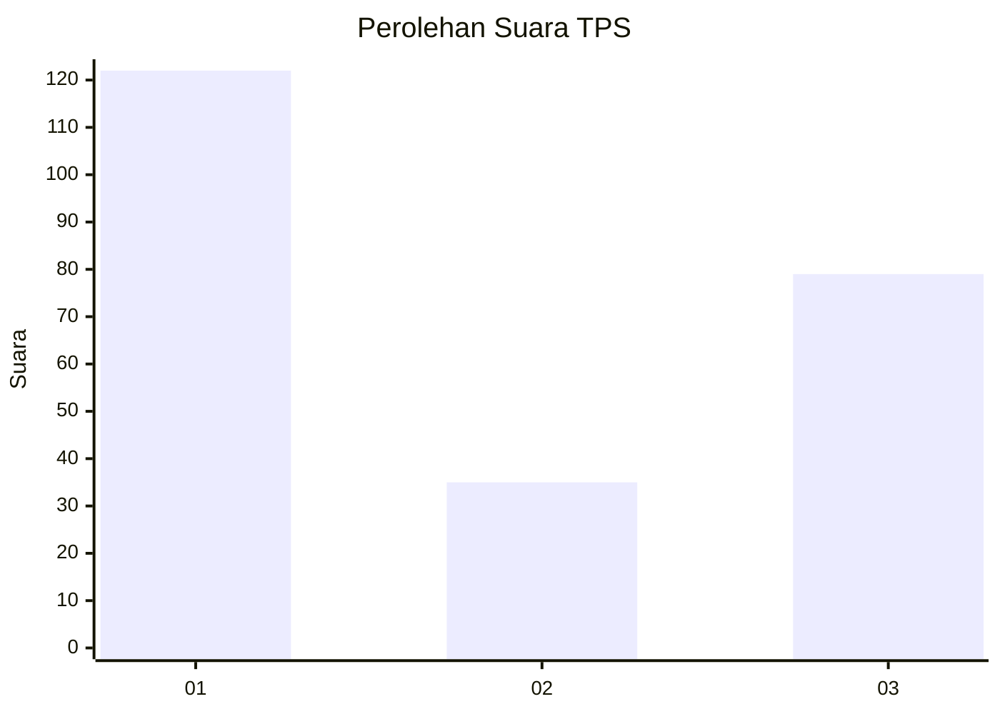
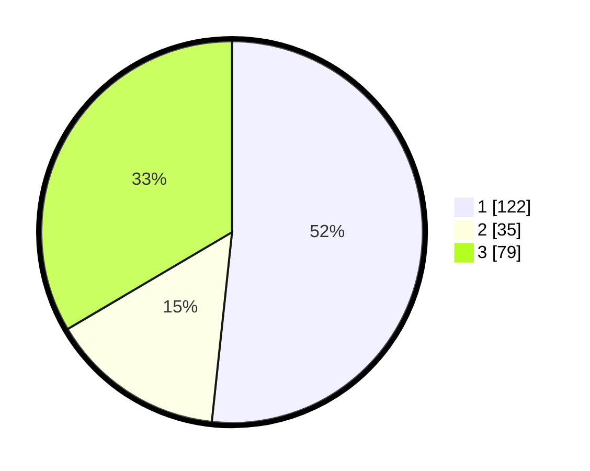

# Hasil

## Grafik

## Tabel

| No. | Nama Paslon    | Suara | Suara (raw) | Persentase |
|:--- |:-------------- | -----:| -----------:| ----------:|
| 1   | ANIES MUHAIMIN | 122   | [122][p-1]  | 51,69      |
| 2   | PRABOWO GIBRAN | 35    | [35][p-2]   | 14,83      |
| 3   | GANJAR MAHFUD  | 79    | [79][p-3]   | 33,47      |

[p-1]: https://github.com/gigit-pemilu/pemilu-2024-32-jawa-barat/blob/main/pilpres/hitung-suara/sub/32-jawa-barat/sub/76-kota-depok/sub/05-sukmajaya/sub/1004-mekarjaya/sub/053-tps/sub/paslon-1.txt
[p-2]: https://github.com/gigit-pemilu/pemilu-2024-32-jawa-barat/blob/main/pilpres/hitung-suara/sub/32-jawa-barat/sub/76-kota-depok/sub/05-sukmajaya/sub/1004-mekarjaya/sub/053-tps/sub/paslon-2.txt
[p-3]: https://github.com/gigit-pemilu/pemilu-2024-32-jawa-barat/blob/main/pilpres/hitung-suara/sub/32-jawa-barat/sub/76-kota-depok/sub/05-sukmajaya/sub/1004-mekarjaya/sub/053-tps/sub/paslon-3.txt

## Foto C Plano

https://sirekap-obj-formc.kpu.go.id/1307/pemilu/ppwp/32/76/05/10/04/3276051004053-20240219-162409--3064fbf4-64fa-4576-9875-96737140bdb6.jpg

https://sirekap-obj-formc.kpu.go.id/1307/pemilu/ppwp/32/76/05/10/04/3276051004053-20240219-162516--ccd64e8f-4f04-4477-aecc-061f1890d6f8.jpg

https://sirekap-obj-formc.kpu.go.id/1307/pemilu/ppwp/32/76/05/10/04/3276051004053-20240219-162557--7ad8490d-2176-4a6d-8a51-8a6009889a6c.jpg

## Metadata

| Key        | Value               |
| ---------- | ------------------- |
| Time Stamp | 2024-02-19 17:00:00 |

## DATA PEMILIH TETAP

Jumlah pemilih dalam DPT: **383**.
 * L: **723**.
 * P: **545**.

## DATA PENGGUNA HAK PILIH

Jumlah pengguna hak pilih dalam DPT: **221**.
 * L: **797**.
 * P: **124**.

Jumlah pengguna hak pilih dalam DPTb: **779**.
 * L: **55**.
 * P: **229**.

Jumlah pengguna hak pilih dalam DPK: **440**.
 * L: **42**.
 * P: **440**.

Jumlah pengguna hak pilih: **225**.
 * L: **193**.
 * P: **136**.

## JUMLAH SUARA SAH DAN TIDAK SAH

JUMLAH SELURUH SUARA SAH: **222**.

JUMLAH SUARA TIDAK SAH: **373**.

JUMLAH SELURUH SUARA SAH DAN SUARA TIDAK SAH: **225**.

