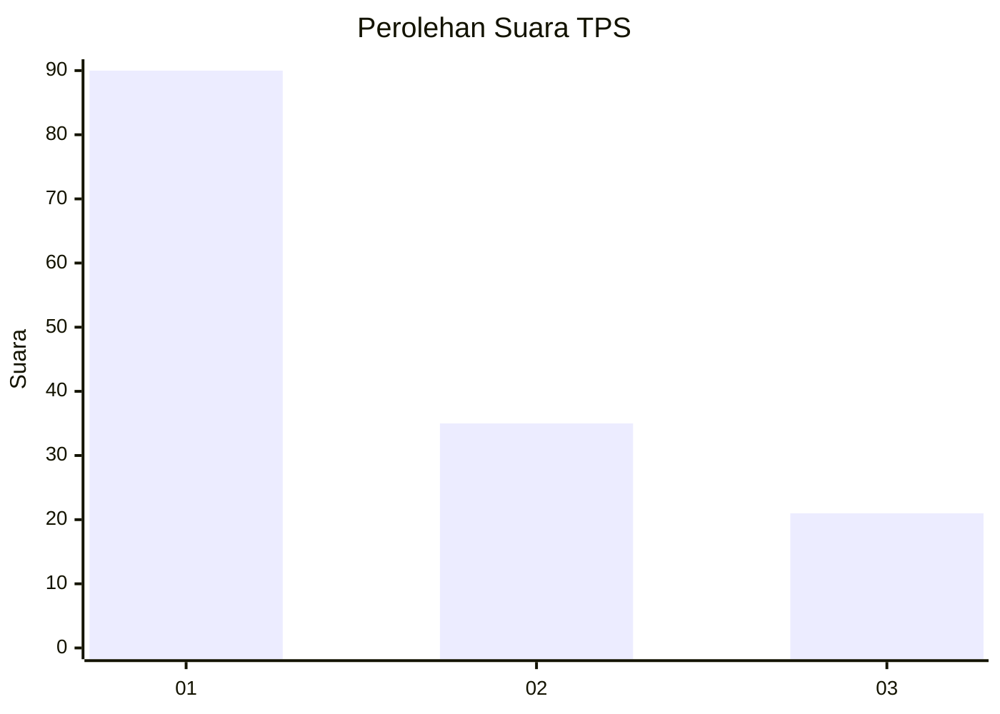
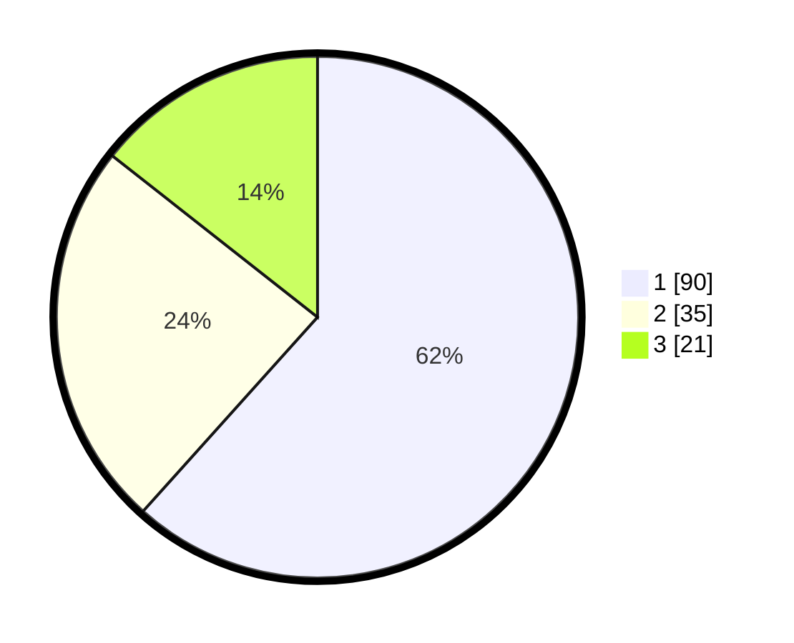

# Hasil

## Grafik

## Tabel

| No. | Nama Paslon    | Suara | Suara (raw) | Persentase |
|:--- |:-------------- | -----:| -----------:| ----------:|
| 1   | ANIES MUHAIMIN | 90    | [90][p-1]   | 61,64      |
| 2   | PRABOWO GIBRAN | 35    | [35][p-2]   | 23,97      |
| 3   | GANJAR MAHFUD  | 21    | [21][p-3]   | 14,38      |

[p-1]: https://github.com/gigit-pemilu/pemilu-2024/blob/main/pilpres/hitung-suara/sub/32-jawa-barat/sub/76-kota-depok/sub/05-sukmajaya/sub/1004-mekarjaya/sub/083-tps/sub/paslon-1.txt
[p-2]: https://github.com/gigit-pemilu/pemilu-2024/blob/main/pilpres/hitung-suara/sub/32-jawa-barat/sub/76-kota-depok/sub/05-sukmajaya/sub/1004-mekarjaya/sub/083-tps/sub/paslon-2.txt
[p-3]: https://github.com/gigit-pemilu/pemilu-2024/blob/main/pilpres/hitung-suara/sub/32-jawa-barat/sub/76-kota-depok/sub/05-sukmajaya/sub/1004-mekarjaya/sub/083-tps/sub/paslon-3.txt

## Foto C Plano

https://sirekap-obj-formc.kpu.go.id/ee08/pemilu/ppwp/32/76/05/10/04/3276051004083-20240219-181710--65e193b2-8bd3-46d1-aa9b-0410b10e7035.jpg

https://sirekap-obj-formc.kpu.go.id/ee08/pemilu/ppwp/32/76/05/10/04/3276051004083-20240219-181745--9d24d28b-75ae-40f4-921f-21a740db6845.jpg

https://sirekap-obj-formc.kpu.go.id/ee08/pemilu/ppwp/32/76/05/10/04/3276051004083-20240219-181823--0733a1b1-fac4-4bed-8430-307fb7b4d11a.jpg

## Metadata

| Key        | Value               |
| ---------- | ------------------- |
| Time Stamp | 2024-02-19 19:00:00 |

## DATA PEMILIH TETAP

Jumlah pemilih dalam DPT: **237**.
 * L: **235**.
 * P: **223**.

## DATA PENGGUNA HAK PILIH

Jumlah pengguna hak pilih dalam DPT: **237**.
 * L: **33**.
 * P: **302**.

Jumlah pengguna hak pilih dalam DPTb: **4**.
 * L: **2**.
 * P: **0**.

Jumlah pengguna hak pilih dalam DPK: **844**.
 * L: **1**.
 * P: **2**.

Jumlah pengguna hak pilih: **344**.
 * L: **96**.
 * P: **103**.

## JUMLAH SUARA SAH DAN TIDAK SAH

JUMLAH SELURUH SUARA SAH: **633**.

JUMLAH SUARA TIDAK SAH: **2**.

JUMLAH SELURUH SUARA SAH DAN SUARA TIDAK SAH: **199**.

