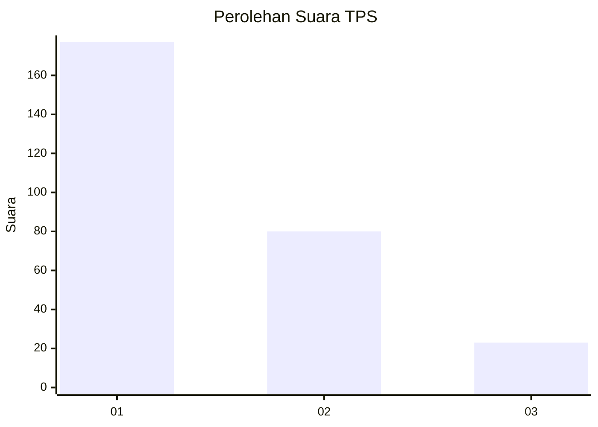
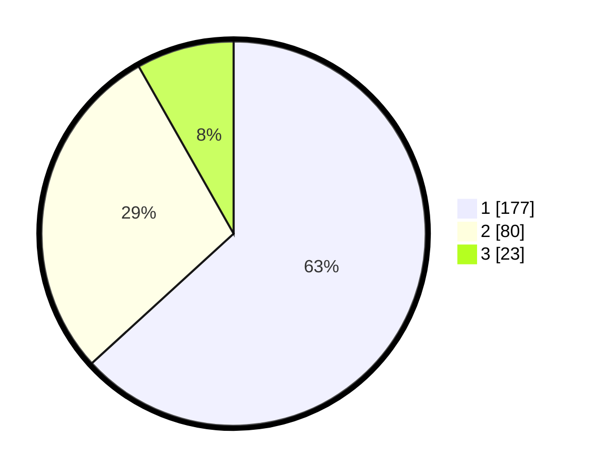

# Hasil

## Grafik

## Tabel

| No. | Nama Paslon    | Suara | Suara (raw) | Persentase |
|:--- |:-------------- | -----:| -----------:| ----------:|
| 1   | ANIES MUHAIMIN | 177   | [177][p-1]  | 63,21      |
| 2   | PRABOWO GIBRAN | 80    | [80][p-2]   | 28,57      |
| 3   | GANJAR MAHFUD  | 23    | [23][p-3]   | 8,21       |

[p-1]: https://github.com/gigit-pemilu/pemilu-2024-32-jawa-barat/blob/main/pilpres/hitung-suara/sub/32-jawa-barat/sub/76-kota-depok/sub/05-sukmajaya/sub/1004-mekarjaya/sub/103-tps/sub/paslon-1.txt
[p-2]: https://github.com/gigit-pemilu/pemilu-2024-32-jawa-barat/blob/main/pilpres/hitung-suara/sub/32-jawa-barat/sub/76-kota-depok/sub/05-sukmajaya/sub/1004-mekarjaya/sub/103-tps/sub/paslon-2.txt
[p-3]: https://github.com/gigit-pemilu/pemilu-2024-32-jawa-barat/blob/main/pilpres/hitung-suara/sub/32-jawa-barat/sub/76-kota-depok/sub/05-sukmajaya/sub/1004-mekarjaya/sub/103-tps/sub/paslon-3.txt

## Foto C Plano

https://sirekap-obj-formc.kpu.go.id/3cb2/pemilu/ppwp/32/76/05/10/04/3276051004103-20240220-112742--1b4c7f86-d410-40c3-88b4-68bbd6e40113.jpg

https://sirekap-obj-formc.kpu.go.id/3cb2/pemilu/ppwp/32/76/05/10/04/3276051004103-20240220-112913--f9a56084-cc65-4f3e-8b1d-32a064576756.jpg

https://sirekap-obj-formc.kpu.go.id/3cb2/pemilu/ppwp/32/76/05/10/04/3276051004103-20240220-113104--9313c46d-6c8e-4962-939f-6370177a04da.jpg

## Metadata

| Key        | Value               |
| ---------- | ------------------- |
| Time Stamp | 2024-02-20 20:00:00 |

