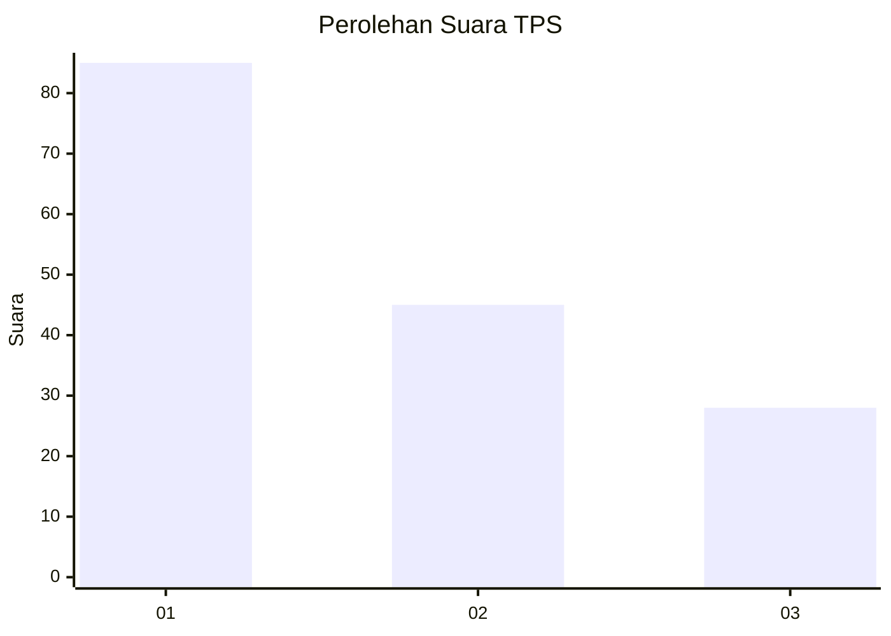
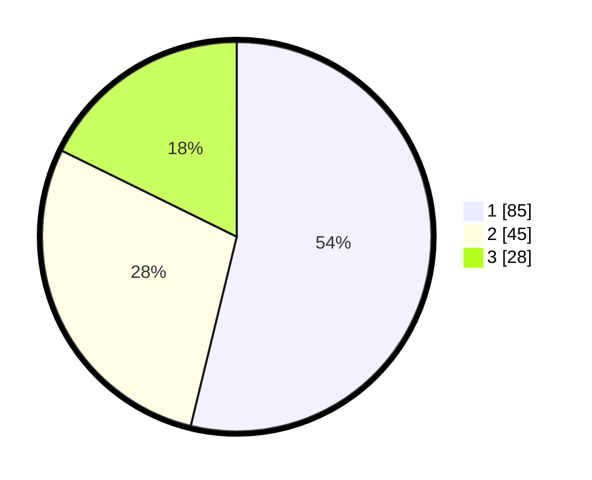

# Hasil

## Grafik

## Tabel

| No. | Nama Paslon    | Suara | Suara (raw) | Persentase |
|:--- |:-------------- | -----:| -----------:| ----------:|
| 1   | ANIES MUHAIMIN | 85    | [85][p-1]   | 53,80      |
| 2   | PRABOWO GIBRAN | 45    | [45][p-2]   | 28,48      |
| 3   | GANJAR MAHFUD  | 28    | [28][p-3]   | 17,72      |

[p-1]: https://github.com/gigit-pemilu/pemilu-2024/blob/main/pilpres/hitung-suara/sub/32-jawa-barat/sub/76-kota-depok/sub/05-sukmajaya/sub/1004-mekarjaya/sub/144-tps/sub/paslon-1.txt
[p-2]: https://github.com/gigit-pemilu/pemilu-2024/blob/main/pilpres/hitung-suara/sub/32-jawa-barat/sub/76-kota-depok/sub/05-sukmajaya/sub/1004-mekarjaya/sub/144-tps/sub/paslon-2.txt
[p-3]: https://github.com/gigit-pemilu/pemilu-2024/blob/main/pilpres/hitung-suara/sub/32-jawa-barat/sub/76-kota-depok/sub/05-sukmajaya/sub/1004-mekarjaya/sub/144-tps/sub/paslon-3.txt

## Foto C Plano

https://sirekap-obj-formc.kpu.go.id/bed8/pemilu/ppwp/32/76/05/10/04/3276051004144-20240220-134601--552e1b3f-1354-4979-b633-e0619a8f57c0.jpg

https://sirekap-obj-formc.kpu.go.id/bed8/pemilu/ppwp/32/76/05/10/04/3276051004144-20240220-134742--a3463483-13f6-4804-9953-f3b4c78603df.jpg

https://sirekap-obj-formc.kpu.go.id/bed8/pemilu/ppwp/32/76/05/10/04/3276051004144-20240220-135103--4eb9b4f5-d9a0-42f2-a326-82a7224c4342.jpg

## Metadata

| Key        | Value               |
| ---------- | ------------------- |
| Time Stamp | 2024-02-20 18:00:00 |

