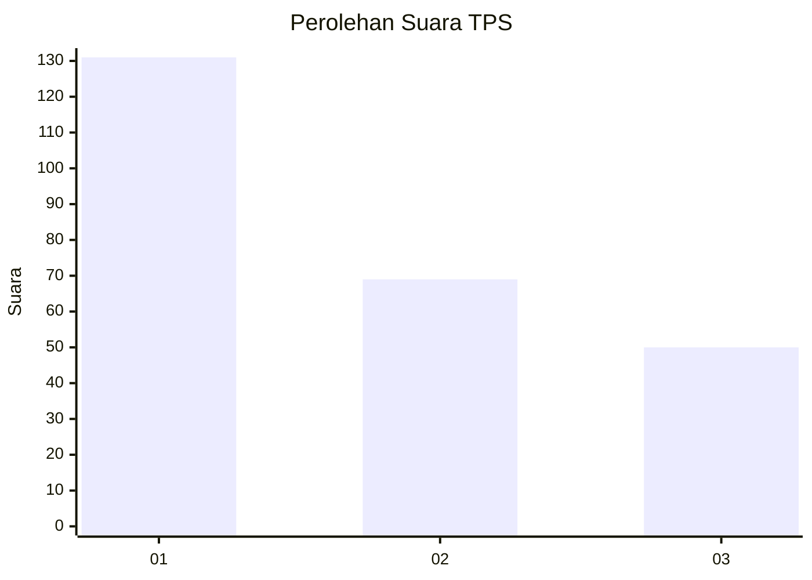
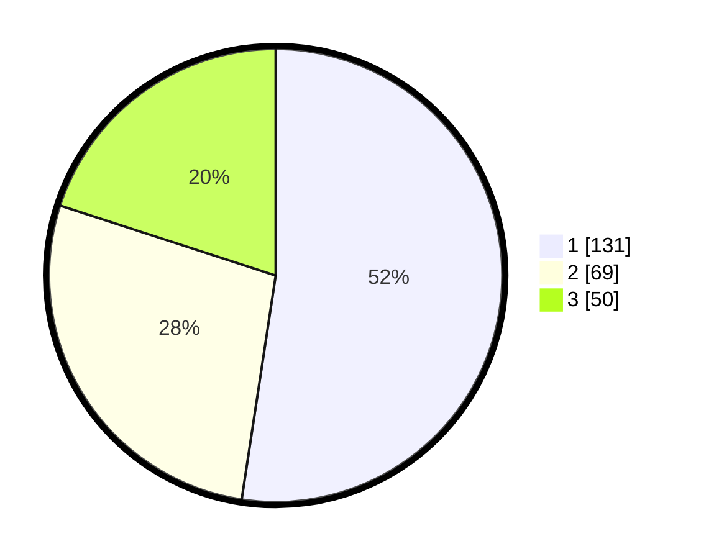

# Hasil

## Grafik

## Tabel

| No. | Nama Paslon    | Suara | Suara (raw) | Persentase |
|:--- |:-------------- | -----:| -----------:| ----------:|
| 1   | ANIES MUHAIMIN | 131   | [131][p-1]  | 52,40      |
| 2   | PRABOWO GIBRAN | 69    | [69][p-2]   | 27,60      |
| 3   | GANJAR MAHFUD  | 50    | [50][p-3]   | 20,00      |

[p-1]: https://github.com/gigit-pemilu/pemilu-2024/blob/main/pilpres/hitung-suara/sub/32-jawa-barat/sub/76-kota-depok/sub/05-sukmajaya/sub/1004-mekarjaya/sub/169-tps/sub/paslon-1.txt
[p-2]: https://github.com/gigit-pemilu/pemilu-2024/blob/main/pilpres/hitung-suara/sub/32-jawa-barat/sub/76-kota-depok/sub/05-sukmajaya/sub/1004-mekarjaya/sub/169-tps/sub/paslon-2.txt
[p-3]: https://github.com/gigit-pemilu/pemilu-2024/blob/main/pilpres/hitung-suara/sub/32-jawa-barat/sub/76-kota-depok/sub/05-sukmajaya/sub/1004-mekarjaya/sub/169-tps/sub/paslon-3.txt

## Foto C Plano

https://sirekap-obj-formc.kpu.go.id/4a1d/pemilu/ppwp/32/76/05/10/04/3276051004169-20240215-051604--5fc760ec-0c80-4521-be5f-ebd4e17423be.jpg

https://sirekap-obj-formc.kpu.go.id/4a1d/pemilu/ppwp/32/76/05/10/04/3276051004169-20240215-051633--4b18fad6-bcbf-474f-b4a5-f7d88f3c7e66.jpg

https://sirekap-obj-formc.kpu.go.id/4a1d/pemilu/ppwp/32/76/05/10/04/3276051004169-20240215-051729--5bc7a80a-d86c-4532-8d04-09786c8911a0.jpg

## Metadata

| Key        | Value               |
| ---------- | ------------------- |
| Time Stamp | 2024-02-15 16:00:26 |

