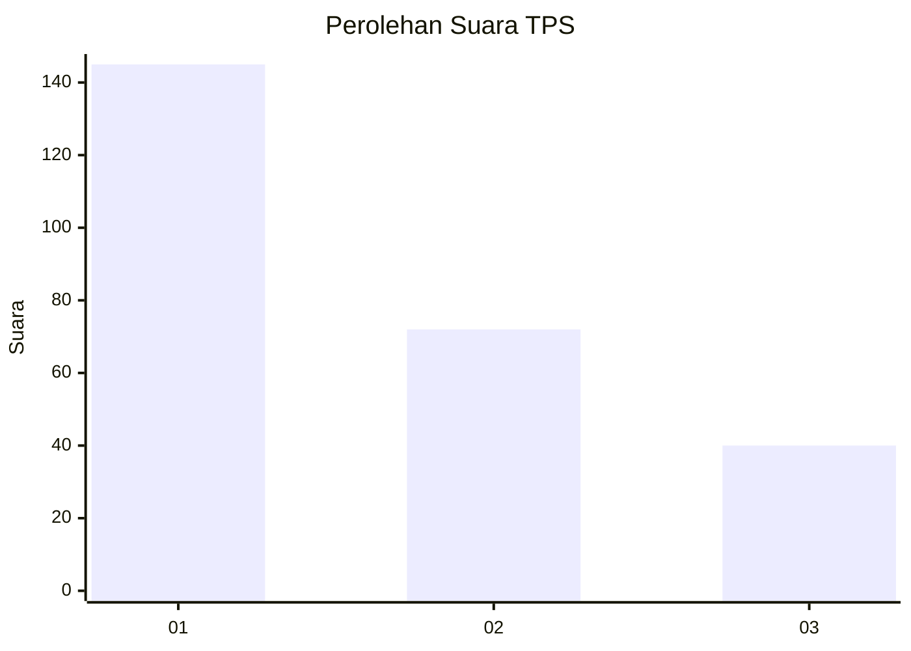
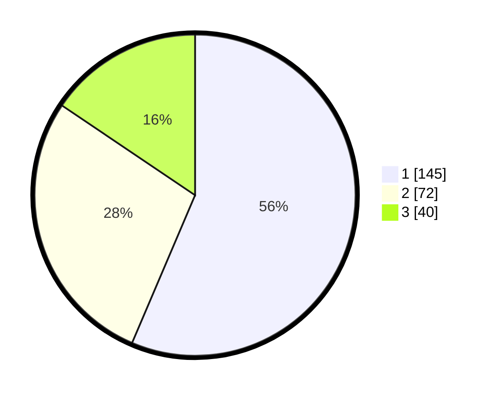

# Hasil

## Grafik

## Tabel

| No. | Nama Paslon    | Suara | Suara (raw) | Persentase |
|:--- |:-------------- | -----:| -----------:| ----------:|
| 1   | ANIES MUHAIMIN | 145   | [145][p-1]  | 56,42      |
| 2   | PRABOWO GIBRAN | 72    | [72][p-2]   | 28,02      |
| 3   | GANJAR MAHFUD  | 40    | [40][p-3]   | 15,56      |

[p-1]: https://github.com/gigit-pemilu/pemilu-2024-32-jawa-barat/blob/main/pilpres/hitung-suara/sub/32-jawa-barat/sub/76-kota-depok/sub/05-sukmajaya/sub/1004-mekarjaya/sub/170-tps/sub/paslon-1.txt
[p-2]: https://github.com/gigit-pemilu/pemilu-2024-32-jawa-barat/blob/main/pilpres/hitung-suara/sub/32-jawa-barat/sub/76-kota-depok/sub/05-sukmajaya/sub/1004-mekarjaya/sub/170-tps/sub/paslon-2.txt
[p-3]: https://github.com/gigit-pemilu/pemilu-2024-32-jawa-barat/blob/main/pilpres/hitung-suara/sub/32-jawa-barat/sub/76-kota-depok/sub/05-sukmajaya/sub/1004-mekarjaya/sub/170-tps/sub/paslon-3.txt

## Foto C Plano

https://sirekap-obj-formc.kpu.go.id/324a/pemilu/ppwp/32/76/05/10/04/3276051004170-20240215-053449--45e705e4-bf9d-47b4-a1ab-4e145e0e7f8c.jpg

https://sirekap-obj-formc.kpu.go.id/324a/pemilu/ppwp/32/76/05/10/04/3276051004170-20240215-053542--e52d30ff-ecf0-452b-8da5-8870613997ab.jpg

https://sirekap-obj-formc.kpu.go.id/324a/pemilu/ppwp/32/76/05/10/04/3276051004170-20240215-053719--3185e74b-01ef-4769-9d9e-893cd0aa2553.jpg

## Metadata

| Key        | Value               |
| ---------- | ------------------- |
| Time Stamp | 2024-02-15 22:00:27 |

