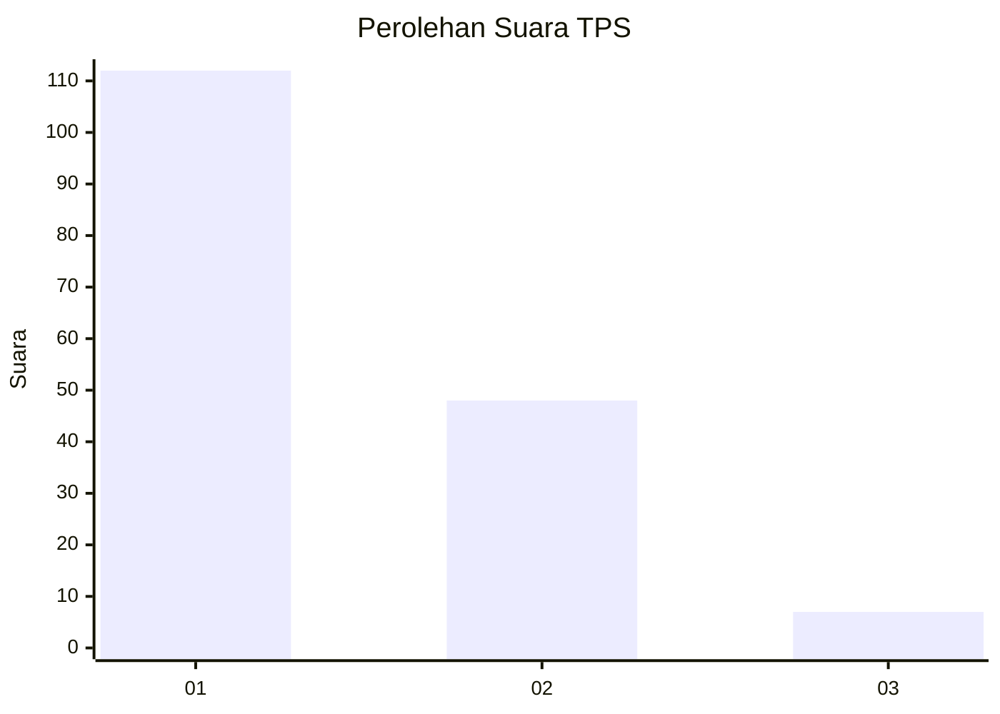
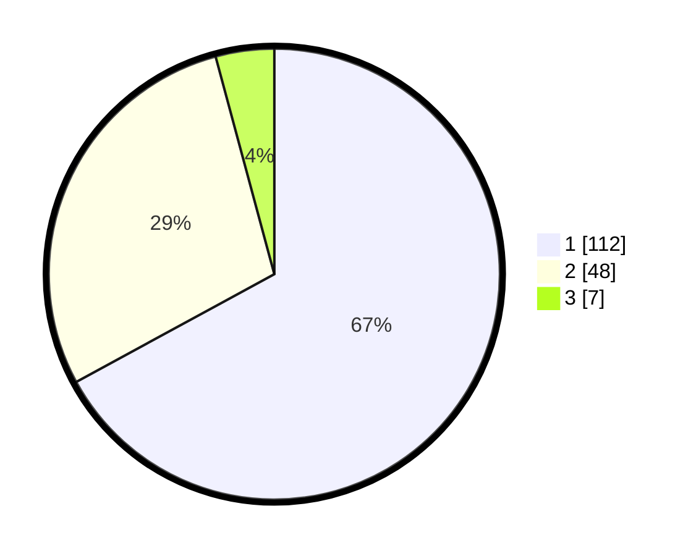

# Hasil

## Grafik

## Tabel

| No. | Nama Paslon    | Suara | Suara (raw) | Persentase |
|:--- |:-------------- | -----:| -----------:| ----------:|
| 1   | ANIES MUHAIMIN | 112   | [112][p-1]  | 67,07      |
| 2   | PRABOWO GIBRAN | 48    | [48][p-2]   | 28,74      |
| 3   | GANJAR MAHFUD  | 7     | [7][p-3]    | 4,19       |

[p-1]: https://github.com/gigit-pemilu/pemilu-2024/blob/main/pilpres/hitung-suara/sub/32-jawa-barat/sub/76-kota-depok/sub/05-sukmajaya/sub/1005-baktijaya/sub/042-tps/sub/paslon-1.txt
[p-2]: https://github.com/gigit-pemilu/pemilu-2024/blob/main/pilpres/hitung-suara/sub/32-jawa-barat/sub/76-kota-depok/sub/05-sukmajaya/sub/1005-baktijaya/sub/042-tps/sub/paslon-2.txt
[p-3]: https://github.com/gigit-pemilu/pemilu-2024/blob/main/pilpres/hitung-suara/sub/32-jawa-barat/sub/76-kota-depok/sub/05-sukmajaya/sub/1005-baktijaya/sub/042-tps/sub/paslon-3.txt

## Foto C Plano

https://sirekap-obj-formc.kpu.go.id/21d9/pemilu/ppwp/32/76/05/10/05/3276051005042-20240227-172224--bb47adb8-5330-44b6-8f8c-9150da9af575.jpg

https://sirekap-obj-formc.kpu.go.id/21d9/pemilu/ppwp/32/76/05/10/05/3276051005042-20240227-172306--e56faf96-2a61-418b-b2b6-846349af4bec.jpg

https://sirekap-obj-formc.kpu.go.id/21d9/pemilu/ppwp/32/76/05/10/05/3276051005042-20240227-172437--e24dd74d-dd06-40cd-97cb-4d3a19d78493.jpg

## Metadata

| Key        | Value               |
| ---------- | ------------------- |
| Time Stamp | 2024-02-28 19:00:00 |

