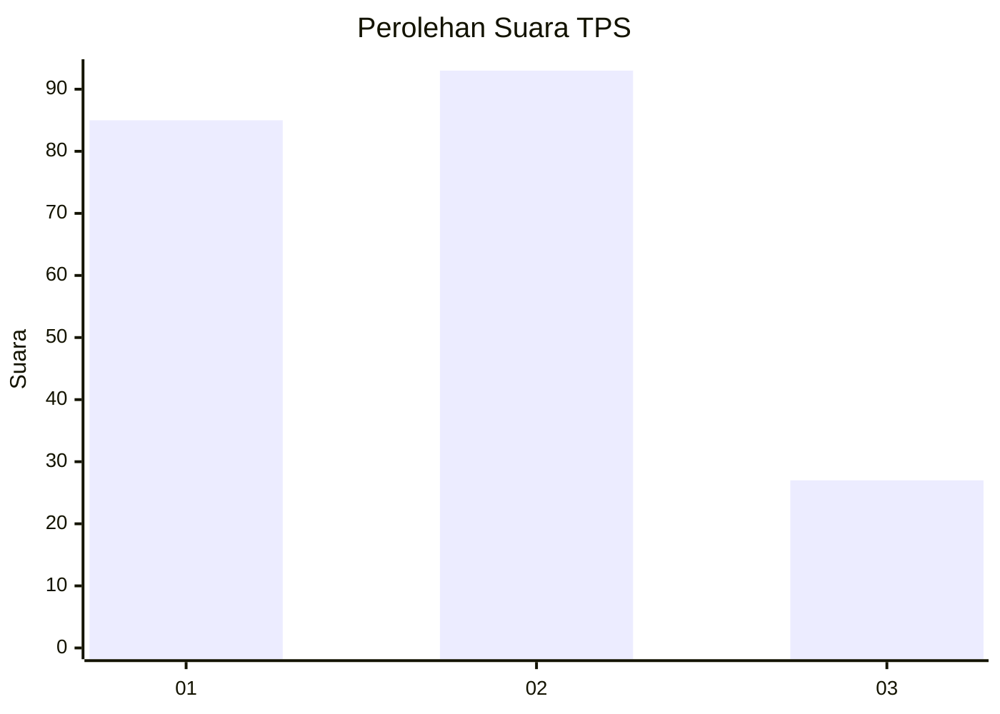
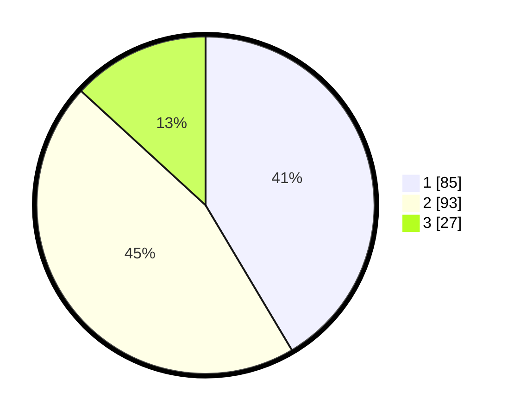

# Hasil

## Grafik

## Tabel

| No. | Nama Paslon    | Suara | Suara (raw) | Persentase |
|:--- |:-------------- | -----:| -----------:| ----------:|
| 1   | ANIES MUHAIMIN | 85    | [85][p-1]   | 41,46      |
| 2   | PRABOWO GIBRAN | 93    | [93][p-2]   | 45,37      |
| 3   | GANJAR MAHFUD  | 27    | [27][p-3]   | 13,17      |

[p-1]: https://github.com/gigit-pemilu/pemilu-2024-32-jawa-barat/blob/main/pilpres/hitung-suara/sub/32-jawa-barat/sub/76-kota-depok/sub/05-sukmajaya/sub/1008-cisalak/sub/025-tps/sub/paslon-1.txt
[p-2]: https://github.com/gigit-pemilu/pemilu-2024-32-jawa-barat/blob/main/pilpres/hitung-suara/sub/32-jawa-barat/sub/76-kota-depok/sub/05-sukmajaya/sub/1008-cisalak/sub/025-tps/sub/paslon-2.txt
[p-3]: https://github.com/gigit-pemilu/pemilu-2024-32-jawa-barat/blob/main/pilpres/hitung-suara/sub/32-jawa-barat/sub/76-kota-depok/sub/05-sukmajaya/sub/1008-cisalak/sub/025-tps/sub/paslon-3.txt

## Foto C Plano

https://sirekap-obj-formc.kpu.go.id/8c0e/pemilu/ppwp/32/76/05/10/08/3276051008025-20240219-113228--8c2bf6bf-cd20-4fb1-9acd-1bd7d2e9e3e1.jpg

https://sirekap-obj-formc.kpu.go.id/8c0e/pemilu/ppwp/32/76/05/10/08/3276051008025-20240219-113314--b59220b2-daf5-4dfc-82d3-3b6a80ac9389.jpg

https://sirekap-obj-formc.kpu.go.id/8c0e/pemilu/ppwp/32/76/05/10/08/3276051008025-20240219-113604--bb5ac2f3-6e23-40b9-8a4f-a0e93e79969c.jpg

## Metadata

| Key        | Value               |
| ---------- | ------------------- |
| Time Stamp | 2024-02-19 17:00:00 |

## DATA PEMILIH TETAP

Jumlah pemilih dalam DPT: **257**.
 * L: **123**.
 * P: **130**.

## DATA PENGGUNA HAK PILIH

Jumlah pengguna hak pilih dalam DPT: **202**.
 * L: **136**.
 * P: **1**.

Jumlah pengguna hak pilih dalam DPTb: **8**.
 * L: **880**.
 * P: **848**.

Jumlah pengguna hak pilih dalam DPK: **7**.
 * L: **49**.
 * P: **886**.

Jumlah pengguna hak pilih: **205**.
 * L: **805**.
 * P: **102**.

## JUMLAH SUARA SAH DAN TIDAK SAH

JUMLAH SELURUH SUARA SAH: **205**.

JUMLAH SUARA TIDAK SAH: **2**.

JUMLAH SELURUH SUARA SAH DAN SUARA TIDAK SAH: **207**.

