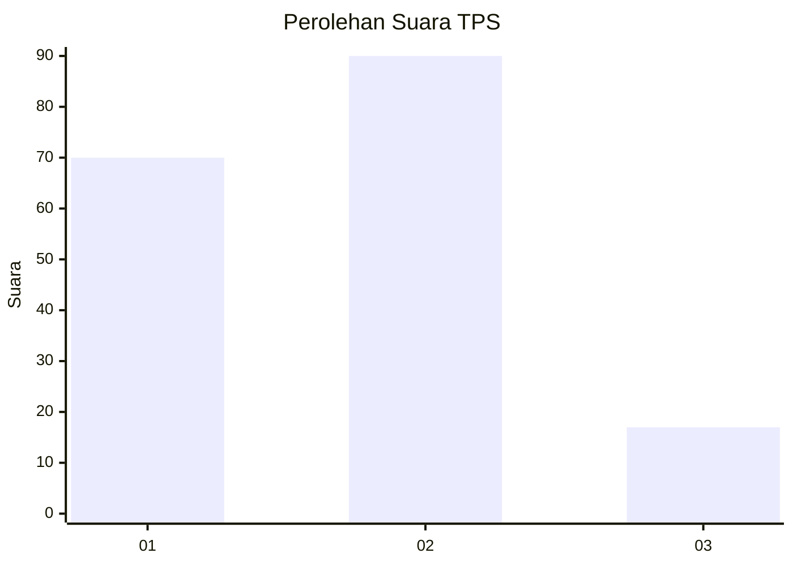
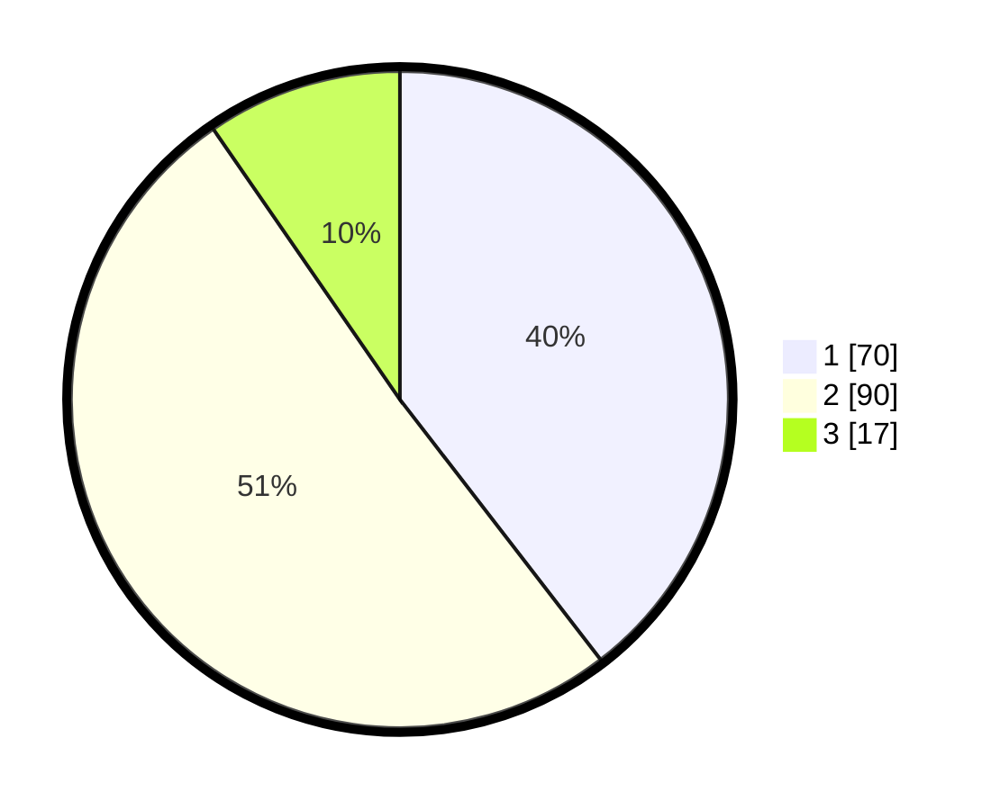

# Hasil

## Grafik

## Tabel

| No. | Nama Paslon    | Suara | Suara (raw) | Persentase |
|:--- |:-------------- | -----:| -----------:| ----------:|
| 1   | ANIES MUHAIMIN | 70    | [70][p-1]   | 39,55      |
| 2   | PRABOWO GIBRAN | 90    | [90][p-2]   | 50,85      |
| 3   | GANJAR MAHFUD  | 17    | [17][p-3]   | 9,60       |

[p-1]: https://github.com/gigit-pemilu/pemilu-2024/blob/main/pilpres/hitung-suara/sub/32-jawa-barat/sub/76-kota-depok/sub/05-sukmajaya/sub/1008-cisalak/sub/026-tps/sub/paslon-1.txt
[p-2]: https://github.com/gigit-pemilu/pemilu-2024/blob/main/pilpres/hitung-suara/sub/32-jawa-barat/sub/76-kota-depok/sub/05-sukmajaya/sub/1008-cisalak/sub/026-tps/sub/paslon-2.txt
[p-3]: https://github.com/gigit-pemilu/pemilu-2024/blob/main/pilpres/hitung-suara/sub/32-jawa-barat/sub/76-kota-depok/sub/05-sukmajaya/sub/1008-cisalak/sub/026-tps/sub/paslon-3.txt

## Foto C Plano

https://sirekap-obj-formc.kpu.go.id/86a4/pemilu/ppwp/32/76/05/10/08/3276051008026-20240219-113810--b2d3ce26-28a1-4c9f-87d0-efce8b0fc4b9.jpg

https://sirekap-obj-formc.kpu.go.id/86a4/pemilu/ppwp/32/76/05/10/08/3276051008026-20240219-113901--2f11788b-7f2b-46f4-a0f0-38eb8fa714c6.jpg

https://sirekap-obj-formc.kpu.go.id/86a4/pemilu/ppwp/32/76/05/10/08/3276051008026-20240219-113942--c649cdd7-434b-4aa9-ac3f-387dbc02ea60.jpg

## Metadata

| Key        | Value               |
| ---------- | ------------------- |
| Time Stamp | 2024-02-19 13:00:00 |

## DATA PEMILIH TETAP

Jumlah pemilih dalam DPT: **235**.
 * L: **133**.
 * P: **134**.

## DATA PENGGUNA HAK PILIH

Jumlah pengguna hak pilih dalam DPT: **383**.
 * L: **633**.
 * P: **293**.

Jumlah pengguna hak pilih dalam DPTb: **75**.
 * L: **888**.
 * P: **388**.

Jumlah pengguna hak pilih dalam DPK: **80**.
 * L: **848**.
 * P: **383**.

Jumlah pengguna hak pilih: **183**.
 * L: **854**.
 * P: **298**.

## JUMLAH SUARA SAH DAN TIDAK SAH

JUMLAH SELURUH SUARA SAH: **177**.

JUMLAH SUARA TIDAK SAH: **6**.

JUMLAH SELURUH SUARA SAH DAN SUARA TIDAK SAH: **183**.

